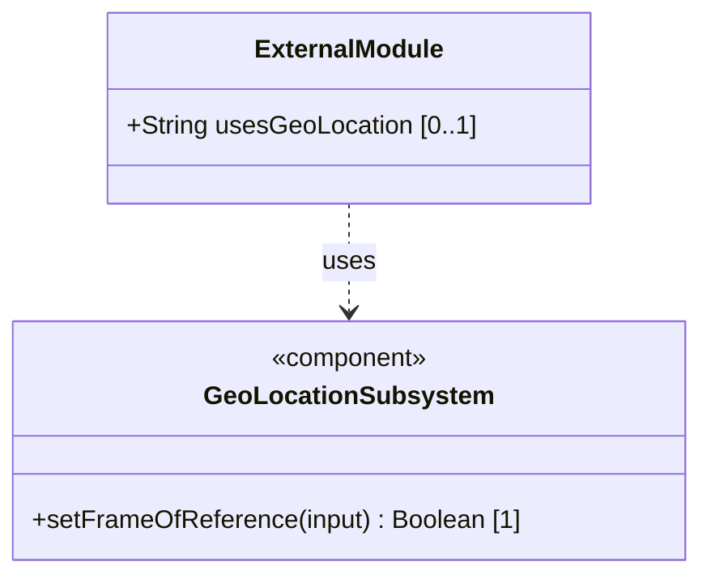
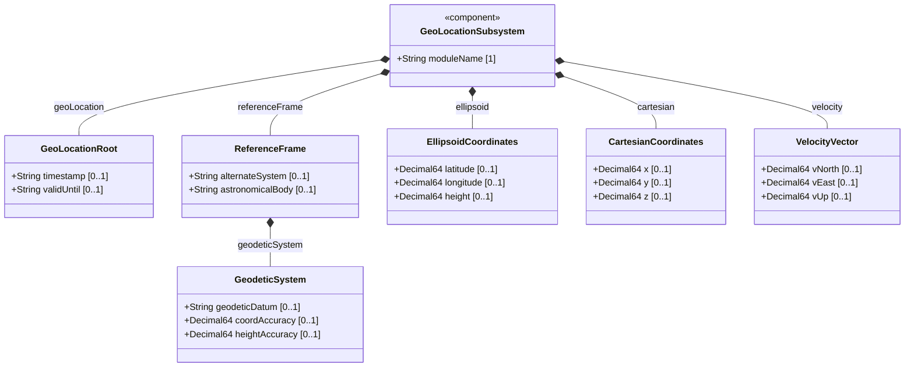
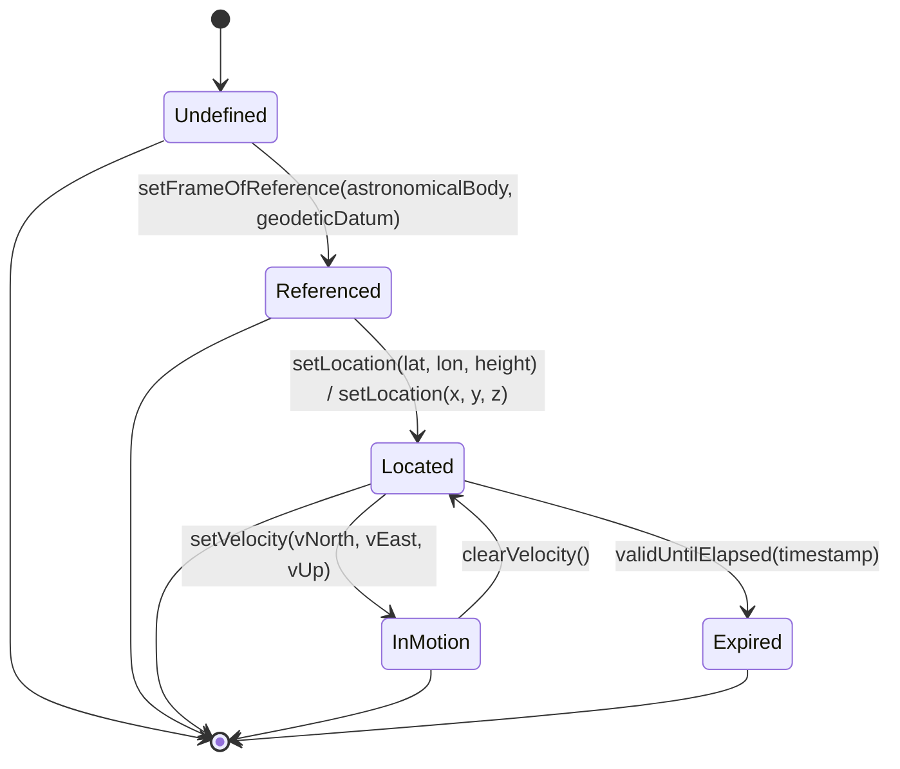

# Epic: Geo-Location Grouping

## 1. Context
This Epic covers the `ietf-geo-location` YANG module defined in RFC 9179. The module provides a reusable YANG grouping (`geo-location`) that specifies a geographic location on or around an astronomical object. The grouping captures the frame of reference (astronomical body and geodetic system), the position using either ellipsoidal (latitude/longitude/height) or Cartesian (x/y/z) coordinates, a velocity vector for objects in motion, temporal attributes (timestamp and validity expiration), and support for alternate coordinate systems such as virtual realities.

## 2. Requirements & Checklist
- [ ] #1 - [Geo-Location Root Container](https://github.com/gintatkinson/3dgs-028/blob/main/docs/features/feat-01-geo-location-root.md) (root container defining timestamp and validity duration for a location record. RFC 9179, Sections 2.3, 2.6)
- [ ] #2 - [Reference Frame](https://github.com/gintatkinson/3dgs-028/blob/main/docs/features/feat-02-reference-frame.md) (container defining the frame of reference: astronomical body and alternate system. RFC 9179, Sections 2.1, 2.6)
- [ ] #3 - [Geodetic System](https://github.com/gintatkinson/3dgs-028/blob/main/docs/features/feat-03-geodetic-system.md) (container defining the geodetic datum, coordinate accuracy, and height accuracy. RFC 9179, Sections 2.1, 6.1)
- [ ] #4 - [Ellipsoid Coordinate System](https://github.com/gintatkinson/3dgs-028/blob/main/docs/features/feat-04-ellipsoid-coordinates.md) (choice case for latitude, longitude, and height coordinates. RFC 9179, Sections 2.2, 4)
- [ ] #5 - [Cartesian Coordinate System](https://github.com/gintatkinson/3dgs-028/blob/main/docs/features/feat-05-cartesian-coordinates.md) (choice case for X, Y, Z Cartesian coordinates. RFC 9179, Sections 2.2, 4)
- [ ] #6 - [Velocity Vector](https://github.com/gintatkinson/3dgs-028/blob/main/docs/features/feat-06-velocity-vector.md) (container defining 3D velocity vector for objects in motion. RFC 9179, Section 2.3)

### Associated Use Cases & User Stories

#### Associated Use Cases
- [ ] #16 - [Register Core Location Entity](https://github.com/gintatkinson/3dgs-028/blob/main/docs/use-cases/uc-01-register-core-entity.md) (end-to-end registration of a location entity)
- [ ] #17 - [Port Location to External Standards](https://github.com/gintatkinson/3dgs-028/blob/main/docs/use-cases/uc-02-port-location-standards.md) (export to IETF URI, W3C, GML, KML)
- [ ] #18 - [Track Object Motion with Velocity Vector](https://github.com/gintatkinson/3dgs-028/blob/main/docs/use-cases/uc-03-track-object-motion.md) (motion tracking and heading/speed computation)
- [ ] #19 - [Configure Geodetic System for Non-Earth Body](https://github.com/gintatkinson/3dgs-028/blob/main/docs/use-cases/uc-04-configure-non-earth-geodetic.md) (celestial body reference frame configuration)

#### Associated User Stories
- [ ] #8 - [Query Location by Timestamp](https://github.com/gintatkinson/3dgs-028/blob/main/docs/user-stories/us-01-query-location-timestamp.md) (temporal location retrieval)
- [ ] #9 - [Validate Location Freshness](https://github.com/gintatkinson/3dgs-028/blob/main/docs/user-stories/us-02-validate-location-freshness.md) (valid-until expiration management)
- [ ] #10 - [Compute Speed from Velocity Vector](https://github.com/gintatkinson/3dgs-028/blob/main/docs/user-stories/us-03-compute-speed-velocity.md) (scalar speed derivation)
- [ ] #11 - [Compute Heading from Velocity Vector](https://github.com/gintatkinson/3dgs-028/blob/main/docs/user-stories/us-04-compute-heading-velocity.md) (compass heading derivation)
- [ ] #12 - [Select Frame of Reference](https://github.com/gintatkinson/3dgs-028/blob/main/docs/user-stories/us-05-select-reference-frame.md) (astronomical body and datum configuration)
- [ ] #13 - [Switch Between Ellipsoid and Cartesian Coordinates](https://github.com/gintatkinson/3dgs-028/blob/main/docs/user-stories/us-06-switch-coordinate-systems.md) (coordinate system selection)
- [ ] #14 - [Handle Expired Location Data](https://github.com/gintatkinson/3dgs-028/blob/main/docs/user-stories/us-07-handle-expired-location.md) (expiration lifecycle management)
- [ ] #15 - [Nest Locations with Inherited Reference Frame](https://github.com/gintatkinson/3dgs-028/blob/main/docs/user-stories/us-08-nest-locations-inheritance.md) (hierarchical reference frame inheritance)

## 3. Architecture

### Subsystem Component Definition
The Geo-Location subsystem provides a reusable grouping for specifying geographic positions. It is a logical component that other data models compose via the YANG `uses` statement. It exposes operations to query and configure location, frame of reference, velocity, and temporal attributes.

## System-Level UML Class Diagram

## State Machine Definitions

## System State Machine Diagram

## 4. Operational Considerations
The geo-location grouping is designed to be used as a reusable component within larger YANG data models. Applications importing this module via `uses geo:geo-location` inherit the complete location structure. Deployment scenarios include locating data centers, network equipment, fiber endpoints, and IoT devices on Earth as well as other astronomical bodies such as the Moon, Mars, or Enceladus. The grouping supports portability with IETF URI values (RFC 5870), W3C Geolocation API, GML (ISO 19136), and KML standards.

## 5. Security & Governance
Location data may be considered sensitive in many deployments. Systems using this grouping SHOULD consider privacy implications when location data is readable by unauthorized parties. The YANG module defines writable/creatable/deletable data nodes (config true) that must be protected via NETCONF access control (RFC 8341) or RESTCONF authorization. Network management protocols must use secure transport layers: SSH for NETCONF (RFC 6242) and TLS for RESTCONF (RFC 8446). Access control should restrict read access to location data for sensitive deployments such as customer device locations.

## Specification Context
The ietf-geo-location module defines a single grouping `geo-location` that contains a complete geographic location specification. It imports `ietf-yang-types` (RFC 6991) for the `date-and-time` type. The module defines an optional feature `alternate-systems` that allows specifying locations using non-standard reference frames (e.g., virtual realities). The grouping is container-oriented with nested sub-containers for reference-frame, geodetic-system, velocity, and a choice statement for ellipsoid vs Cartesian coordinate systems. Per RFC 9179 Section 1: "This document defines a 'geo-location' YANG grouping that allows for all the above data to be captured."

## 6. Source References
Structural Schema: [ietf-geo-location@2022-02-11.yang](https://github.com/YangModels/yang/blob/main/standard/ietf/RFC/ietf-geo-location%402022-02-11.yang) (Clause: Module definition)
Normative Specification: [RFC 9179: A YANG Grouping for Geographic Locations](https://datatracker.ietf.org/doc/rfc9179/) (Clause: All sections)
