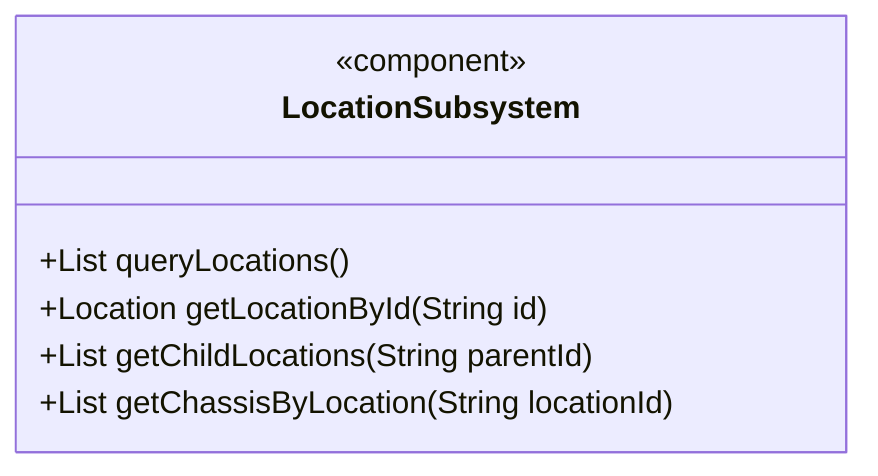
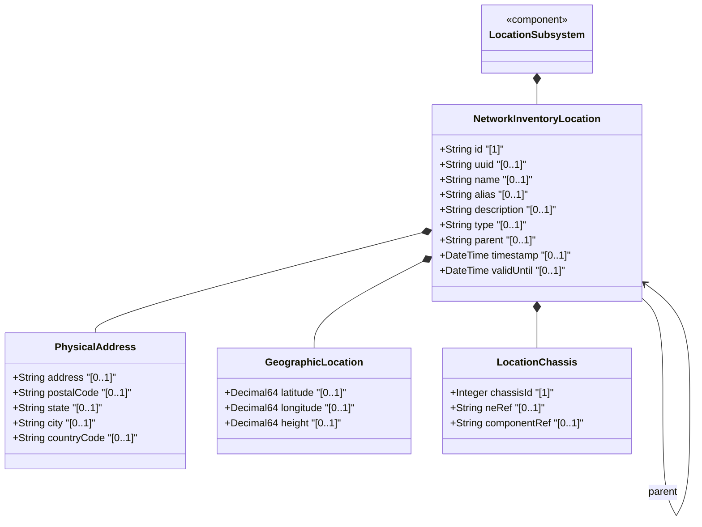
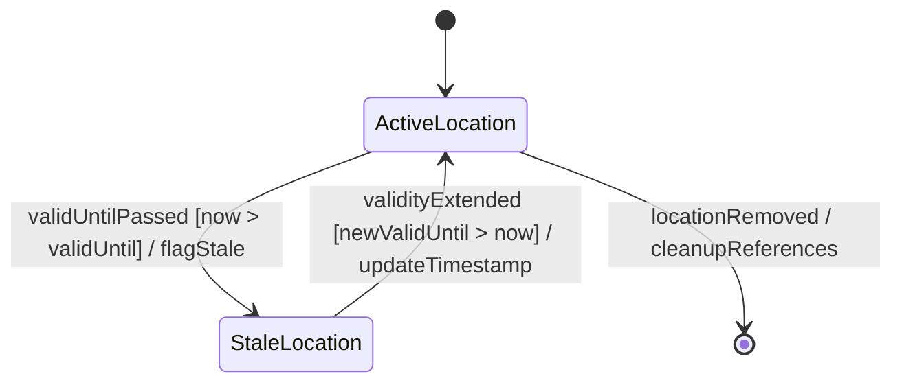

# Epic: Network Inventory Location — Location Hierarchy & Facilities

## 1. Context
This epic covers the hierarchical location model for network inventory as defined in `draft-ietf-ivy-network-inventory-location-06`, Section 2. It encompasses the core location entity with its hierarchical containment (parent-child relationships), physical postal address, geographic coordinate data via `ietf-geo-location` (RFC 9179), and direct (non-rack) chassis deployment at the location level. This provides the foundational spatial data structure for mapping network elements to physical places including sites, buildings, equipment rooms, floors, corridors, poles, and rooftops.

## 2. Requirements & Checklist
- [ ] #1 - [Network Inventory Location Entity](https://github.com/gintatkinson/3dgs-028/blob/main/docs/features/feat-01-ni-location-entity.md) (Core location list with id, type, parent hierarchy, and temporal validity — Section 2)
- [ ] #2 - [Physical Address for Network Inventory Locations](https://github.com/gintatkinson/3dgs-028/blob/main/docs/features/feat-02-physical-address.md) (Postal address sub-container for field dispatch readiness — Section 2)
- [ ] #3 - [Geographic Location for Network Inventory](https://github.com/gintatkinson/3dgs-028/blob/main/docs/features/feat-03-geographic-location.md) (Geographic coordinates via ietf-geo-location grouping — Section 2, RFC 9179)
- [ ] #4 - [Location-Level Chassis Container](https://github.com/gintatkinson/3dgs-028/blob/main/docs/features/feat-04-location-chassis.md) (Direct chassis deployment without rack — Appendix A.1, A.2)

### Associated Use Cases & User Stories

#### Associated Use Cases
- [ ] #28 - [Register and Manage Network Inventory Location Hierarchy](https://github.com/gintatkinson/3dgs-028/blob/main/docs/use-cases/uc-01-location-hierarchy.md) (Core location container hierarchy management)
- [ ] #30 - [Enrich Network Inventory Location with Physical Address and Geographic Coordinates](https://github.com/gintatkinson/3dgs-028/blob/main/docs/use-cases/uc-02-physical-address-enrichment.md) (Address and geo-location enrichment)
- [ ] #36 - [Deploy Chassis Equipment in Racks and Direct Locations](https://github.com/gintatkinson/3dgs-028/blob/main/docs/use-cases/uc-05-deploy-chassis.md) (Chassis placement across rack and direct-location deployments)
- [ ] #37 - [Validate Location Data Quality and Operational Readiness](https://github.com/gintatkinson/3dgs-028/blob/main/docs/use-cases/uc-06-validate-data-quality.md) (Cross-cutting data quality validation)

#### Associated User Stories
- [ ] #10 - [Query Network Inventory Location Hierarchy](https://github.com/gintatkinson/3dgs-028/blob/main/docs/user-stories/us-01-query-location-hierarchy.md) (Hierarchical traversal of location tree — Section 2, 6)
- [ ] #12 - [Validate Location for Field Dispatch Readiness](https://github.com/gintatkinson/3dgs-028/blob/main/docs/user-stories/us-02-validate-location-dispatch.md) (Operational readiness check for field dispatch — Section 6)
- [ ] #15 - [Handle Expired Location Data and Temporal Staleness](https://github.com/gintatkinson/3dgs-028/blob/main/docs/user-stories/us-03-expired-location-handling.md) (Temporal validity lifecycle of location records — Section 6)
- [ ] #23 - [Navigate Full Facility Topology from Site to Chassis](https://github.com/gintatkinson/3dgs-028/blob/main/docs/user-stories/us-07-navigate-facility-topology.md) (End-to-end topology navigation — Section 1, Appendix A)
- [ ] #24 - [Enforce Read-Only Access Control on Location Data](https://github.com/gintatkinson/3dgs-028/blob/main/docs/user-stories/us-08-enforce-access-control.md) (NACM-based security for location data — Section 7)
- [ ] #26 - [Map Distributed Multi-Chassis Network Elements Across Locations](https://github.com/gintatkinson/3dgs-028/blob/main/docs/user-stories/us-09-distributed-multi-chassis.md) (Multi-location chassis mapping — Appendix A.2)
- [ ] #27 - [Paginated Query of Large-Scale Location Inventories](https://github.com/gintatkinson/3dgs-028/blob/main/docs/user-stories/us-10-paginated-queries.md) (Pagination for large datasets — Section 6)

## 3. Architecture

### Subsystem Component Definition

### System-Level UML Class Diagram

## State Machine Definitions

### System State Machine Diagram

## 4. Operational Considerations
- Location data is read-only operational state (`config false`) maintained by the controller through automated tooling (RFID, geolocation services, manual entry)
- OSS systems consume location data via YANG retrieval operations (NETCONF, RESTCONF)
- The model supports brownfield migration from proprietary inventory OSS solutions; migration path is implementation-specific
- Data quality is indicated through timestamps and optional expiration times
- For large-scale inventories, RESTCONF/NETCONF pagination should be utilized

## 5. Security & Governance
- Sensitive data: physical addresses, geographic coordinates, facility structure descriptions
- Access control via NACM (RFC 8341) to restrict read access
- Secure transport required: NETCONF over SSH (RFC 6242), RESTCONF over TLS (RFC 8446) or QUIC (RFC 9000)
- Disclosure of location data may enable association of inventory identifiers with physical facilities and geographic coordinates

## Specification Context
> The "location" list is generalized to support a variety of geographic location, such as sites, rooms, buildings. A site represents a general geographic location to group a set of NEs and corresponding inventory components. A room is a facility, a space for network elements and other equipment with power supply systems, air conditioning system, etc. Locations can be nested to form a hierarchy. For example, buildings may be within a site, and a room may be within a building.

## 6. Source References
Structural Schema: [ietf-ni-location.yang](https://github.com/ietf-ivy-wg/network-inventory-location/blob/main/ietf-ni-location.yang) (Clause: grouping locations, container locations, list location)
Normative Specification: [draft-ietf-ivy-network-inventory-location-06](https://datatracker.ietf.org/doc/html/draft-ietf-ivy-network-inventory-location) (Section 2: Hierarchical Locations of Network Inventory, Appendix A)
