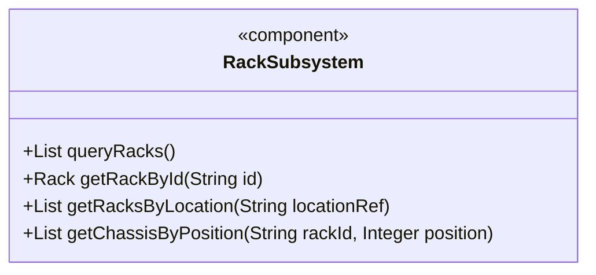
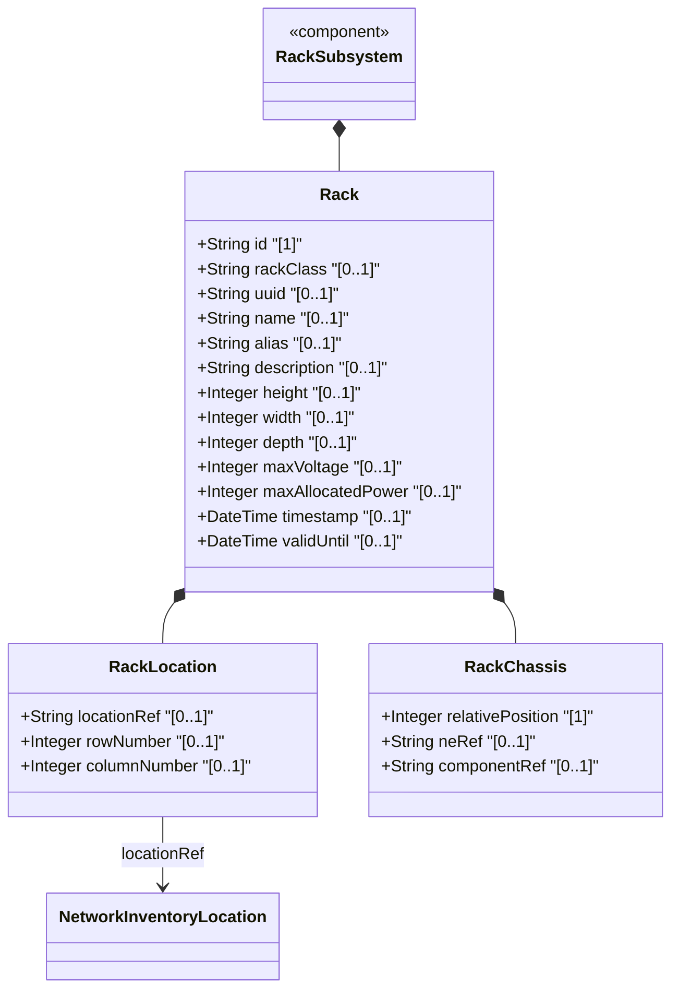
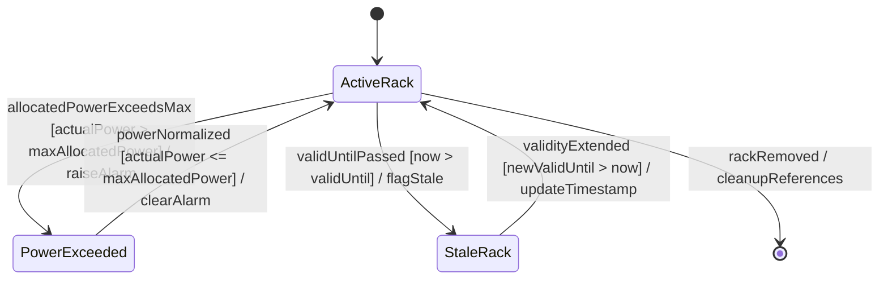

# Epic: Network Inventory Location — Rack Infrastructure

## 1. Context
This epic covers the rack infrastructure sub-model within the network inventory location system as defined in `draft-ietf-ivy-network-inventory-location-06`, Section 3. It encompasses the rack entity with its security classification hierarchy (standard, secure-baseline, secure-medium, secure-high), physical dimensions (height, width, depth in millimeters), electrical specifications (max-voltage, max-allocated-power), spatial placement within facilities (location reference, row, column), and rack-mounted equipment (chassis at specific U-slot positions). This enables precise physical and electrical capacity management of rack infrastructure.

## 2. Requirements & Checklist
- [ ] #5 - [Rack Entity for Network Inventory](https://github.com/gintatkinson/3dgs-028/blob/main/docs/features/feat-05-rack-entity.md) (Core rack entity with classification, dimensions, power specs, and temporal validity — Section 3)
- [ ] #6 - [Rack Placement within Network Inventory Location](https://github.com/gintatkinson/3dgs-028/blob/main/docs/features/feat-06-rack-placement.md) (Rack-to-location spatial assignment with row/column — Section 3)
- [ ] #7 - [Rack-Level Chassis Container](https://github.com/gintatkinson/3dgs-028/blob/main/docs/features/feat-07-rack-chassis.md) (Chassis with U-slot positions within racks — Section 3, Appendix A.2)

### Associated Use Cases & User Stories

#### Associated Use Cases
- [ ] #32 - [Deploy and Manage Equipment Racks in Network Facilities](https://github.com/gintatkinson/3dgs-028/blob/main/docs/use-cases/uc-03-deploy-equipment-rack.md) (Core rack container and rack entity lifecycle)
- [ ] #34 - [Assign and Locate Racks within Facility Rooms and Spaces](https://github.com/gintatkinson/3dgs-028/blob/main/docs/use-cases/uc-04-assign-rack-location.md) (Rack-to-location spatial assignment)
- [ ] #36 - [Deploy Chassis Equipment in Racks and Direct Locations](https://github.com/gintatkinson/3dgs-028/blob/main/docs/use-cases/uc-05-deploy-chassis.md) (Chassis placement across rack and direct-location deployments)
- [ ] #37 - [Validate Location Data Quality and Operational Readiness](https://github.com/gintatkinson/3dgs-028/blob/main/docs/use-cases/uc-06-validate-data-quality.md) (Cross-cutting data quality validation)

#### Associated User Stories
- [ ] #17 - [Query Rack Infrastructure Inventory](https://github.com/gintatkinson/3dgs-028/blob/main/docs/user-stories/us-04-query-rack-inventory.md) (Full rack inventory listing with filtering — Section 3)
- [ ] #18 - [Locate Racks by Facility or Location](https://github.com/gintatkinson/3dgs-028/blob/main/docs/user-stories/us-05-locate-racks-by-facility.md) (Spatial filtering of racks by location reference — Section 3, 6)
- [ ] #20 - [Calculate Rack Power and Spatial Capacity Utilization](https://github.com/gintatkinson/3dgs-028/blob/main/docs/user-stories/us-06-rack-capacity-calculations.md) (Electrical and spatial capacity calculations — Section 3)

## 3. Architecture

### Subsystem Component Definition

### System-Level UML Class Diagram

## State Machine Definitions

### System State Machine Diagram

## 4. Operational Considerations
- Rack data is read-only operational state (`config false`) maintained by the controller
- Rack dimensions (height, width, depth) represent the physical rack as described in Figure 2 of the specification
- Rack security classification uses an extensible identity hierarchy, allowing vendor/regional extensions
- Rack electrical specifications enable power capacity planning and circuit provisioning
- Multiple racks can be assigned to the same location
- Large inventories may benefit from paginated queries

## 5. Security & Governance
- Sensitive data: rack physical security classifications, facility layouts revealed through rack placement data, equipment density information
- Access control via NACM (RFC 8341) to restrict read access to rack attributes
- Secure transport required: NETCONF over SSH, RESTCONF over TLS/QUIC
- Disclosure of rack security classifications indicates physical protection levels

## Specification Context
> "racks" represent physical equipment racks in which NEs can be installed, which facilitate device maintenance. Through "rack-location", each rack can be assigned to a site or a specific location within a site, such as an equipment room. Each rack is assigned a unique ID and a name in the context of a facility. A rack may have some specific attributes, such as appearance-related attributes and electricity-related attributes.

## 6. Source References
Structural Schema: [ietf-ni-location.yang](https://github.com/ietf-ivy-wg/network-inventory-location/blob/main/ietf-ni-location.yang) (Clause: grouping racks, container racks, list rack, identities for rack-class-type)
Normative Specification: [draft-ietf-ivy-network-inventory-location-06](https://datatracker.ietf.org/doc/html/draft-ietf-ivy-network-inventory-location) (Section 3: Rack, Appendix A.2)
