# Feature: Geo-Location Root Container

## Parent Epic
- [ ] #7 - [Geo-Location Grouping](https://github.com/gintatkinson/3dgs-028/blob/main/docs/epics/epic-01-geo-location-grouping.md) (root container of the geo-location grouping; all child features are nested within this container)

## Description
Defines the root container for a geographic location entity on or around an astronomical object. This container is the entry point for all location data including frame of reference, coordinates, velocity, and temporal attributes. It serves as the top-level aggregator for the complete geo-location specification as defined in RFC 9179 and conforms to ISO 6709:2008. The root container directly contains the timestamp recording when the location was measured and an optional validity expiration timestamp.

## UML Class Diagram

```mermaid
classDiagram
    class GeoLocation {
        +String timestamp [0..1]
        -String validUntil [0..1]
        +getLocation(entityId: String) GeoLocation [1]
        +queryLocation(entityId: String) GeoLocation [1]
        +setCartesianLocation(x: Decimal64, y: Decimal64, z: Decimal64) Boolean [1]
        +getVelocity(entityId: String) VelocityVector [0..1]
        +checkExpiration(entityId: String) Boolean [1]
        +archiveExpiredData(entityId: String) Boolean [0..1]
        +getParentLocation(entityId: String) ReferenceFrame [0..1]
    }
    class ReferenceFrame {
        +String alternateSystem [0..1]
        +String astronomicalBody [0..1]
        +validateBody(astronomicalBody: String) Boolean [1]
        +validateDatum(geodeticDatum: String) Boolean [1]
    }
    class Location {
        <<choice>>
    }
    class VelocityVector {
        +Decimal64 vNorth [0..1]
        +Decimal64 vEast [0..1]
        +Decimal64 vUp [0..1]
    }
    class Datastore {
        +readGeoLocation(entityId: String) GeoLocation [0..1]
        +storeLocation(location: GeoLocation) Boolean [1]
        +readValidUntil(entityId: String) Timestamp [0..1]
        +storeReferenceFrame(frameData: ReferenceFrame) Boolean [1]
    }
    class SystemClock {
        +currentTime() Timestamp [1]
    }
    class NetworkManagementSystem {
        +queryLocation(entityId: String) GeoLocation [0..1]
    }
    class SystemAdministrator {
        +setReferenceFrame(body: String, datum: String) Boolean [1]
    }
    class LocationConsumer {
        +getLocation(entityId: String) GeoLocation [0..1]
    }
    class LocationAnalyticsSystem {
        +getVelocity(entityId: String) VelocityVector [0..1]
    }
    class NavigationSystem {
        +getVelocity(entityId: String) VelocityVector [0..1]
    }
    class FacilityManager {
        +resolveLocation(entityId: String) GeoLocation [0..1]
    }
    class LocationHierarchyResolver {
        +resolveLocation(entityId: String) GeoLocation [1]
    }
    class GeospatialApplication {
        +getLocation(entityId: String) Location [0..1]
        +setCartesianLocation(x: Decimal64, y: Decimal64, z: Decimal64) Boolean [1]
    }
    class CoordinateConverter {
        +toCartesian(lat: Decimal64, lon: Decimal64, h: Decimal64, datum: String) CartesianCoordinates [1]
    }
    class DataRetentionManager {
        +checkExpiration(entityId: String) Boolean [1]
        +archiveExpiredData(entityId: String) Boolean [0..1]
    }
    class VelocityCalculator {
        +computeSpeed(vNorth: Decimal64, vEast: Decimal64) Decimal64 [1]
    }
    class HeadingCalculator {
        +computeHeading(vNorth: Decimal64, vEast: Decimal64) Decimal64 [1]
    }
    class GeoLocationConfigurator {
        +setReferenceFrame(body: String, datum: String) Boolean [1]
    }
    GeoLocation *-- ReferenceFrame
    GeoLocation *-- Location
    GeoLocation *-- VelocityVector
    GeoLocation ..> Datastore : uses
    GeoLocation ..> SystemClock : uses
    Datastore ..> NetworkManagementSystem : serves
    Datastore ..> SystemAdministrator : serves
    Datastore ..> LocationConsumer : serves
    Datastore ..> LocationAnalyticsSystem : serves
    Datastore ..> NavigationSystem : serves
    Datastore ..> FacilityManager : serves
    Datastore ..> LocationHierarchyResolver : serves
    Datastore ..> GeospatialApplication : serves
    Datastore ..> CoordinateConverter : serves
    Datastore ..> DataRetentionManager : serves
    Datastore ..> VelocityCalculator : serves
    Datastore ..> HeadingCalculator : serves
    Datastore ..> GeoLocationConfigurator : serves
```


## Interface Requirements

### 1. Payload Schema
```json
{
  "geo-location": {
    "timestamp": "2022-02-11T12:00:00Z",
    "valid-until": "2023-02-11T12:00:00Z",
    "reference-frame": {
      "astronomical-body": "earth",
      "geodetic-system": {
        "geodetic-datum": "wgs-84"
      }
    },
    "latitude": 40.7128,
    "longitude": -74.0060
  }
}
```

### 2. Validation & Constraints
- `timestamp`: value of type `yang:date-and-time` (RFC 6991). The reference time when the location was recorded. Optional (leaf not mandatory).
- `valid-until`: value of type `yang:date-and-time` (RFC 6991). The timestamp for which this geo-location remains valid. Optional leaf. If unspecified, the geo-location has no specific expiration time. The temporal relationship `timestamp < valid-until` SHOULD hold when both are present.
- The root `geo-location` container itself has no mandatory children; all descendant leaves and containers are optional, allowing partial location specifications.

### 3. Logical Operations & Interface Messages
- **Create Location Record**: Write a new `geo-location` container instance via NETCONF edit-config or RESTCONF POST/PUT. The complete subtree including reference-frame, coordinates, velocity, and temporal attributes may be set.
- **Query Location Record**: Read the `geo-location` container via NETCONF get-config/get or RESTCONF GET to retrieve the current location state.
- **Update Location Record**: Modify specific sub-elements (e.g., update timestamp after re-measurement) via NETCONF edit-config (merge/replace) or RESTCONF PATCH.
- **Delete Location Record**: Remove the `geo-location` container via NETCONF edit-config (delete operation) or RESTCONF DELETE.

### 4. Logical Exception States & Validation Failures
- **Missing Timestamp**: When no timestamp is provided, the location data does not carry temporal context. Consumers must not assume freshness or recency.
- **Expired Validity**: When the current time exceeds `valid-until`, the location data is logically expired. Consumers SHOULD treat expired data with reduced confidence or request an update.
- **Invalid Timestamp Format**: A timestamp value that does not conform to `yang:date-and-time` lexical representation (YYYY-MM-DDTHH:MM:SS[.fraction][Z|(+|-)HH:MM]) must be rejected with a schema violation error.
- **Invalid Validity Period**: A `valid-until` value earlier than the corresponding `timestamp` is logically inconsistent and SHOULD be flagged by validation consumers.

## Given-When-Then Acceptance Criteria

### Scenario 1: Create location with timestamp
**Given** a geo-location entity is being created
**When** a valid `timestamp` value conforming to `yang:date-and-time` format is provided
**Then** the geo-location is successfully stored with the recorded timestamp

### Scenario 2: Create location without timestamp
**Given** a geo-location entity is being created
**When** no `timestamp` value is specified
**Then** the geo-location is successfully stored without temporal context and the timestamp field is absent

### Scenario 3: Set validity expiration
**Given** a geo-location entity with a recorded `timestamp`
**When** a `valid-until` value is provided that is chronologically after the `timestamp`
**Then** the geo-location stores the expiration time and consumers can determine data freshness

### Scenario 4: Location without validity expiration
**Given** a geo-location entity exists
**When** no `valid-until` value is specified
**Then** the geo-location has no specific expiration and is considered valid indefinitely until explicitly removed

### Scenario 5: Invalid timestamp format
**Given** a geo-location entity is being created or updated
**When** a `timestamp` value is provided that does not conform to the `yang:date-and-time` format (e.g., "not-a-date")
**Then** the operation is rejected with a data validation error indicating the timestamp format is invalid

### Scenario 6: Expired location data
**Given** a geo-location entity exists with `valid-until` set to a past timestamp
**When** a consumer reads the geo-location data
**Then** the consumer can detect the data is expired by comparing the current time against `valid-until`

### Scenario 7: Inverted temporal relationship
**Given** a geo-location entity is being created
**When** a `valid-until` value is provided that is chronologically before the `timestamp` value
**Then** the system SHOULD flag the inconsistency, though the schema does not enforce this constraint at the data-model level

## Specification Context (Verbatim)
From RFC 9179, Section 2.3:
"Support is added for objects in relatively stable motion. For objects in relatively stable motion, the grouping provides a three-dimensional vector value."

From RFC 9179, Section 2.6 (YANG tree):
"module: ietf-geo-location
   +-- geo-location
      +-- timestamp?         yang:date-and-time
      +-- valid-until?       yang:date-and-time"

From RFC 9179, YANG module:
"leaf timestamp { type yang:date-and-time; description 'Reference time when location was recorded.'; }"
"leaf valid-until { type yang:date-and-time; description 'The timestamp for which this geo-location is valid until. If unspecified, the geo-location has no specific expiration time.'; }"

## Source References
Structural Schema: [ietf-geo-location@2022-02-11.yang](https://github.com/YangModels/yang/blob/main/standard/ietf/RFC/ietf-geo-location%402022-02-11.yang) (Clause: container geo-location, leaves timestamp and valid-until)
Normative Specification: [RFC 9179: A YANG Grouping for Geographic Locations](https://datatracker.ietf.org/doc/rfc9179/) (Clause: Sections 2, 2.3, 2.6)

## Logical UI & Layout Bindings
- **Target LUI Component:** PropertyGrid
- **Target Layout Container ID:** properties_view
- **Data Source Bindings:** schema:ietf-geo-location/geo-location/timestamp, schema:ietf-geo-location/geo-location/valid-until
