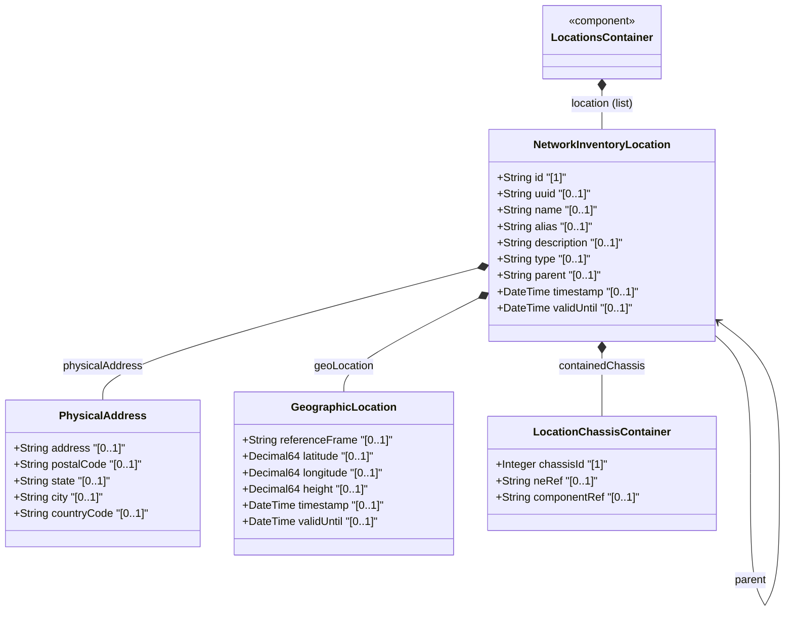

# Feature: Network Inventory Location Entity

## Parent Epic
- [ ] #8 - Network Inventory Location — Location Hierarchy & Facilities (https://github.com/gintatkinson/3dgs-028/blob/main/docs/epics/epic-01-location-hierarchy-facilities.md) (Core location entity with hierarchical containment)

## Description
Defines the core location entity within the network inventory. A location represents a physical place in a hierarchy (site, building, room, floor, corridor, etc.) where network elements and equipment are deployed. Each location has a unique identifier, a type classification, optional parent reference for hierarchy formation, and temporal validity markers.

## UML Class Diagram


## Interface Requirements

### 1. Payload Schema
```json
{
  "id": "Building-A",
  "uuid": "550e8400-e29b-41d4-a716-446655440001",
  "name": "Building A",
  "alias": "Bldg-A",
  "description": "Main office building",
  "type": "building",
  "parent": "Foo-Enterprise-Campus",
  "timestamp": "2026-01-15T08:30:00Z",
  "valid-until": "2030-12-31T23:59:59Z"
}
```

### 2. Validation & Constraints
- `id` (mandatory, key): type `string`, must be unique within the location list
- `uuid`: type `yang:uuid` via inherited `nwi:basic-common-entity-attributes`, optional
- `name`: type `string` via inherited `nwi:basic-common-entity-attributes`, optional
- `alias`: type `string` via inherited `nwi:basic-common-entity-attributes`, optional
- `description`: type `string` via inherited `nwi:basic-common-entity-attributes`, optional
- `type`: type `string`, optional; flexible operator-defined classification (e.g., "site", "building", "equipment room", "floor", "pole", "roof")
- `parent`: type `leafref` to `../../location/id`, optional; must reference an existing location id
- `timestamp`: type `yang:date-and-time`, optional; records when the location was captured
- `valid-until`: type `yang:date-and-time`, optional; expiration timestamp; if unspecified, location has no specific expiration time

### 3. Logical Operations & Interface Messages
- **GET /locations/location** — Retrieve location list (YANG NETCONF/RESTCONF)
- **GET /locations/location/{id}** — Retrieve specific location by id
- Location data is read-only operational state (`config false`); no create/update/delete via this model

### 4. Logical Exception States & Validation Failures
- **Invalid parent reference**: If `parent` leafref does not resolve to an existing location id, the reference is invalid and the hierarchy link is broken
- **Duplicate id**: Two locations with the same `id` value are invalid; the key constraint enforces uniqueness
- **Expired location**: If `valid-until` is present and has passed, the location MUST be considered stale

## Given-When-Then Acceptance Criteria
**Given** a network inventory with multiple physical sites, buildings, and rooms
**When** the management system queries the locations list via NETCONF/RESTCONF
**Then** a list of location entries is returned, each with a unique id, type, and optional parent reference forming a hierarchy

**Given** a location entry with a populated `type` field
**When** the system retrieves the location data
**Then** the type reflects the operator-defined classification (e.g., "site", "building", "room")

**Given** a location with a `parent` leafref pointing to another location id
**When** the parent id resolves to an existing location in the same list
**Then** the child-parent hierarchy relationship is established

**Given** a location with a `parent` leafref pointing to a non-existent location id
**When** the data is validated
**Then** the reference is invalid and the hierarchy link cannot be resolved

**Given** a location with a `valid-until` timestamp that is in the past
**When** an operational query checks the location validity
**Then** the location is considered stale and MUST NOT be used for operational purposes

**Given** a location without a `valid-until` timestamp
**When** the location is queried
**Then** the location has no specific expiration time and remains valid indefinitely

**Given** a location entity with `uuid`, `name`, `alias`, and `description` inherited from `nwi:basic-common-entity-attributes`
**When** the location is retrieved
**Then** all inherited attributes are available alongside location-specific attributes

**Given** a location with no `parent` specified
**When** the hierarchy is traversed
**Then** the location is a top-level location (root of its hierarchy tree)

## Specification Context (Verbatim)
> The "location" list is generalized to support a variety of geographic location, such as sites, rooms, buildings. A site represents a general geographic location to group a set of NEs and corresponding inventory components. NEs, racks, equipment rooms, and buildings can be grouped within a site. Locations can be nested to form a hierarchy. For example, buildings may be within a site, and a room may be within a building.

> The model is designed based on the controller maintaining authoritative location data through automated tooling, while OSS systems consume this data as read-only operational state. As this data is read-only, the controller does not support OSS modification of controller location records.

## Source References
Structural Schema: [ietf-ni-location.yang](https://github.com/ietf-ivy-wg/network-inventory-location/blob/main/ietf-ni-location.yang) (Clause: grouping locations > list location)
Normative Specification: [draft-ietf-ivy-network-inventory-location-06](https://datatracker.ietf.org/doc/html/draft-ietf-ivy-network-inventory-location) (Section 2: Hierarchical Locations of Network Inventory)

## Logical UI & Layout Bindings
- **Target LUI Component:** PropertyGrid
- **Target Layout Container ID:** properties_view
- **Data Source Bindings:** `nil:locations/location/id`, `nil:locations/location/type`, `nil:locations/location/parent`, `nil:locations/location/timestamp`, `nil:locations/location/valid-until`
