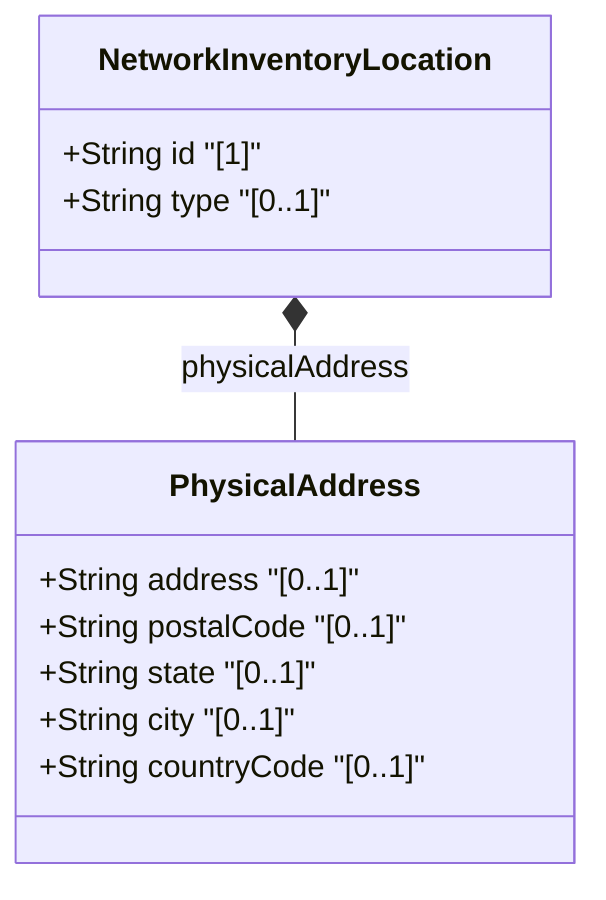

# Feature: Physical Address for Network Inventory Locations

## Parent Epic
- [ ] #8 - Network Inventory Location — Location Hierarchy & Facilities (https://github.com/gintatkinson/3dgs-028/blob/main/docs/epics/epic-01-location-hierarchy-facilities.md) (Physical postal address sub-container of location entity)

## Description
Captures the physical postal address of a network inventory location, including street address, postal code, state/region, city, and ISO ALPHA-2 country code. This sub-container enriches location records with human-readable address information for field dispatch and planning.

## UML Class Diagram


## Interface Requirements

### 1. Payload Schema
```json
{
  "physical-address": {
    "address": "123 Foo Street",
    "postal-code": "12345",
    "state": "Foo-State",
    "city": "Foo-City",
    "country-code": "ZZ"
  }
}
```

### 2. Validation & Constraints
- `address` (optional): type `string`; specifies an address (number and street)
- `postal-code` (optional): type `string`; specifies a postal code
- `state` (optional): type `string`; specifies a state; can also describe a region for countries without states
- `city` (optional): type `string`; specifies a city
- `country-code` (optional): type `string` with constraint `pattern '[A-Z]{2}'`; expressed as ISO ALPHA-2 code; must be exactly 2 uppercase ASCII letters

### 3. Logical Operations & Interface Messages
- **GET /locations/location/{id}/physical-address** — Retrieve physical address for a location
- Data is read-only operational state (`config false`)

### 4. Logical Exception States & Validation Failures
- **Invalid country code**: If `country-code` does not match pattern `[A-Z]{2}`, the value is invalid
- **Missing mandatory fields for dispatch**: Before using a location for field dispatch, verification is required to ensure at least one of physical-address or geo-location is present

## Given-When-Then Acceptance Criteria
**Given** a location with a physical address sub-container
**When** the management system retrieves the location data
**Then** the address, postal-code, state, city, and country-code fields are available

**Given** a country-code value of "US"
**When** the pattern validation `[A-Z]{2}` is applied
**Then** the value is accepted as a valid ISO ALPHA-2 country code

**Given** a country-code value of "usa"
**When** the pattern validation `[A-Z]{2}` is applied
**Then** the value is rejected because it contains lowercase letters and is longer than 2 characters

**Given** a country-code value of "U5"
**When** the pattern validation `[A-Z]{2}` is applied
**Then** the value is rejected because it contains a digit

**Given** a location with only a physical-address and no geo-location
**When** field dispatch validation is performed
**Then** the location is acceptable for dispatch (at least one of physical-address or geo-location present)

**Given** a location with neither physical-address nor geo-location populated
**When** field dispatch validation is performed
**Then** the location fails the verification check for dispatch readiness

**Given** a location in a country without states
**When** the state field is populated
**Then** the state field describes a region rather than a state

## Specification Context (Verbatim)
> Additionally, it includes provisions for physical addresses or geo-location data (geographic coordinates). Before using a location for field dispatch or planning, verification is required to ensure at least one of physical-address or geo-location is present, and that the valid-until leaf is either not present or indicates a future time.

## Source References
Structural Schema: [ietf-ni-location.yang](https://github.com/ietf-ivy-wg/network-inventory-location/blob/main/ietf-ni-location.yang) (Clause: grouping physical-address > container physical-address)
Normative Specification: [draft-ietf-ivy-network-inventory-location-06](https://datatracker.ietf.org/doc/html/draft-ietf-ivy-network-inventory-location) (Section 2: Hierarchical Locations of Network Inventory)

## Logical UI & Layout Bindings
- **Target LUI Component:** PropertyGrid
- **Target Layout Container ID:** properties_view
- **Data Source Bindings:** `nil:locations/location/physical-address/address`, `nil:locations/location/physical-address/postal-code`, `nil:locations/location/physical-address/state`, `nil:locations/location/physical-address/city`, `nil:locations/location/physical-address/country-code`
