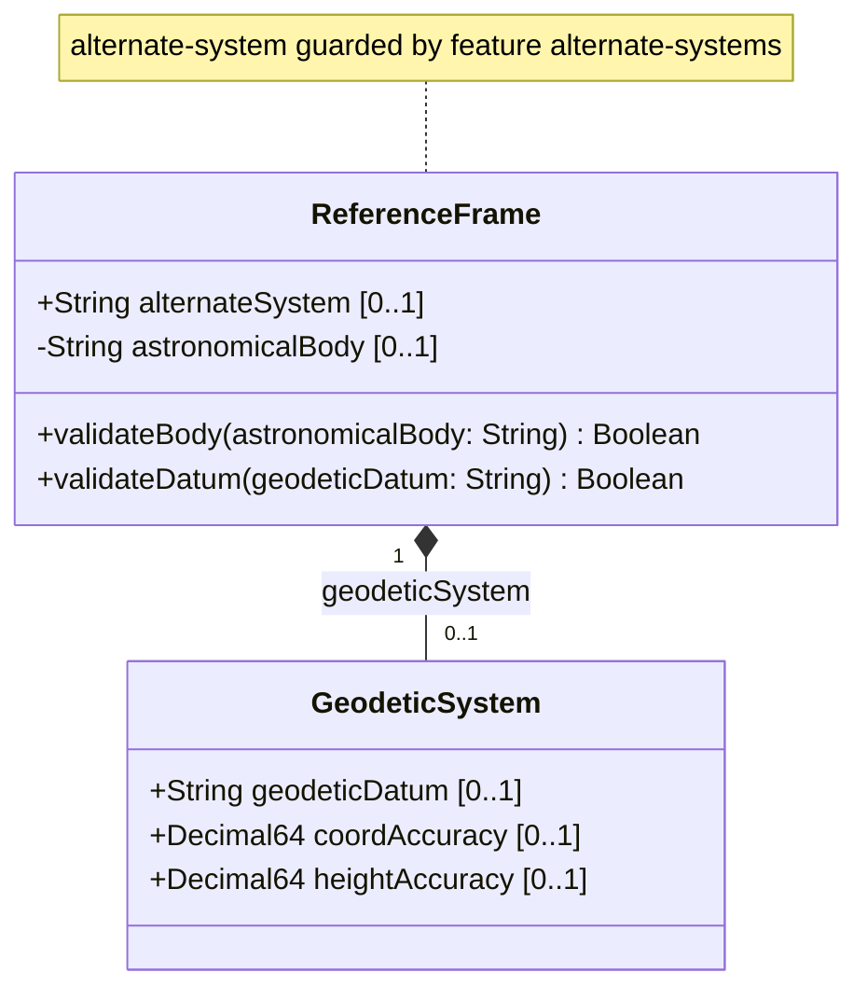

# Feature: Reference Frame

## Parent Epic
- [ ] #7 - [Geo-Location Grouping](https://github.com/gintatkinson/3dgs-028/blob/main/docs/epics/epic-01-geo-location-grouping.md) (the reference-frame container defines the coordinate system context for all location values)

## Description
Defines the frame of reference for geographical location values. This container specifies which astronomical body the location is relative to, with Earth as the default. It also supports an optional alternate system for non-standard reference frames such as virtual realities or simulations. The reference frame determines the meaning and precision of all location coordinates, the definition of 0-height, and the interpretation of latitude, longitude, and Cartesian values.

## UML Class Diagram


## Interface Requirements

### 1. Payload Schema
```json
{
  "reference-frame": {
    "alternate-system": null,
    "astronomical-body": "earth",
    "geodetic-system": {
      "geodetic-datum": "wgs-84",
      "coord-accuracy": 0.000001,
      "height-accuracy": 0.01
    }
  }
}
```

### 2. Validation & Constraints
- `alternate-system`: value of type `string`. Only present when the device supports the `alternate-systems` feature (conditional via YANG `if-feature`). When present, specifies the system in which the astronomical body and geodetic datum are defined. Normally absent (implying the natural universe). Modifies the definition but not the type of other reference-frame values.
- `astronomical-body`: value of type `string` constrained by pattern `[ -@\[-\^_-~]*` (ASCII characters 32-64 and 91-126). Default value is `"earth"`. Named by the International Astronomical Union (IAU) or according to the alternate system if specified. Uppercase SHOULD be converted to lowercase. Control characters not included. Examples include: `"sun"`, `"earth"`, `"moon"`, `"enceladus"`, `"ceres"`, `"67p/churyumov-gerasimenko"`. Any preceding 'the' in the name SHOULD NOT be included.

### 3. Logical Operations & Interface Messages
- **Read Reference Frame**: Query the `reference-frame` container to retrieve the current astronomical body, alternate system, and geodetic system values.
- **Write Reference Frame**: Set or update the `reference-frame` container with target astronomical body and geodetic datum values. The `alternate-system` leaf is only writable when `alternate-systems` feature is enabled.
- **Inherit Reference Frame**: When locations are nested (e.g., a building containing routers), the parent module may specify that the reference-frame is inherited from the containing object, avoiding repetition.

### 4. Logical Exception States & Validation Failures
- **Invalid Astronomical Body Pattern**: A value for `astronomical-body` containing characters outside the permitted ASCII range (control characters, characters > 126) must be rejected.
- **Alternate System Without Feature Support**: Attempting to set `alternate-system` on a device that does not support the `alternate-systems` feature must be rejected with a feature-not-supported error.
- **Missing Geodetic Datum**: When the geodetic datum is absent, the default implied by the astronomical body applies (e.g., `"wgs-84"` for Earth). Consumers should not assume a datum is present.
- **Empty Astronomical Body**: An empty string for `astronomical-body` is not rejected by the pattern constraint. Consumers should treat an empty value as unspecified or fall back to the default `"earth"`.

## Given-When-Then Acceptance Criteria

### Scenario 1: Default reference frame
**Given** a geo-location entity is being created
**When** no `reference-frame` values are explicitly specified
**Then** the astronomical body defaults to `"earth"` and the geodetic datum defaults to `"wgs-84"` per the schema defaults

### Scenario 2: Specify alternate astronomical body
**Given** a geo-location entity is being created on the Moon
**When** the `astronomical-body` is set to `"moon"`
**Then** the location data is associated with the lunar reference frame and the geodetic datum may be set to a Moon-appropriate value (e.g., `"me"` for Mean Earth/Polar Axis)

### Scenario 3: Specify alternate system (virtual reality)
**Given** a device supports the `alternate-systems` feature
**When** a `reference-frame` is created with `alternate-system` set to `"virtual-reality-1"` and `astronomical-body` set to `"mars"`
**Then** the location values are interpreted within the "virtual-reality-1" system for the Mars body

### Scenario 4: Attempt alternate system without feature support
**Given** a device does NOT support the `alternate-systems` feature
**When** an attempt is made to set the `alternate-system` leaf
**Then** the operation is rejected because the conditional leaf is not available per the `if-feature "alternate-systems"` guard

### Scenario 5: Invalid astronomical body characters
**Given** a geo-location entity is being created
**When** the `astronomical-body` is set to a value containing control characters (e.g., ASCII values 0-31 or 127)
**Then** the operation is rejected with a pattern validation error because the value violates the `[ -@\[-\^_-~]*` pattern constraint

### Scenario 6: Valid astronomical body with special characters
**Given** a geo-location entity is being created for a comet
**When** the `astronomical-body` is set to `"67p/churyumov-gerasimenko"`
**Then** the operation succeeds because forward slash and hyphen are within the permitted ASCII character range (32-64, 91-126)

### Scenario 7: Astronomical body case normalization
**Given** a geo-location entity is being created
**When** the `astronomical-body` is set to `"Earth"` (mixed case) or `"EARTH"` (uppercase)
**Then** the system SHOULD convert to lowercase `"earth"` per the schema description guidance

## Specification Context (Verbatim)
From RFC 9179, Section 2.1:
"The frame of reference ('reference-frame') defines what the location values refer to and their meaning. The referred-to object can be any astronomical body. It could be a planet such as Earth or Mars, a moon such as Enceladus, an asteroid such as Ceres, or even a comet such as 1P/Halley. This value is specified in 'astronomical-body' and is defined by the International Astronomical Union. The default 'astronomical-body' value is 'earth'."

"Finally, we define an optional feature that allows for changing the system for which the above values are defined. This optional feature adds an 'alternate-system' value to the reference frame. This value is normally not present, which implies the natural universe is the system. The use of this value is intended to allow for creating virtual realities or perhaps alternate coordinate systems."

## Source References
Structural Schema: [ietf-geo-location@2022-02-11.yang](https://github.com/YangModels/yang/blob/main/standard/ietf/RFC/ietf-geo-location%402022-02-11.yang) (Clause: container reference-frame, leaves alternate-system and astronomical-body)
Normative Specification: [RFC 9179: A YANG Grouping for Geographic Locations](https://datatracker.ietf.org/doc/rfc9179/) (Clause: Section 2.1)

## Logical UI & Layout Bindings
- **Target LUI Component:** PropertyGrid
- **Target Layout Container ID:** properties_view
- **Data Source Bindings:** schema:ietf-geo-location/geo-location/reference-frame/astronomical-body, schema:ietf-geo-location/geo-location/reference-frame/alternate-system
