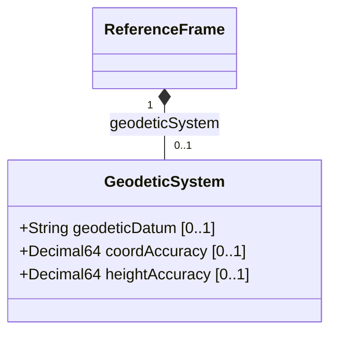

# Feature: Geodetic System

## Parent Epic
- [ ] #7 - [Geo-Location Grouping](https://github.com/gintatkinson/3dgs-028/blob/main/docs/epics/epic-01-geo-location-grouping.md) (the geodetic-system container defines the coordinate meaning and measurement accuracy for location data)

## Description
Defines the geodetic system of the location data, specifying which geodetic datum provides the meaning of latitude, longitude, and height. The geodetic datum determines how accurately the coordinate system models the astronomical body in question, both for horizontal coordinates and for height. This container also carries optional coordinate accuracy and height accuracy values that indicate the precision with which the location measurements were made. When specified, these accuracy values override the defaults implied by the geodetic datum itself.

## UML Class Diagram


## Interface Requirements

### 1. Payload Schema
```json
{
  "geodetic-system": {
    "geodetic-datum": "wgs-84",
    "coord-accuracy": 10.5,
    "height-accuracy": 3.2
  }
}
```

### 2. Validation & Constraints
- `geodetic-datum`: value of type `string` constrained by pattern `[ -@\[-\^_-~]*` (ASCII characters 32-64 and 91-126). Defines the meaning of latitude, longitude, and height. Default when the astronomical body is `"earth"` is `"wgs-84"` (World Geodetic System 1984, used by GPS). Uppercase SHOULD be converted to lowercase and spaces converted to dashes. The specification for the geodetic-datum indicates how accurately it models the astronomical body, both for horizontal and height coordinates.
- `coord-accuracy`: value of type `decimal64` with 6 fraction digits. Indicates the accuracy of the latitude/longitude pair for ellipsoidal coordinates, or the X/Y/Z components for Cartesian coordinates, relative to the coordinate system defined by the geodetic-datum. Unitless (implied meters). Optional leaf.
- `height-accuracy`: value of type `decimal64` with 6 fraction digits, unit is `"meters"`. Indicates the accuracy of the height value for ellipsoidal coordinates. Not used with Cartesian coordinates. Optional leaf. Represents how precisely heights have been determined with respect to the geodetic-datum coordinate system.

### 3. Logical Operations & Interface Messages
- **Read Geodetic System**: Query the `geodetic-system` container to retrieve the geodetic datum, coordinate accuracy, and height accuracy.
- **Write Geodetic System**: Set or update the geodetic datum and accuracy values. The geodetic-datum value should reference a registered value from the IANA "Geodetic System Values" registry (RFC 9179, Section 6.1).
- **Inherit from Parent**: In nested location hierarchies, the geodetic-system may be inherited from a parent container to avoid configuration repetition.

### 4. Logical Exception States & Validation Failures
- **Invalid Geodetic Datum Pattern**: A value for `geodetic-datum` containing characters outside the permitted ASCII range must be rejected with a pattern validation error.
- **Negative Accuracy Values**: A negative value for `coord-accuracy` or `height-accuracy` is logically nonsensical. While the decimal64 type does not enforce non-negative values, consumers SHOULD reject or warn on negative accuracy values.
- **Missing Geodetic Datum**: When the geodetic-datum is absent and the astronomical body is Earth, the effective default is `"wgs-84"`. For non-Earth bodies, the absence indicates no explicit datum specification and consumers must infer or require manual specification.
- **Height Accuracy on Cartesian Coordinates**: Setting `height-accuracy` when using Cartesian coordinates is ignored per the specification. Consumers should not rely on `height-accuracy` for Cartesian coordinate datasets.

## Given-When-Then Acceptance Criteria

### Scenario 1: Default geodetic datum for Earth
**Given** a geo-location entity is being created on Earth
**When** no `geodetic-datum` value is explicitly specified
**Then** the effective datum defaults to `"wgs-84"` per the schema description

### Scenario 2: Specify custom geodetic datum
**Given** a geo-location entity is being created on the Moon
**When** the `geodetic-datum` is set to `"me"` (Mean Earth/Polar Axis, registered in the IANA Geodetic System Values registry)
**Then** the location coordinates are interpreted using the lunar Mean Earth reference system

### Scenario 3: Specify coordinate accuracy
**Given** a geo-location entity is being created with experimental measurements
**When** the `coord-accuracy` is set to `10.5` (indicating uncertainty of approximately 10.5 meters for the latitude/longitude pair)
**Then** the accuracy value is stored and consumers can use it to assess the precision of the location data

### Scenario 4: Specify height accuracy
**Given** a geo-location entity with ellipsoidal coordinates is being created
**When** the `height-accuracy` is set to `3.2` meters
**Then** the height measurement precision is recorded and consumers can determine the vertical uncertainty

### Scenario 5: Invalid geodetic datum pattern
**Given** a geo-location entity is being created
**When** the `geodetic-datum` is set to a value containing control characters (ASCII 0-31)
**Then** the operation is rejected with a pattern validation error

### Scenario 6: Geodetic datum with space-to-dash conversion
**Given** a geo-location entity is being created
**When** the `geodetic-datum` is set to a value containing spaces (e.g., `"wgs 84"`)
**Then** the IANA registry rules mandate converting spaces to dashes, resulting in `"wgs-84"`. The YANG pattern does NOT directly enforce this, so the raw value may be stored.

### Scenario 7: Height accuracy ignored for Cartesian coordinates
**Given** a geo-location entity uses Cartesian coordinates (`x`, `y`, `z`)
**When** a `height-accuracy` value is provided
**Then** the value is stored but consumers SHOULD NOT use it for Cartesian coordinate interpretation per the schema description: "this value is not used with Cartesian coordinates"

## Specification Context (Verbatim)
From RFC 9179, Section 2.1:
"In addition to identifying the astronomical body, we also need to define the meaning of the coordinates (e.g., latitude and longitude) and the definition of 0-height. This is done with a 'geodetic-datum' value. The default value for 'geodetic-datum' is 'wgs-84' (i.e., the World Geodetic System [WGS84]), which is used by the Global Positioning System (GPS) among many others. We define an IANA registry for specifying standard values for the 'geodetic-datum'."

"In addition to the 'geodetic-datum' value, we allow overriding the coordinate and height accuracy using 'coord-accuracy' and 'height-accuracy', respectively. When specified, these values override the defaults implied by the 'geodetic-datum' value."

From RFC 9179, Section 6.1:
"IANA has created the 'Geodetic System Values' registry under the 'YANG Geographic Location Parameters' registry. This registry allocates names for standard geodetic systems. The values SHOULD use an acronym when available, they MUST be converted to lowercase, and spaces MUST be changed to dashes '-'."

## Source References
Structural Schema: [ietf-geo-location@2022-02-11.yang](https://github.com/YangModels/yang/blob/main/standard/ietf/RFC/ietf-geo-location%402022-02-11.yang) (Clause: container geodetic-system, leaves geodetic-datum, coord-accuracy, height-accuracy)
Normative Specification: [RFC 9179: A YANG Grouping for Geographic Locations](https://datatracker.ietf.org/doc/rfc9179/) (Clause: Sections 2.1, 6.1)

## Logical UI & Layout Bindings
- **Target LUI Component:** PropertyGrid
- **Target Layout Container ID:** properties_view
- **Data Source Bindings:** schema:ietf-geo-location/geo-location/reference-frame/geodetic-system/geodetic-datum, schema:ietf-geo-location/geo-location/reference-frame/geodetic-system/coord-accuracy, schema:ietf-geo-location/geo-location/reference-frame/geodetic-system/height-accuracy
