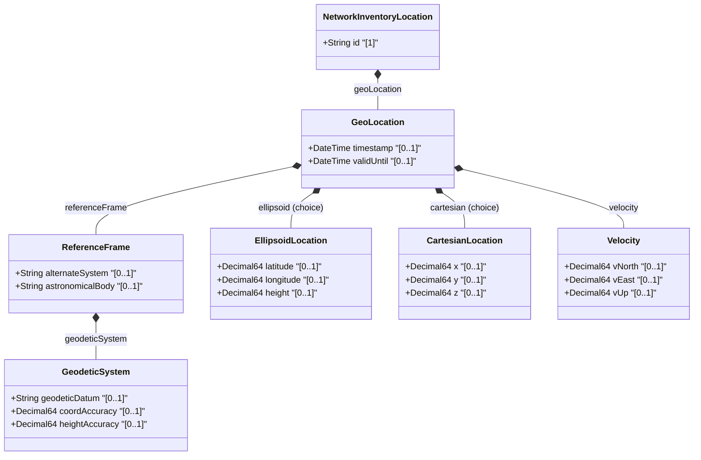

# Feature: Geographic Location for Network Inventory

## Parent Epic
- [ ] #8 - Network Inventory Location — Location Hierarchy & Facilities (https://github.com/gintatkinson/3dgs-028/blob/main/docs/epics/epic-01-location-hierarchy-facilities.md) (Geographic coordinate data via ietf-geo-location grouping)

## Description
Provides geographic coordinate data for network inventory locations using the `ietf-geo-location` grouping (RFC 9179). Supports both ellipsoid (latitude/longitude/height) and Cartesian (x/y/z) coordinate systems, geodetic reference frames, velocity data, and temporal validity markers. This sub-container enables precise physical positioning of network assets.

## UML Class Diagram


## Interface Requirements

### 1. Payload Schema
```json
{
  "geo-location": {
    "reference-frame": {
      "astronomical-body": "earth",
      "geodetic-system": {
        "geodetic-datum": "WGS-84",
        "coord-accuracy": 5.0,
        "height-accuracy": 10.0
      }
    },
    "ellipsoid": {
      "latitude": 40.7128,
      "longitude": -74.0060,
      "height": 15.0
    },
    "velocity": {
      "v-north": 0.0,
      "v-east": 0.0,
      "v-up": 0.0
    },
    "timestamp": "2026-01-15T08:30:00Z",
    "valid-until": "2030-12-31T23:59:59Z"
  }
}
```

### 2. Validation & Constraints
- `reference-frame/alternate-system`: type `string`, optional; conditional on `if-feature "alternate-systems"`
- `reference-frame/astronomical-body`: type `string`, optional; default is "earth"
- `geodetic-system/geodetic-datum`: type `string`, optional
- `geodetic-system/coord-accuracy`: type `decimal64`, optional
- `geodetic-system/height-accuracy`: type `decimal64`, optional
- `(location)` choice: exactly one of `ellipsoid` or `cartesian` may be present
  - `ellipsoid/latitude`: type `decimal64`, optional
  - `ellipsoid/longitude`: type `decimal64`, optional
  - `ellipsoid/height`: type `decimal64`, optional
  - `cartesian/x`: type `decimal64`, optional
  - `cartesian/y`: type `decimal64`, optional
  - `cartesian/z`: type `decimal64`, optional
- `velocity/v-north`: type `decimal64`, optional
- `velocity/v-east`: type `decimal64`, optional
- `velocity/v-up`: type `decimal64`, optional
- `geo-location/timestamp`: type `yang:date-and-time`, optional
- `geo-location/valid-until`: type `yang:date-and-time`, optional

### 3. Logical Operations & Interface Messages
- **GET /locations/location/{id}/geo-location** — Retrieve geographic location data for a location
- Data is read-only operational state (`config false`)

### 4. Logical Exception States & Validation Failures
- **Coordinate system conflict**: Both ellipsoid and cartesian coordinates present violates the `(location)` choice constraint
- **Invalid accuracy**: Negative coord-accuracy or height-accuracy values are semantically invalid
- **Transitional velocity on fixed asset**: v-north/v-east/v-up populated for a stationary location is permissible but indicates movement

## Given-When-Then Acceptance Criteria
**Given** a location with ellipsoid geographic coordinates
**When** the management system retrieves geo-location data
**Then** latitude, longitude, and optional height are returned within the ellipsoid sub-container

**Given** a location configured with Cartesian coordinates
**When** the system retrieves geo-location data
**Then** x, y, and z coordinates are returned within the cartesian sub-container

**Given** a geo-location with a reference-frame specifying WGS-84 datum and earth as astronomical-body
**When** the coordinate accuracy is 5.0 meters
**Then** the geodetic system metadata correctly qualifies the precision of the coordinates

**Given** both ellipsoid and cartesian coordinate data present in a single geo-location instance
**When** the choice validation is applied
**Then** the data is rejected because only one coordinate system variant may be present at a time

**Given** a geo-location with an expired valid-until timestamp
**When** operational validation is performed
**Then** the geo-location data is considered stale

**Given** a location with populated velocity data (v-north, v-east, v-up)
**When** the geo-location is queried
**Then** velocity vector data is available for moving assets

**Given** a location without alternate-systems feature enabled
**When** the geo-location reference-frame is queried
**Then** the alternate-system field is not present

## Specification Context (Verbatim)
> Additionally, it includes provisions for physical addresses or geo-location data (geographic coordinates). Sources of controller location data may include RFID tooling, geolocation services, as well as manual entry via controller interfaces. Data quality is indicated through timestamps recording the last update time, as well as an optional expiration time for location validity.

## Source References
Structural Schema: [ietf-ni-location.yang](https://github.com/ietf-ivy-wg/network-inventory-location/blob/main/ietf-ni-location.yang) (Clause: uses geo:geo-location within location list)
Normative Specification: [draft-ietf-ivy-network-inventory-location-06](https://datatracker.ietf.org/doc/html/draft-ietf-ivy-network-inventory-location) (Section 2)
External Reference: [RFC 9179](https://www.rfc-editor.org/rfc/rfc9179) — A YANG Grouping for Geographic Locations

## Logical UI & Layout Bindings
- **Target LUI Component:** PropertyGrid
- **Target Layout Container ID:** properties_view
- **Data Source Bindings:** `nil:locations/location/geo-location/reference-frame/astronomical-body`, `nil:locations/location/geo-location/reference-frame/geodetic-system/geodetic-datum`, `nil:locations/location/geo-location/ellipsoid/latitude`, `nil:locations/location/geo-location/ellipsoid/longitude`, `nil:locations/location/geo-location/ellipsoid/height`, `nil:locations/location/geo-location/timestamp`, `nil:locations/location/geo-location/valid-until`
