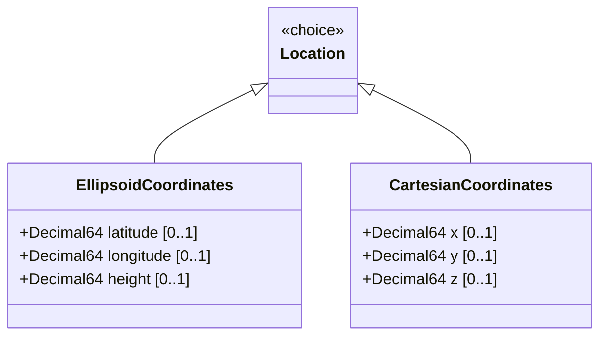

# Feature: Ellipsoid Coordinate System

## Parent Epic
- [ ] #7 - [Geo-Location Grouping](https://github.com/gintatkinson/3dgs-028/blob/main/docs/epics/epic-01-geo-location-grouping.md) (the ellipsoid case of the location choice provides latitude/longitude/height coordinate specification)

## Description
Defines the ellipsoidal (geodetic) coordinate representation for geographic location as one case of the `location` choice. This system uses two angular coordinates — latitude and longitude in decimal degrees — and an optional height in meters from a reference zero value. The exact definition and precision of these measurements is indicated by the parent reference-frame and geodetic-system. This coordinate system is commonly used for Earth-based positioning and conforms to ISO 6709:2008 standard representation of geographic point location by coordinates.

## UML Class Diagram


## Interface Requirements

### 1. Payload Schema
```json
{
  "location": {
    "latitude": 40.7128,
    "longitude": -74.0060,
    "height": 15.5
  }
}
```

### 2. Validation & Constraints
- `latitude`: value of type `decimal64` with 16 fraction digits. Unit is `"decimal degrees"`. Specifies the latitude value on the astronomical body. Range: -90.0 to +90.0 degrees for Earth; range for other astronomical bodies is defined by the reference-frame. The definition and precision of this measurement is indicated by the reference-frame. Optional leaf.
- `longitude`: value of type `decimal64` with 16 fraction digits. Unit is `"decimal degrees"`. Specifies the longitude value on the astronomical body. Range: -180.0 to +180.0 degrees for Earth. The definition and precision is indicated by the reference-frame. Optional leaf.
- `height`: value of type `decimal64` with 6 fraction digits. Unit is `"meters"`. Height from a reference zero value. The precision and zero value is defined by the reference-frame. Optional leaf.
- All three leaves within the `ellipsoid` case are optional. A complete location specification SHOULD include at least `latitude` and `longitude`.

### 3. Logical Operations & Interface Messages
- **Set Ellipsoid Coordinates**: Write the ellipsoid case of the location choice with latitude, longitude, and optionally height via NETCONF edit-config or RESTCONF PUT. The choice discriminator selects ellipsoid vs Cartesian based on which case leaves are populated.
- **Read Ellipsoid Coordinates**: Query the location choice to retrieve the current latitude, longitude, and height values.
- **Update Coordinates**: Modify individual coordinate values (e.g., update latitude after movement) via merge/replace operations.

### 4. Logical Exception States & Validation Failures
- **Latitude Out of Range for Earth**: A latitude value exceeding the [-90, +90] degree range for Earth-based locations. The decimal64 type does not enforce this range at the YANG type level; validation must be performed by the application or via a `must` constraint in the using module.
- **Longitude Out of Range for Earth**: A longitude value exceeding the [-180, +180] degree range for Earth-based locations. Application-level validation is required.
- **Mixed Coordinate Systems**: Attempting to provide both ellipsoid and Cartesian coordinates simultaneously within the same `location` choice. The YANG `choice` semantics allow only one case to be active at a time. Attempting both must be rejected.
- **Precision Underflow**: Values with more fractional digits than the defined limit (16 for latitude/longitude, 6 for height) are rounded or truncated according to decimal64 precision rules, potentially losing precision.

## Given-When-Then Acceptance Criteria

### Scenario 1: Set Earth location with latitude and longitude
**Given** a geo-location entity is being created for an Earth-based location
**When** `latitude` is set to `40.7128` decimal degrees and `longitude` is set to `-74.0060` decimal degrees
**Then** the ellipsoid case is selected and the coordinates are stored with full decimal64 precision (16 fraction digits)

### Scenario 2: Set location with height
**Given** a geo-location entity with latitude and longitude is being created
**When** a `height` of `15.5` meters is also provided
**Then** the 3D ellipsoid location is stored with all three components

### Scenario 3: Set location with high-precision latitude
**Given** a geo-location entity is being created with high-precision requirements
**When** `latitude` is set to `40.7128000000000001` (16 fraction digits of precision)
**Then** the latitude value is stored with full decimal64 precision without rounding at the schema level

### Scenario 4: Latitude out of Earth range
**Given** a geo-location entity is being created for an Earth-based context
**When** `latitude` is set to `95.0` degrees (exceeds the terrestrial maximum of 90.0)
**Then** the YANG schema does not enforce the range; application-level validation SHOULD reject or flag the out-of-range value

### Scenario 5: Attempt simultaneous ellipsoid and Cartesian coordinates
**Given** a geo-location entity is being configured
**When** both ellipsoid coordinate values (`latitude`, `longitude`) and Cartesian values (`x`, `y`, `z`) are provided simultaneously
**Then** the operation is rejected because the `choice` statement allows only one active case

### Scenario 6: Set location on non-Earth body
**Given** a geo-location entity is configured with `astronomical-body` set to `"mars"`
**When** ellipsoid coordinates are provided for the Martian surface
**Then** the coordinate range and interpretation is defined by the Martian reference frame, which may differ from Earth's [-90, +90] latitude range

### Scenario 7: Precision loss on height value
**Given** a geo-location entity stores a height value
**When** the height is specified with more than 6 fractional digits (e.g., `15.1234567`)
**Then** the decimal64 type truncates or rounds to 6 fraction digits per the `fraction-digits 6` constraint

## Specification Context (Verbatim)
From RFC 9179, Section 2.2:
"This is the location on, or relative to, the astronomical object. It is specified using two or three coordinate values. These values are given either as 'latitude', 'longitude', and an optional 'height', or as Cartesian coordinates of 'x', 'y', and 'z'. For the standard location choice, 'latitude' and 'longitude' are specified as decimal degrees, and the 'height' value is in fractions of meters. For the Cartesian choice, 'x', 'y', and 'z' are in fractions of meters. In both choices, the exact meanings of all the values are defined by the 'geodetic-datum' value in Section 2.1."

From RFC 9179, Section 4 (ISO 6709:2008 Conformance):
"For test 'A.1.2.4', the latitude/longitude values conform. For test 'A.1.2.5', the height value conforms."

## Source References
Structural Schema: [ietf-geo-location@2022-02-11.yang](https://github.com/YangModels/yang/blob/main/standard/ietf/RFC/ietf-geo-location%402022-02-11.yang) (Clause: choice location, case ellipsoid, leaves latitude, longitude, height)
Normative Specification: [RFC 9179: A YANG Grouping for Geographic Locations](https://datatracker.ietf.org/doc/rfc9179/) (Clause: Sections 2.2, 4)

## Logical UI & Layout Bindings
- **Target LUI Component:** PropertyGrid
- **Target Layout Container ID:** properties_view
- **Data Source Bindings:** schema:ietf-geo-location/geo-location/location/latitude, schema:ietf-geo-location/geo-location/location/longitude, schema:ietf-geo-location/geo-location/location/height
