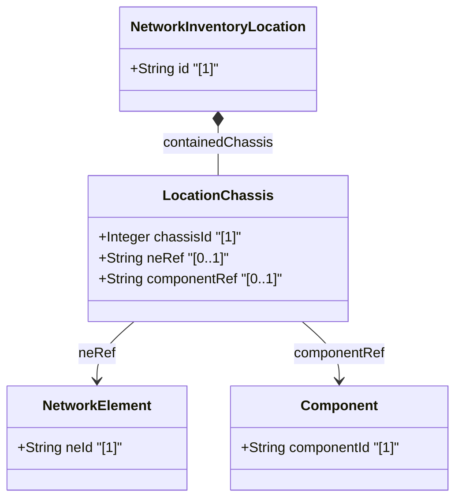

# Feature: Location-Level Chassis Container

## Parent Epic
- [ ] #8 - Network Inventory Location — Location Hierarchy & Facilities (https://github.com/gintatkinson/3dgs-028/blob/main/docs/epics/epic-01-location-hierarchy-facilities.md) (Direct chassis deployment within location)

## Description
Defines the list of chassis directly deployed at a location without rack enclosure. This covers edge deployment scenarios (e.g., ceiling-mounted access points) and distributed chassis components that are logically part of a network element but physically located at a specific site. Each entry references a network element and its specific component.

## UML Class Diagram


## Interface Requirements

### 1. Payload Schema
```json
{
  "contained-chassis": [
    {
      "chassis-id": 1,
      "ne-ref": "AP-Corridor-East-01",
      "component-ref": "chassis-1"
    }
  ]
}
```

### 2. Validation & Constraints
- `chassis-id` (mandatory, key): type `uint32`; unique identifier for this chassis instance within the location
- `ne-ref` (optional): type `leafref` to `/nwi:network-inventory/nwi:network-elements/nwi:network-element/nwi:ne-id`; references the network element this chassis belongs to
- `component-ref` (optional): type `leafref` to the specific component within the referenced network element; path is conditional on ne-ref resolution
- Multiple chassis entries may reference the same `ne-ref` for distributed multi-chassis systems

### 3. Logical Operations & Interface Messages
- **GET /locations/location/{id}/contained-chassis** — Retrieve chassis assigned to a location
- **GET /locations/location/{id}/contained-chassis/{chassis-id}** — Retrieve a specific chassis entry
- Data is read-only operational state (`config false`)

### 4. Logical Exception States & Validation Failures
- **Unresolved ne-ref**: If `ne-ref` points to a non-existent network element id, the reference is dangling
- **Unresolved component-ref**: If `component-ref` cannot be resolved within the referenced network element, the component association is broken
- **Duplicate chassis-id**: Two chassis entries with the same `chassis-id` in the same location violate the key constraint

## Given-When-Then Acceptance Criteria
**Given** a location with a ceiling-mounted access point
**When** the chassis list is queried
**Then** the chassis entry contains chassis-id, ne-ref pointing to the access point NE, and component-ref to the specific chassis component

**Given** a distributed multi-chassis network element spanning multiple locations
**When** each location's contained-chassis list is inspected
**Then** each location entry references the same ne-ref but different component-ref values

**Given** a valid ne-ref that resolves to an existing network element
**When** component-ref is validated against that network element's components
**Then** the component association is resolved successfully

**Given** an ne-ref pointing to a deleted or non-existent network element
**When** the reference is dereferenced
**Then** the chassis entry has a dangling ne-ref and the association cannot be resolved

**Given** a location with no directly deployed chassis
**When** the contained-chassis list is queried
**Then** an empty list is returned

**Given** duplicate chassis-id values within the same location
**When** the key constraint is validated
**Then** the data is rejected because chassis-id must be unique per location

## Specification Context (Verbatim)
> Chassis directly deployed in this location without rack. Also used for distributed chassis components that are logically part of a network element but physically located. Multiple chassis entries may reference the same ne-ref for distributed systems.

## Source References
Structural Schema: [ietf-ni-location.yang](https://github.com/ietf-ivy-wg/network-inventory-location/blob/main/ietf-ni-location.yang) (Clause: list contained-chassis within location)
Normative Specification: [draft-ietf-ivy-network-inventory-location-06](https://datatracker.ietf.org/doc/html/draft-ietf-ivy-network-inventory-location) (Appendix A.1: Non-Rack Deployment: Access Point, Appendix A.2: Distributed Multi-Chassis Network Element)

## Logical UI & Layout Bindings
- **Target LUI Component:** TableView
- **Target Layout Container ID:** components_table
- **Data Source Bindings:** `nil:locations/location/contained-chassis/chassis-id`, `nil:locations/location/contained-chassis/ne-ref`, `nil:locations/location/contained-chassis/component-ref`
