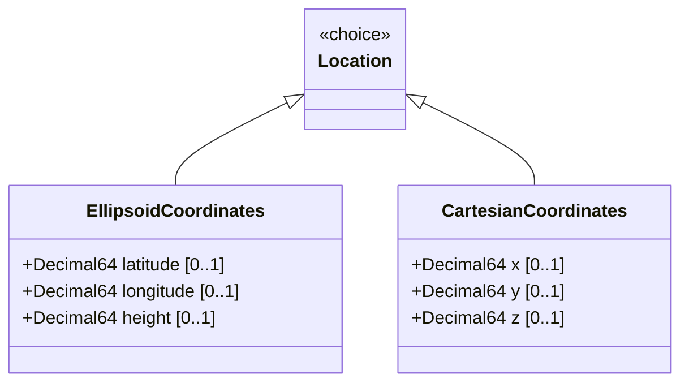

# Feature: Cartesian Coordinate System

## Parent Epic
- [ ] #7 - [Geo-Location Grouping](https://github.com/gintatkinson/3dgs-028/blob/main/docs/epics/epic-01-geo-location-grouping.md) (the cartesian case of the location choice provides X/Y/Z Cartesian coordinate specification)

## Description
Defines the Cartesian coordinate representation for geographic location as the alternative case of the `location` choice. This system uses three orthogonal spatial components — X, Y, and Z in fractional meters — whose axes and origin are defined by the parent reference-frame and geodetic-system. The Cartesian system provides an alternative to the ellipsoidal (latitude/longitude/height) representation for applications that require rectilinear coordinate semantics. The choice mechanism ensures that a location uses either ellipsoid or Cartesian coordinates, never both simultaneously.

## UML Class Diagram


## Interface Requirements

### 1. Payload Schema
```json
{
  "location": {
    "x": 1285123.456789,
    "y": -4596123.012345,
    "z": 4089123.654321
  }
}
```

### 2. Validation & Constraints
- `x`: value of type `decimal64` with 6 fraction digits. Unit is `"meters"`. Specifies the X-coordinate value as defined by the reference-frame. Optional leaf.
- `y`: value of type `decimal64` with 6 fraction digits. Unit is `"meters"`. Specifies the Y-coordinate value as defined by the reference-frame. Optional leaf.
- `z`: value of type `decimal64` with 6 fraction digits. Unit is `"meters"`. Specifies the Z-coordinate value as defined by the reference-frame. Optional leaf.
- All three leaves within the `cartesian` case are optional. A complete Cartesian specification SHOULD include all three components.
- The `height-accuracy` leaf from the geodetic-system is not used with Cartesian coordinates per the schema description.

### 3. Logical Operations & Interface Messages
- **Set Cartesian Coordinates**: Write the cartesian case of the location choice with x, y, z values via NETCONF edit-config or RESTCONF PUT. The choice discriminator selects Cartesian vs ellipsoid based on which case leaves are populated.
- **Read Cartesian Coordinates**: Query the location choice to retrieve the current x, y, and z values.
- **Update Coordinates**: Modify individual coordinate values via merge/replace operations.
- **Convert from Ellipsoid**: Application-level transformation from latitude/longitude/height to Cartesian x/y/z using the geodetic datum formulas. This is an application-level operation, not enforced by the schema.

### 4. Logical Exception States & Validation Failures
- **Incomplete Cartesian Specification**: Providing only one or two of the three Cartesian components. The schema allows this but applications SHOULD require all three for a well-defined Cartesian location.
- **Simultaneous Coordinate Systems**: Attempting to provide both Cartesian and ellipsoid coordinates simultaneously within the same `location` choice. The YANG `choice` semantics reject this.
- **Precision Underflow**: Cartesian values with more than 6 fractional digits are truncated or rounded according to `decimal64` precision rules.
- **Axis Ambiguity**: Without a well-defined reference-frame, the meaning of X, Y, Z axes is undefined. Applications should ensure the reference-frame is properly configured before interpreting Cartesian coordinates.

## Given-When-Then Acceptance Criteria

### Scenario 1: Set Earth-centered Cartesian coordinates
**Given** a geo-location entity is being created with an Earth-based reference frame
**When** Cartesian `x`, `y`, and `z` coordinates are set to Earth-Centered Earth-Fixed (ECEF) values in meters
**Then** the Cartesian case is selected and the 3D position is stored with 6-fraction-digit precision

### Scenario 2: Set Cartesian coordinates on non-Earth body
**Given** a geo-location entity is configured with `astronomical-body` set to `"moon"` and geodetic-datum set to `"me"`
**When** Cartesian coordinates are provided for the lunar surface
**Then** the axis meaning is defined by the lunar Mean Earth reference system

### Scenario 3: Set partial Cartesian coordinates
**Given** a geo-location entity is being created
**When** only `x` and `y` coordinates are provided without `z`
**Then** the location is stored with a 2D Cartesian position (Z component is absent)

### Scenario 4: Attempt simultaneous Cartesian and ellipsoid coordinates
**Given** a geo-location entity is being configured
**When** both Cartesian (`x`, `y`, `z`) and ellipsoid (`latitude`, `longitude`) values are provided simultaneously
**Then** the operation is rejected because the YANG `choice` statement permits only one active case

### Scenario 5: Precision bound on large Cartesian values
**Given** a geo-location entity stores Cartesian coordinates with large integer parts
**When** the `x` value approaches the maximum representable range for `decimal64` with 6 fraction digits
**Then** the value is stored accurately within the decimal64 representable range; values exceeding the range are rejected

### Scenario 6: Height-accuracy is ignored for Cartesian coordinates
**Given** a geo-location entity uses Cartesian coordinates
**When** the `height-accuracy` leaf in the geodetic-system is set to a non-zero value
**Then** the height-accuracy value is stored but must not be applied to Cartesian coordinate interpretation per the schema description

## Specification Context (Verbatim)
From RFC 9179, Section 2.2:
"This is the location on, or relative to, the astronomical object. It is specified using two or three coordinate values. These values are given either as 'latitude', 'longitude', and an optional 'height', or as Cartesian coordinates of 'x', 'y', and 'z'. For the Cartesian choice, 'x', 'y', and 'z' are in fractions of meters. In both choices, the exact meanings of all the values are defined by the 'geodetic-datum' value in Section 2.1."

From the YANG schema:
"leaf x { type decimal64 { fraction-digits 6; } units 'meters'; description 'The X value as defined by the reference-frame.'; }"
"leaf y { type decimal64 { fraction-digits 6; } units 'meters'; description 'The Y value as defined by the reference-frame.'; }"
"leaf z { type decimal64 { fraction-digits 6; } units 'meters'; description 'The Z value as defined by the reference-frame.'; }"

## Source References
Structural Schema: [ietf-geo-location@2022-02-11.yang](https://github.com/YangModels/yang/blob/main/standard/ietf/RFC/ietf-geo-location%402022-02-11.yang) (Clause: choice location, case cartesian, leaves x, y, z)
Normative Specification: [RFC 9179: A YANG Grouping for Geographic Locations](https://datatracker.ietf.org/doc/rfc9179/) (Clause: Sections 2.2, 4)

## Logical UI & Layout Bindings
- **Target LUI Component:** PropertyGrid
- **Target Layout Container ID:** properties_view
- **Data Source Bindings:** schema:ietf-geo-location/geo-location/location/x, schema:ietf-geo-location/geo-location/location/y, schema:ietf-geo-location/geo-location/location/z
