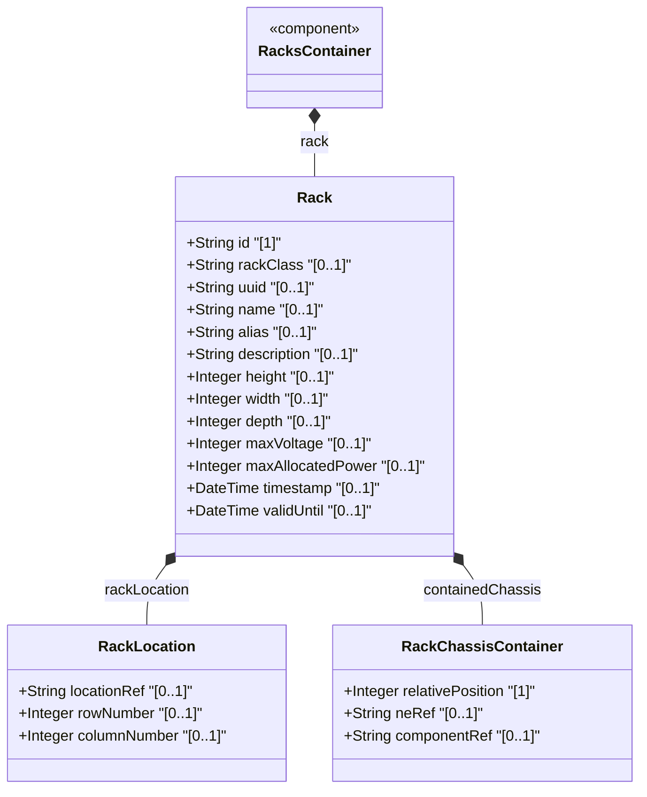

# Feature: Rack Entity for Network Inventory

## Parent Epic
- [ ] #9 - Network Inventory Location — Rack Infrastructure (https://github.com/gintatkinson/3dgs-028/blob/main/docs/epics/epic-02-rack-infrastructure.md) (Core rack entity within rack infrastructure)

## Description
Defines the rack entity — a physical equipment rack in which network elements are installed. Each rack has a unique id, security classification (via extensible identity hierarchy), dimensional attributes (height, width, depth in millimeters), electrical specifications (max-voltage in volts, max-allocated-power in watts), and temporal validity markers. Racks are contained within the locations structure and facilitate device maintenance.

## UML Class Diagram


## Interface Requirements

### 1. Payload Schema
```json
{
  "rack": {
    "id": "Rack-101-A",
    "rack-class": "rack-secure-baseline",
    "uuid": "660e8400-e29b-41d4-a716-446655440010",
    "name": "Rack A Room 101",
    "height": 2200,
    "width": 600,
    "depth": 1200,
    "max-voltage": 240,
    "max-allocated-power": 8000,
    "timestamp": "2026-01-15T10:00:00Z",
    "valid-until": "2028-01-15T10:00:00Z"
  }
}
```

### 2. Validation & Constraints
- `id` (mandatory, key): type `string`; uniquely identifies the rack
- `rack-class` (optional): type `identityref` with base `rack-class-type`; values: `rack-standard`, `rack-secure-baseline`, `rack-secure-medium`, `rack-secure-high`
- `uuid`: type `yang:uuid` via inherited `nwi:basic-common-entity-attributes`, optional
- `name`: type `string` via inherited `nwi:basic-common-entity-attributes`, optional
- `alias`: type `string` via inherited `nwi:basic-common-entity-attributes`, optional
- `description`: type `string` via inherited `nwi:basic-common-entity-attributes`, optional
- `height` (optional): type `uint16`, units `millimeter`; rack height, range 0..65535
- `width` (optional): type `uint16`, units `millimeter`; rack width, range 0..65535
- `depth` (optional): type `uint16`, units `millimeter`; rack depth, range 0..65535
- `max-voltage` (optional): type `uint16`, units `volt`; maximum voltage supported by the rack, range 0..65535
- `max-allocated-power` (optional): type `uint16`, units `watts`; maximum allocated power for the rack, range 0..65535
- `timestamp` (optional): type `yang:date-and-time`; records when rack information was captured
- `valid-until` (optional): type `yang:date-and-time`; expiration timestamp; if unspecified, rack has no specific expiration time

### 3. Logical Operations & Interface Messages
- **GET /locations/racks/rack** — Retrieve rack list (YANG NETCONF/RESTCONF)
- **GET /locations/racks/rack/{id}** — Retrieve specific rack by id
- Data is read-only operational state (`config false`)

### 4. Logical Exception States & Validation Failures
- **Invalid rack-class**: If the identityref value does not derive from `rack-class-type`, the classification is invalid
- **Zero or negative dimensions**: Height, width, or depth of 0 are semantically invalid for a physical rack
- **Duplicate id**: Two racks with the same `id` value violate the key constraint
- **Expired rack**: If `valid-until` is present and has passed, the rack data is considered stale

## Given-When-Then Acceptance Criteria
**Given** a rack entity with id "Rack-101-A"
**When** the management system queries the rack list
**Then** the rack is returned with its identifier, physical dimensions, and classification

**Given** a rack with rack-class set to "rack-secure-high"
**When** the rack classification is retrieved
**Then** the system indicates the rack has high security classification

**Given** a rack with height 2200mm, width 600mm, and depth 1200mm
**When** the dimensional attributes are queried
**Then** all three dimensions are returned with their millimeter unit values

**Given** a rack with max-voltage of 240V and max-allocated-power of 8000W
**When** the electrical specifications are retrieved
**Then** the power capacity and voltage limits are available for capacity planning

**Given** a rack with valid-until timestamp that is in the past
**When** operational validation is performed
**Then** the rack data is considered stale and MUST NOT be used for operational purposes

**Given** a rack with uuid, name, alias, and description inherited from basic-common-entity-attributes
**When** the rack is retrieved
**Then** all inherited attributes are available alongside rack-specific attributes

**Given** a rack identityref value not deriving from rack-class-type
**When** validation is applied
**Then** the classification is rejected as invalid

## Specification Context (Verbatim)
> "racks" represent physical equipment racks in which NEs can be installed, which facilitate device maintenance. Through "rack-location", each rack can be assigned to a site or a specific location within a site, such as an equipment room. Each rack is assigned a unique ID and a name in the context of a facility, e.g. a site. A rack may have some specific attributes, such as appearance-related attributes and electricity-related attributes.

## Source References
Structural Schema: [ietf-ni-location.yang](https://github.com/ietf-ivy-wg/network-inventory-location/blob/main/ietf-ni-location.yang) (Clause: grouping racks > list rack)
Normative Specification: [draft-ietf-ivy-network-inventory-location-06](https://datatracker.ietf.org/doc/html/draft-ietf-ivy-network-inventory-location) (Section 3: Rack)

## Logical UI & Layout Bindings
- **Target LUI Component:** PropertyGrid
- **Target Layout Container ID:** properties_view
- **Data Source Bindings:** `nil:locations/racks/rack/id`, `nil:locations/racks/rack/rack-class`, `nil:locations/racks/rack/height`, `nil:locations/racks/rack/width`, `nil:locations/racks/rack/depth`, `nil:locations/racks/rack/max-voltage`, `nil:locations/racks/rack/max-allocated-power`, `nil:locations/racks/rack/timestamp`, `nil:locations/racks/rack/valid-until`
