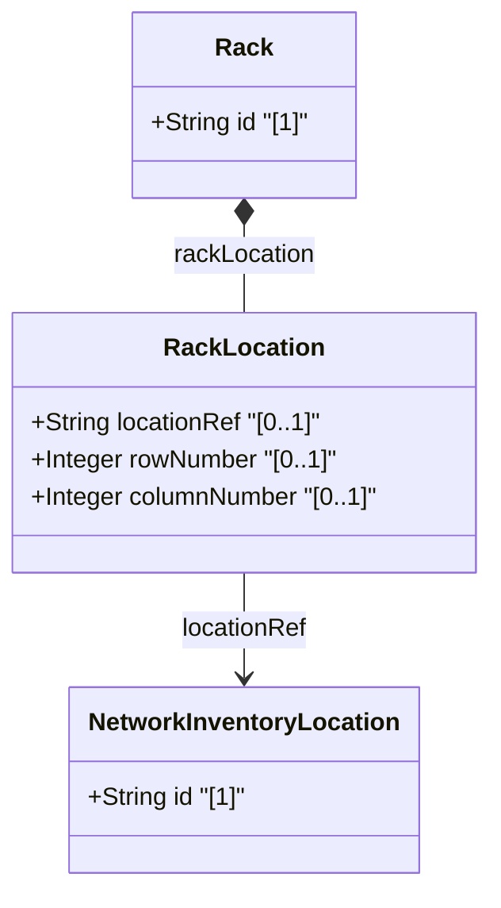

# Feature: Rack Placement within Network Inventory Location

## Parent Epic
- [ ] #9 - Network Inventory Location — Rack Infrastructure (https://github.com/gintatkinson/3dgs-028/blob/main/docs/epics/epic-02-rack-infrastructure.md) (Rack-to-location spatial assignment)

## Description
Defines the placement of a rack within a network inventory location. Each rack is assigned to a specific location via a leafref, and its position within that location is described by row and column numbers. This enables precise physical spatial mapping of rack infrastructure within equipment rooms and facilities.

## UML Class Diagram


## Interface Requirements

### 1. Payload Schema
```json
{
  "rack-location": {
    "location-ref": "Room-101",
    "row-number": 1,
    "column-number": 1
  }
}
```

### 2. Validation & Constraints
- `location-ref` (optional): type `ni-location-ref` — leafref to `/nwi:network-inventory/nil:locations/nil:location/nil:id`; must reference an existing location id
- `row-number` (optional): type `uint32`; identifies the row within the location where the rack is located, range 0..4294967295
- `column-number` (optional): type `uint32`; identifies the column within the location where the rack is located, range 0..4294967295

### 3. Logical Operations & Interface Messages
- **GET /locations/racks/rack/{id}/rack-location** — Retrieve rack placement data
- Data is read-only operational state (`config false`)
- The `ni-location-ref` typedef enforces referential integrity to the location list

### 4. Logical Exception States & Validation Failures
- **Dangling location-ref**: If `location-ref` points to a deleted or non-existent location id, the reference is broken
- **Unspecified location-ref**: A rack without a location-ref has no spatial assignment, which may indicate data quality gap

## Given-When-Then Acceptance Criteria
**Given** a rack "Rack-101-A" placed in location "Room-101" at row 1, column 1
**When** the rack-location sub-container is retrieved
**Then** the location-ref resolves to "Room-101" with row-number 1 and column-number 1

**Given** a location-ref pointing to a deleted location
**When** the reference is dereferenced
**Then** the rack has a dangling location reference and cannot be spatially mapped

**Given** a rack-location with row-number and column-number both set to 0
**When** the placement data is retrieved
**Then** the row and column coordinates are returned as valid uint32 values

**Given** a rack with no rack-location container populated
**When** the rack is queried
**Then** the rack has no assigned facility location

**Given** multiple racks placed in the same location
**When** location queries filter by location-ref
**Then** all racks associated with that location are returned

## Specification Context (Verbatim)
> Through "rack-location", each rack can be assigned to a site or a specific location within a site, such as an equipment room. The location information of the rack, which comprises the location reference, row number, and column number.

## Source References
Structural Schema: [ietf-ni-location.yang](https://github.com/ietf-ivy-wg/network-inventory-location/blob/main/ietf-ni-location.yang) (Clause: container rack-location within rack)
Normative Specification: [draft-ietf-ivy-network-inventory-location-06](https://datatracker.ietf.org/doc/html/draft-ietf-ivy-network-inventory-location) (Section 3: Rack)

## Logical UI & Layout Bindings
- **Target LUI Component:** PropertyGrid
- **Target Layout Container ID:** properties_view
- **Data Source Bindings:** `nil:locations/racks/rack/rack-location/location-ref`, `nil:locations/racks/rack/rack-location/row-number`, `nil:locations/racks/rack/rack-location/column-number`
