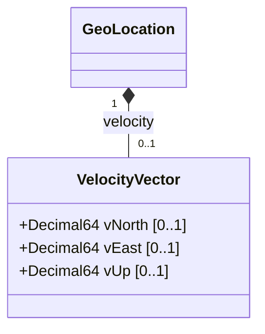

# Feature: Velocity Vector

## Parent Epic
- [ ] #7 - [Geo-Location Grouping](https://github.com/gintatkinson/3dgs-028/blob/main/docs/epics/epic-01-geo-location-grouping.md) (the velocity container defines the 3D velocity vector for objects in motion)

## Description
Defines a three-dimensional velocity vector for objects in relatively stable motion. The vector is composed of three orthogonal components: `v-north` (rate of change towards true north), `v-east` (rate of change perpendicular to the right of true north), and `v-up` (rate of change away from the center of mass). All components are specified in fractional meters per second. This velocity vector supports applications that need to track moving objects, including very slow movement such as continental drift. From the vector components, derived quantities such as two-dimensional speed and heading can be computed using standard trigonometric formulas defined in RFC 9179, Section 2.3.

## UML Class Diagram


## Interface Requirements

### 1. Payload Schema
```json
{
  "velocity": {
    "v-north": 2.5,
    "v-east": -1.0,
    "v-up": 0.1
  }
}
```

### 2. Validation & Constraints
- `v-north`: value of type `decimal64` with 12 fraction digits. Unit is `"meters per second"`. Rate of change (speed) towards true north as defined by the geodetic-system. Optional leaf.
- `v-east`: value of type `decimal64` with 12 fraction digits. Unit is `"meters per second"`. Rate of change (speed) perpendicular to the right of true north as defined by the geodetic-system. Optional leaf.
- `v-up`: value of type `decimal64` with 12 fraction digits. Unit is `"meters per second"`. Rate of change (speed) away from the center of mass. Optional leaf.
- Derived speed value: `speed = sqrt(v_north^2 + v_east^2)` in meters per second.
- Derived heading value: `heading = arctan(v_east / v_north)` in radians (needs conversion to degrees for practical use).
- The velocity vector describes motion at the time given by the `timestamp` leaf in the parent `geo-location` container.

### 3. Logical Operations & Interface Messages
- **Set Velocity Vector**: Write the `velocity` container with v-north, v-east, and v-up components via NETCONF edit-config or RESTCONF PUT/PATCH.
- **Read Velocity Vector**: Query the `velocity` container to retrieve the current velocity components.
- **Compute Speed and Heading**: Application-level computation of 2D speed and heading from the 3D vector components. These derived values are not stored in the schema.
- **Clear Velocity**: Remove the `velocity` container when the object is stationary or velocity tracking is no longer needed.

### 4. Logical Exception States & Validation Failures
- **Zero Velocity Vector**: Setting all three components to zero (v-north=0, v-east=0, v-up=0) indicates the object is stationary. This is a valid state.
- **Division by Zero in Heading**: When v-north is zero, the heading formula `arctan(v_east / v_north)` results in division by zero. Applications must handle this edge case: heading is 90 degrees (pi/2) when v-east > 0 and 270 degrees (3*pi/2) when v-east < 0. When both are zero, heading is undefined.
- **Extreme Velocity Values**: Values approaching the maximum representable range for decimal64 with 12 fraction digits in meters per second. At relativistic speeds, this model breaks down but for terrestrial and moderate space applications, the representable range is sufficient.
- **Missing Timestamp Context**: Velocity without a corresponding `timestamp` in the parent geo-location reduces the temporal precision of the velocity measurement.

## Given-When-Then Acceptance Criteria

### Scenario 1: Set velocity for a moving object
**Given** a geo-location entity exists with a recorded timestamp
**When** the `v-north` is set to `2.5` m/s, `v-east` set to `-1.0` m/s, and `v-up` set to `0.1` m/s
**Then** the velocity vector is stored and represents the object's motion at the recorded timestamp

### Scenario 2: Compute speed from velocity vector
**Given** a velocity vector with `v-north = 3.0` m/s and `v-east = 4.0` m/s
**When** the consumer computes the 2D horizontal speed using `sqrt(v_north^2 + v_east^2)`
**Then** the speed equals `5.0` m/s

### Scenario 3: Compute heading from velocity vector
**Given** a velocity vector with `v-north = 1.0` m/s and `v-east = 1.0` m/s
**When** the consumer computes the heading using `arctan(v_east / v_north)`
**Then** the heading equals `45.0` degrees from true north (pi/4 radians)

### Scenario 4: Stationary object with zero velocity
**Given** a geo-location entity exists for a stationary object
**When** all velocity components are set to zero (`v-north=0`, `v-east=0`, `v-up=0`)
**Then** the velocity vector indicates the object is not in motion

### Scenario 5: Track continental drift
**Given** a geo-location entity exists for a fixed ground station
**When** the velocity components are set to very small values (e.g., `0.000000000035` m/s representing ~1.1 mm/year continental drift)
**Then** the decimal64 type with 12 fraction digits has sufficient precision to represent the slow movement

### Scenario 6: Heading undefined for zero velocity
**Given** a velocity vector with both `v-north = 0` and `v-east = 0`
**When** the consumer attempts to compute heading using `arctan(v_east / v_north)`
**Then** the heading is undefined and the application must handle the division-by-zero edge case gracefully

### Scenario 7: Heading at cardinal direction
**Given** a velocity vector with `v-north = 0` and `v-east = 5.0` m/s
**When** the consumer computes the heading
**Then** the heading is `90.0` degrees (due east) because v-north is zero and v-east is positive

### Scenario 8: Set velocity without timestamp
**Given** a geo-location entity is being created without a `timestamp`
**When** a velocity vector is provided
**Then** the velocity is stored but its temporal reference point is unspecified, reducing the precision of the motion data

### Scenario 9: Precision bound on velocity values
**Given** a geo-location entity stores a velocity vector
**When** a component is specified with more than 12 fractional digits (e.g., `2.5000000000001`)
**Then** the decimal64 type truncates or rounds to 12 fraction digits

## Specification Context (Verbatim)
From RFC 9179, Section 2.3:
"Support is added for objects in relatively stable motion. For objects in relatively stable motion, the grouping provides a three-dimensional vector value. The components of the vector are 'v-north', 'v-east', and 'v-up', which are all given in fractional meters per second. The values 'v-north' and 'v-east' are relative to true north as defined by the reference frame for the astronomical body; 'v-up' is perpendicular to the plane defined by 'v-north' and 'v-east', and is pointed away from the center of mass."

"To derive the two-dimensional heading and speed, one would use the following formulas:
    speed = sqrt(v_north^2 + v_east^2)
    heading = arctan(v_east / v_north)"

"For some applications that demand high accuracy and where the data is infrequently updated, this velocity vector can track very slow movement such as continental drift."

## Source References
Structural Schema: [ietf-geo-location@2022-02-11.yang](https://github.com/YangModels/yang/blob/main/standard/ietf/RFC/ietf-geo-location%402022-02-11.yang) (Clause: container velocity, leaves v-north, v-east, v-up)
Normative Specification: [RFC 9179: A YANG Grouping for Geographic Locations](https://datatracker.ietf.org/doc/rfc9179/) (Clause: Section 2.3)

## Logical UI & Layout Bindings
- **Target LUI Component:** PropertyGrid
- **Target Layout Container ID:** properties_view
- **Data Source Bindings:** schema:ietf-geo-location/geo-location/velocity/v-north, schema:ietf-geo-location/geo-location/velocity/v-east, schema:ietf-geo-location/geo-location/velocity/v-up
