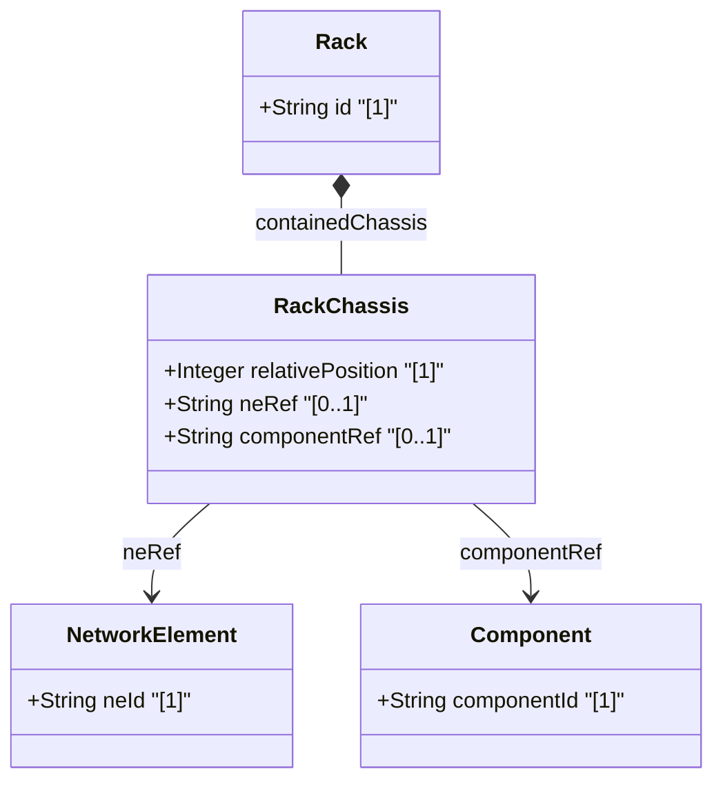

# Feature: Rack-Level Chassis Container

## Parent Epic
- [ ] #9 - Network Inventory Location — Rack Infrastructure (https://github.com/gintatkinson/3dgs-028/blob/main/docs/epics/epic-02-rack-infrastructure.md) (Chassis within rack powered slots)

## Description
Defines the list of chassis mounted within a rack. Each entry records the relative position (U-slot) within the rack and references the network element and specific component. This enables precise equipment-to-rack mapping for rack-mounted network elements and supports distributed multi-chassis systems spanning multiple racks.

## UML Class Diagram


## Interface Requirements

### 1. Payload Schema
```json
{
  "contained-chassis": [
    {
      "relative-position": 10,
      "ne-ref": "NE-1",
      "component-ref": "chassis-1"
    }
  ]
}
```

### 2. Validation & Constraints
- `relative-position` (mandatory, key): type `uint8`; relative position (e.g., U-slot) of chassis within the rack, range 0..255
- `ne-ref` (optional): type `leafref` to `/nwi:network-inventory/nwi:network-elements/nwi:network-element/nwi:ne-id`; references the network element containing the chassis component
- `component-ref` (optional): type `leafref` to the specific component within the referenced network element; path is conditional on ne-ref resolution
- Chassis entries at the same relative-position must be unique (key constraint)

### 3. Logical Operations & Interface Messages
- **GET /locations/racks/rack/{id}/contained-chassis** — Retrieve chassis mounted in a rack
- **GET /locations/racks/rack/{id}/contained-chassis/{relative-position}** — Retrieve chassis at specific U-slot
- Data is read-only operational state (`config false`)

### 4. Logical Exception States & Validation Failures
- **Duplicate relative-position**: Two chassis entries at the same U-slot position in the same rack violate the key constraint
- **Unresolved ne-ref**: If `ne-ref` points to a non-existent network element, the reference is dangling
- **Unresolved component-ref**: If `component-ref` cannot be resolved within the referenced network element, the component association is broken
- **Relative-position overflow**: Values above 255 exceed uint8 range and are invalid

## Given-When-Then Acceptance Criteria
**Given** a rack "Rack-101-A" with a chassis at U-slot 10
**When** the contained-chassis list is queried
**Then** the entry shows relative-position 10 with valid ne-ref and component-ref

**Given** two chassis entries at the same relative-position in the same rack
**When** the key constraint is validated
**Then** the data is rejected because relative-position must be unique per rack

**Given** a distributed stack switch (NE-1) with chassis-1 in Rack-101-A and chassis-2 in Rack-201-B
**When** each rack's contained-chassis list is inspected
**Then** both entries reference the same ne-ref "NE-1" with different component-ref values

**Given** a rack with a chassis entry at relative-position 42
**When** a chassis entry at U-slot 42 is retrieved
**Then** the entry returns with its ne-ref and component-ref associations

**Given** a relative-position value exceeding 255
**When** the uint8 type constraint is applied
**Then** the value is rejected as out of range

**Given** an ne-ref pointing to a removed network element
**When** the reference is dereferenced
**Then** the rack chassis entry has a dangling ne-ref

## Specification Context (Verbatim)
> The list of chassis within a rack. Relative position (e.g., U-slot) of chassis within the rack. Reference to the network element containing the chassis component.

## Source References
Structural Schema: [ietf-ni-location.yang](https://github.com/ietf-ivy-wg/network-inventory-location/blob/main/ietf-ni-location.yang) (Clause: list contained-chassis within rack)
Normative Specification: [draft-ietf-ivy-network-inventory-location-06](https://datatracker.ietf.org/doc/html/draft-ietf-ivy-network-inventory-location) (Section 3: Rack, Appendix A.2: Distributed Multi-Chassis Network Element)

## Logical UI & Layout Bindings
- **Target LUI Component:** TableView
- **Target Layout Container ID:** components_table
- **Data Source Bindings:** `nil:locations/racks/rack/contained-chassis/relative-position`, `nil:locations/racks/rack/contained-chassis/ne-ref`, `nil:locations/racks/rack/contained-chassis/component-ref`
