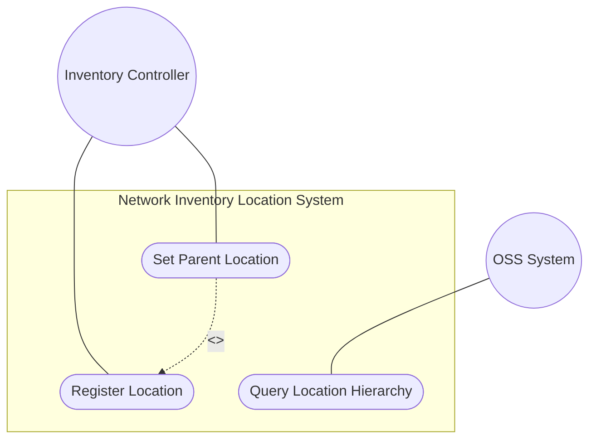
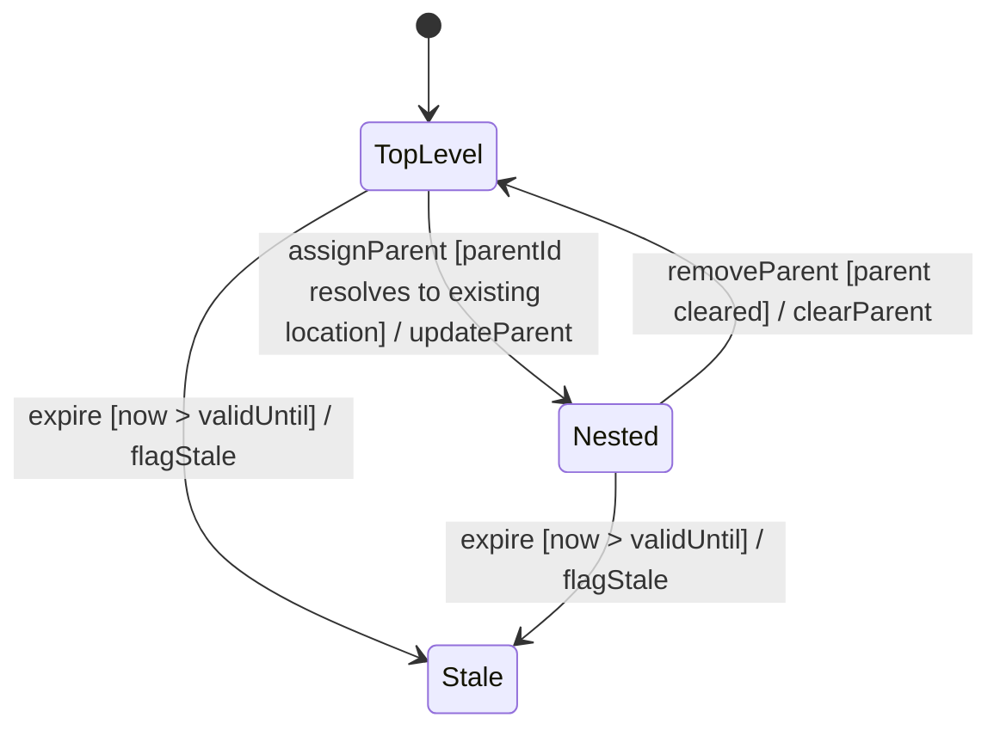

# Use Case: Register and Manage Network Inventory Location Hierarchy

## Parent Epic
- [ ] #8 - Network Inventory Location — Location Hierarchy & Facilities (https://github.com/gintatkinson/3dgs-028/blob/main/docs/epics/epic-01-location-hierarchy-facilities.md) (Core location container and hierarchy)

## 1. Actors
- **Primary Actor:** Inventory Controller (automated tooling or manual operator)
- **Secondary Actors:** OSS Management System, RFID/GPS Data Sources

## 2. Preconditions
- The base network inventory module (`ietf-network-inventory`) is populated with Network Elements
- The controller has access to location data sources (RFID, geolocation services, manual entry)
- The `ietf-ni-location` module is loaded and augments the base inventory

## 3. Trigger
The controller receives new location data from automated tooling or manual entry, triggering location record creation or update within the `locations` container.

## 4. Main Success Scenario (Basic Flow)
1. The Inventory Controller receives location metadata from a data source (RFID scan, GPS reading, or manual form input)
2. The Controller assigns a unique string `id` to the new location
3. The Controller populates `type` classification (e.g., "site", "building", "room", "pole")
4. If the location is nested within an existing location, the Controller sets the `parent` leafref to the containing location's id
5. The Controller sets the `timestamp` to the current date-and-time
6. The Controller optionally sets `valid-until` to indicate an expiration time
7. The location record is stored as read-only operational state in the controller datastore
8. OSS systems can now query the location via NETCONF/RESTCONF GET operations mapping NEs to locations

## 5. Alternate and Exception Flows
- **5a. Duplicate Location ID (Branches from Basic Flow step 2):**
  1. The Controller detects that the proposed `id` already exists in the location list
  2. The duplicate is rejected; the controller either assigns a new id or updates the existing record
  3. If updating, the controller overwrites mutable fields and returns to step 7 of the Main Success Scenario

- **5b. Invalid Parent Reference (Branches from Basic Flow step 4):**
  1. The Controller attempts to set `parent` to a non-existent location id
  2. The leafref validation fails; the hierarchy link cannot be established
  3. The controller either creates the parent location first or leaves the location at the top level

- **5c. Location Type Not Standardized (Branches from Basic Flow step 3):**
  1. The operator enters a custom location type string (e.g., "pole", "roof", "floor")
  2. The system accepts the flexible string type without requiring model extensions
  3. Organizational naming conventions are captured as-is

- **5d. Expired Location Detected (Branches from Basic Flow step 6):**
  1. A query includes a location whose `valid-until` has passed
  2. The system returns the location data but flags it as stale
  3. The location is excluded from operational use (dispatch, planning)

## 6. Postconditions (Guarantees)
- **Success Guarantee:** A new location record exists in the read-only `locations/location` list with a unique id, type, and optional parent reference; the location is queryable by OSS systems
- **Failure Guarantee:** No duplicate id is created; leafref violations roll back the parent assignment leaving the location at the top level

## UML Diagrams
### Use Case Diagram

### State Machine Diagram

## 7. Operational Context
> The Network Inventory location model is to record physical locations, such as sites, building, equipment rooms, racks, and so on. The "location" list is generalized to support a variety of geographic location. Locations can be nested to form a hierarchy. For example, buildings may be within a site, and a room may be within a building.

## 8. Realization Matrix
### Required User Stories
- [ ] #10 - [Query Network Inventory Location Hierarchy](https://github.com/gintatkinson/3dgs-028/blob/main/docs/user-stories/us-01-query-location-hierarchy.md) (Retrieval of the hierarchical location tree)
- [ ] #15 - [Handle Expired Location Data and Temporal Staleness](https://github.com/gintatkinson/3dgs-028/blob/main/docs/user-stories/us-03-expired-location-handling.md) (Temporal validity lifecycle)
### Required Features
- [ ] #1 - [Network Inventory Location Entity](https://github.com/gintatkinson/3dgs-028/blob/main/docs/features/feat-01-ni-location-entity.md) (Core location entity with id, type, parent, timestamp, valid-until)

## Source References
Structural Schema: [ietf-ni-location.yang](https://github.com/ietf-ivy-wg/network-inventory-location/blob/main/ietf-ni-location.yang) (container locations, list location)
Normative Specification: [draft-ietf-ivy-network-inventory-location-06](https://datatracker.ietf.org/doc/html/draft-ietf-ivy-network-inventory-location) (Section 2, Section 6)
