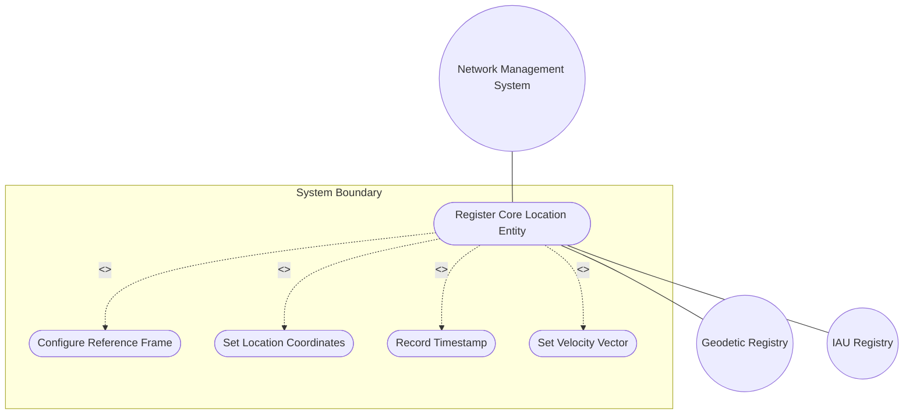
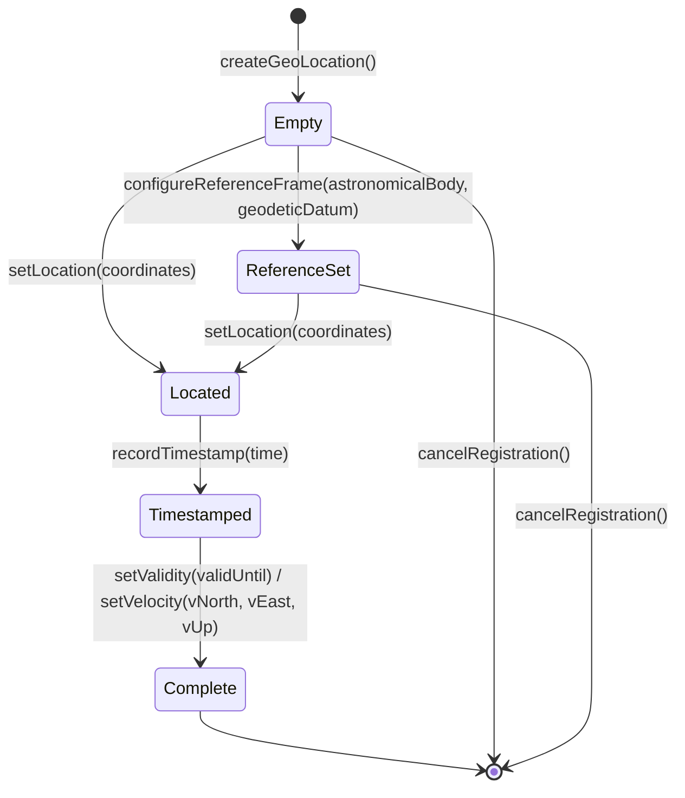

# Use Case: Register Core Location Entity

## Parent Epic
- [ ] #7 - [Geo-Location Grouping](https://github.com/gintatkinson/3dgs-028/blob/main/docs/epics/epic-01-geo-location-grouping.md) (end-to-end registration of a complete geographic location entity using the geo-location grouping)

## 1. Actors
- **Primary Actor:** Network Management System (NMS)
- **Secondary Actors:** Geodetic Registry (IANA Geodetic System Values Registry), IAU Registry

## 2. Preconditions
- The YANG data model using the geo-location grouping is loaded and validated on the target device.
- The target device supports the NETCONF (RFC 6241) or RESTCONF (RFC 8040) management protocol.
- The NMS has appropriate write access permissions for the target configuration datastore.

## 3. Trigger
A network operator or automated system initiates the creation of a new network element that requires geographic location attribution (e.g., deploying a new router, registering a data center, or cataloging a fiber endpoint).

## 4. Main Success Scenario (Basic Flow)
1. The NMS operator selects the target network element to assign a geo-location.
2. The NMS creates a new `geo-location` container instance under the target element.
3. The NMS configures the `reference-frame` with `astronomical-body` set to "earth" and `geodetic-datum` set to "wgs-84" (or leaves them as defaults).
4. The NMS sets the location coordinates by choosing either the `ellipsoid` case (providing latitude, longitude, and optionally height) or the `cartesian` case (providing x, y, z values).
5. The NMS optionally records the measurement `timestamp` indicating when the location was determined.
6. The NMS optionally sets a `valid-until` expiration time for location freshness management.
7. The NMS optionally provides a `velocity` vector (v-north, v-east, v-up) if the object is in motion.
8. The system commits the configuration, validates all schema constraints, and persists the geo-location data.

## 5. Alternate and Exception Flows
- **5a. Invalid Astronomical Body Pattern (Branches from Basic Flow step 3):**
  1. The NMS provides an `astronomical-body` value containing control characters outside the permitted ASCII range.
  2. The system rejects the value with a pattern validation error (`[ -@\[-\^_-~]*`).
  3. The NMS corrects the value to a valid IAU name and retries the configuration.
- **5b. Simultaneous Coordinate Systems (Branches from Basic Flow step 4):**
  1. The NMS attempts to set both ellipsoid coordinates (latitude, longitude) and Cartesian coordinates (x, y, z) simultaneously.
  2. The system rejects the configuration because the YANG `choice` statement permits only one active case.
  3. The NMS selects one coordinate system and retries the configuration.
- **5c. Missing Geodetic Datum for Non-Earth Body (Branches from Basic Flow step 3):**
  1. The NMS sets `astronomical-body` to a value other than "earth" (e.g., "moon") without specifying a `geodetic-datum`.
  2. The system stores the configuration but logs a warning that the geodetic datum is absent for a non-default astronomical body.
  3. The NMS selects an appropriate datum (e.g., "me" for the Moon) from the IANA registry and updates the configuration.
- **5d. Alternate System Feature Disabled (Branches from Basic Flow step 3):**
  1. The NMS attempts to set the `alternate-system` leaf when the device does not support the `alternate-systems` feature.
  2. The system rejects the operation because the leaf is conditionally unavailable.
  3. The NMS retries without specifying the alternate-system value.

## 6. Postconditions (Guarantees)
- **Success Guarantee:** A complete or partial geo-location container is persisted in the device configuration with all provided attribute values validated against schema constraints. The location can be queried via standard management protocols.
- **Failure Guarantee:** The device configuration is rolled back to its previous state (or the edit is rejected). No partial location data is persisted in the datastore. An error response with specific constraint violation details is returned to the NMS.

## UML Diagrams
### Use Case Diagram

### State Machine Diagram

## 7. Operational Context
From RFC 9179, Section 1: "In many applications, we would like to specify the location of something geographically. Some examples of locations in networking might be the location of data centers, a rack in an Internet exchange point, a router, a firewall, a port on some device, or it could be the endpoints of a fiber, or perhaps the failure point along a fiber."

From RFC 9179, Section 2: "This document defines a 'geo-location' YANG grouping that allows for all the above data to be captured."

## 8. Realization Matrix
### Required User Stories
- [ ] #8 - [Query Location by Timestamp](https://github.com/gintatkinson/3dgs-028/blob/main/docs/user-stories/us-01-query-location-timestamp.md) (registering a location requires a timestamp for temporal context)
- [ ] #9 - [Validate Location Freshness](https://github.com/gintatkinson/3dgs-028/blob/main/docs/user-stories/us-02-validate-location-freshness.md) (registration may include valid-until for freshness management)
- [ ] #12 - [Select Frame of Reference](https://github.com/gintatkinson/3dgs-028/blob/main/docs/user-stories/us-05-select-reference-frame.md) (registration includes configuring the reference frame)

### Required Features
- [ ] #1 - [Geo-Location Root Container](https://github.com/gintatkinson/3dgs-028/blob/main/docs/features/feat-01-geo-location-root.md) (the root container that aggregates all location sub-components)
- [ ] #2 - [Reference Frame](https://github.com/gintatkinson/3dgs-028/blob/main/docs/features/feat-02-reference-frame.md) (reference-frame configuration during location registration)
- [ ] #3 - [Geodetic System](https://github.com/gintatkinson/3dgs-028/blob/main/docs/features/feat-03-geodetic-system.md) (geodetic-datum and accuracy configuration)
- [ ] #4 - [Ellipsoid Coordinate System](https://github.com/gintatkinson/3dgs-028/blob/main/docs/features/feat-04-ellipsoid-coordinates.md) (ellipsoid coordinate option during registration)
- [ ] #5 - [Cartesian Coordinate System](https://github.com/gintatkinson/3dgs-028/blob/main/docs/features/feat-05-cartesian-coordinates.md) (Cartesian coordinate option during registration)
- [ ] #6 - [Velocity Vector](https://github.com/gintatkinson/3dgs-028/blob/main/docs/features/feat-06-velocity-vector.md) (velocity vector configuration during registration)

## Source References
Structural Schema: [ietf-geo-location@2022-02-11.yang](https://github.com/YangModels/yang/blob/main/standard/ietf/RFC/ietf-geo-location%402022-02-11.yang)
Normative Specification: [RFC 9179: A YANG Grouping for Geographic Locations](https://datatracker.ietf.org/doc/rfc9179/) (Clause: Sections 1, 2, 2.1, 2.2, 2.3, 2.6)
