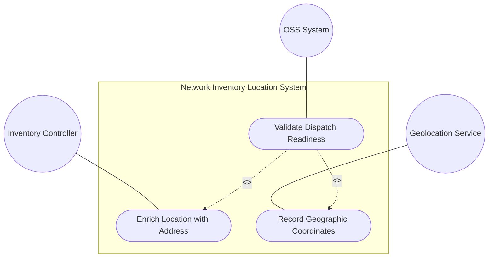
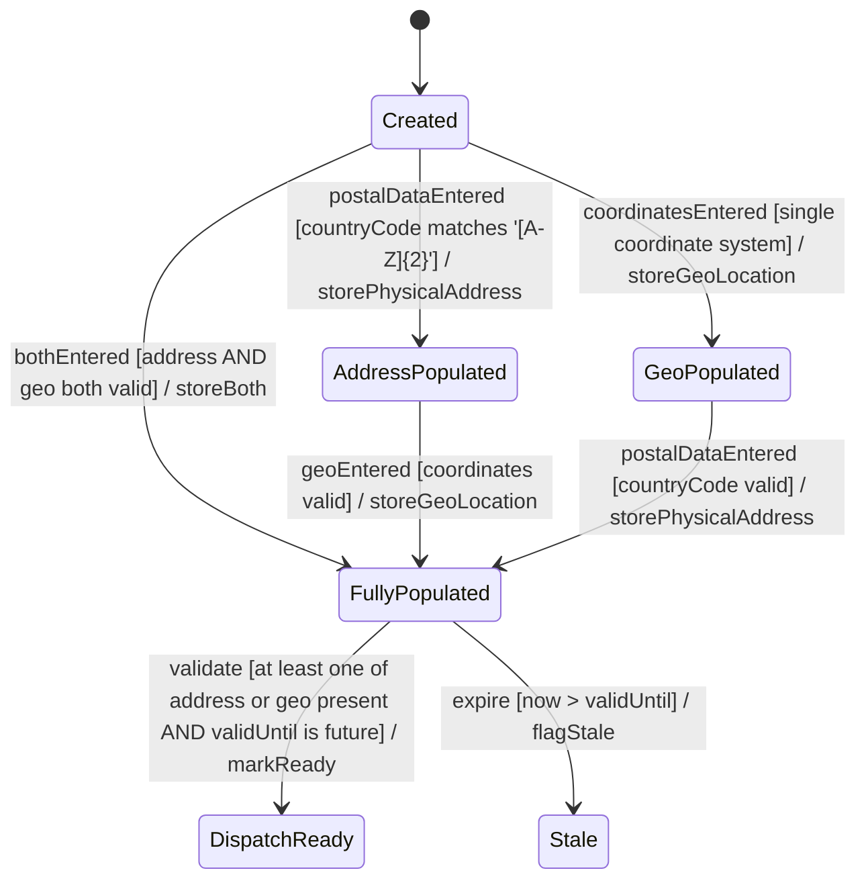

# Use Case: Enrich Network Inventory Location with Physical Address and Geographic Coordinates

## Parent Epic
- [ ] #8 - Network Inventory Location — Location Hierarchy & Facilities (https://github.com/gintatkinson/3dgs-028/blob/main/docs/epics/epic-01-location-hierarchy-facilities.md) (Address and geo-location enrichment of location records)

## 1. Actors
- **Primary Actor:** Inventory Controller
- **Secondary Actors:** Geolocation Service, RFID Scanner, Field Technician

## 2. Preconditions
- A location record exists in the `locations/location` list with a valid id
- At least one data source (manual entry, geolocation service, or RFID) is available

## 3. Trigger
A new location requires physical address and/or geographic coordinate enrichment for field dispatch readiness.

## 4. Main Success Scenario (Basic Flow)
1. The Inventory Controller selects an existing location record
2. The Controller populates the `physical-address` sub-container with postal data: address, postal-code, state, city, and country-code (ISO ALPHA-2, 2-letter uppercase)
3. The Controller populates the `geo-location` sub-container via the `ietf-geo-location` grouping:
   a. Sets `reference-frame` with `astronomical-body` (default: "earth") and geodetic datum
   b. Selects either `ellipsoid` (latitude, longitude, height) or `cartesian` (x, y, z) coordinates
   c. Optionally records `velocity` data (v-north, v-east, v-up)
4. The Controller sets `timestamp` to record when the geo-location was captured
5. The Controller optionally sets `valid-until` for geo-location data expiration
6. The enriched location is stored as read-only operational state

## 5. Alternate and Exception Flows
- **5a. Invalid Country Code Format (Branches from Basic Flow step 2):**
  1. The operator enters a country-code that does not match pattern `[A-Z]{2}`
  2. The pattern validation rejects the value
  3. The operator corrects to a valid 2-letter uppercase ISO code and returns to step 2

- **5b. Both Coordinate Systems Present (Branches from Basic Flow step 3b):**
  1. The data source provides both ellipsoid and cartesian coordinates
  2. The `(location)` choice constraint rejects the dual presence
  3. The controller selects one coordinate system variant and discards the other; returns to step 3b

- **5c. Missing Both Address and Geo-Location (Branches from Basic Flow step 2):**
  1. Neither physical-address nor geo-location data is provided
  2. The location fails field dispatch readiness validation
  3. The location is flagged as incomplete and cannot be used for dispatch or planning

- **5d. Coordinate Accuracy Below Threshold (Branches from Basic Flow step 3):**
  1. The `coord-accuracy` or `height-accuracy` values in `geodetic-system` are set
  2. If accuracy is below acceptable operational thresholds, the location is flagged for verification
  3. The controller may decide to re-collect coordinates with higher precision

- **5e. Alternate Coordinate System Selected (Branches from Basic Flow step 3a):**
  1. The `alternate-system` field is populated (conditional on `if-feature "alternate-systems"`)
  2. If the feature is not enabled, the field is suppressed
  3. If enabled, alternate system metadata accompanies the standard reference frame

- **5f. Velocity Data for Stationary Asset (Branches from Basic Flow step 3c):**
  1. Velocity vector data (v-north, v-east, v-up) is provided for a stationary rack or building
  2. The system accepts the data without rejecting it, as zero-velocity vectors are valid

## 6. Postconditions (Guarantees)
- **Success Guarantee:** The location record contains a valid `physical-address` and/or `geo-location` sub-container; the location passes dispatch readiness validation; the country-code matches ISO ALPHA-2 pattern; coordinates comply with the single-variant choice constraint
- **Failure Guarantee:** Invalid country-codes are rejected; dual coordinate system entries are resolved to a single variant; incomplete locations (neither address nor geo-location) are flagged

## UML Diagrams
### Use Case Diagram

### State Machine Diagram

## 7. Operational Context
> Additionally, it includes provisions for physical addresses or geo-location data (geographic coordinates). Before using a location for field dispatch or planning, verification is required to ensure at least one of physical-address or geo-location is present, and that the valid-until leaf is either not present or indicates a future time.

## 8. Realization Matrix
### Required User Stories
- [ ] #12 - [Validate Location for Field Dispatch Readiness](https://github.com/gintatkinson/3dgs-028/blob/main/docs/user-stories/us-02-validate-location-dispatch.md) (Dispatch readiness validation logic)
- [ ] #15 - [Handle Expired Location Data and Temporal Staleness](https://github.com/gintatkinson/3dgs-028/blob/main/docs/user-stories/us-03-expired-location-handling.md) (Temporal validity lifecycle for geo-location)
### Required Features
- [ ] #2 - [Physical Address for Network Inventory Locations](https://github.com/gintatkinson/3dgs-028/blob/main/docs/features/feat-02-physical-address.md) (Postal address attributes with country-code pattern)
- [ ] #3 - [Geographic Location for Network Inventory](https://github.com/gintatkinson/3dgs-028/blob/main/docs/features/feat-03-geographic-location.md) (Geographic coordinates, reference frames, velocity)

## Source References
Structural Schema: [ietf-ni-location.yang](https://github.com/ietf-ivy-wg/network-inventory-location/blob/main/ietf-ni-location.yang) (grouping physical-address, uses geo:geo-location)
Normative Specification: [draft-ietf-ivy-network-inventory-location-06](https://datatracker.ietf.org/doc/html/draft-ietf-ivy-network-inventory-location) (Section 2, Section 6)
External Reference: [RFC 9179](https://www.rfc-editor.org/rfc/rfc9179) — A YANG Grouping for Geographic Locations
