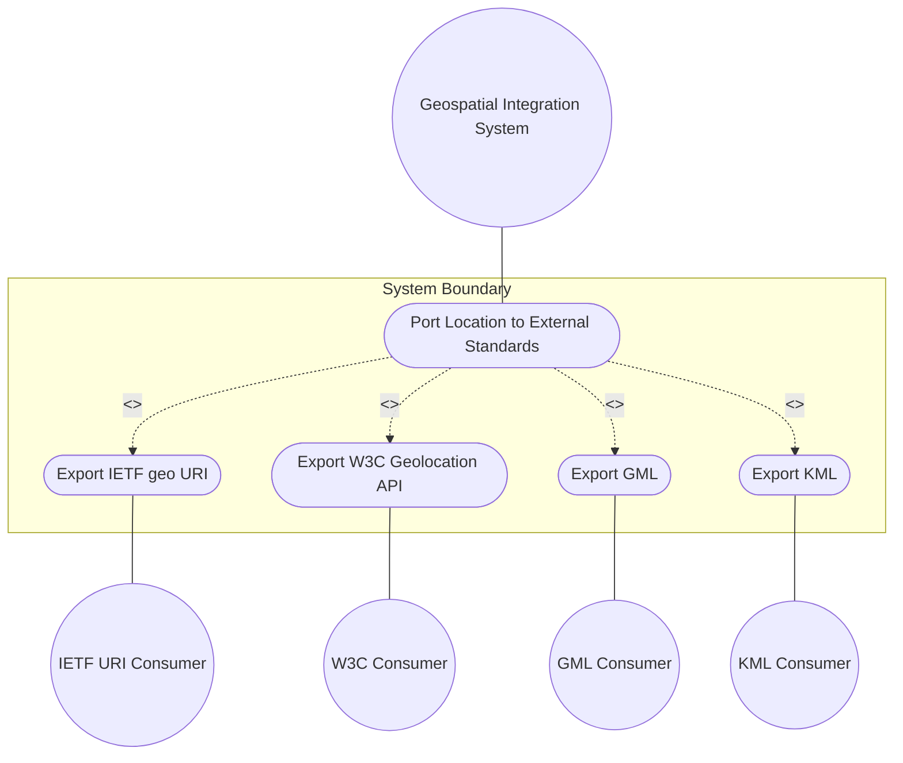
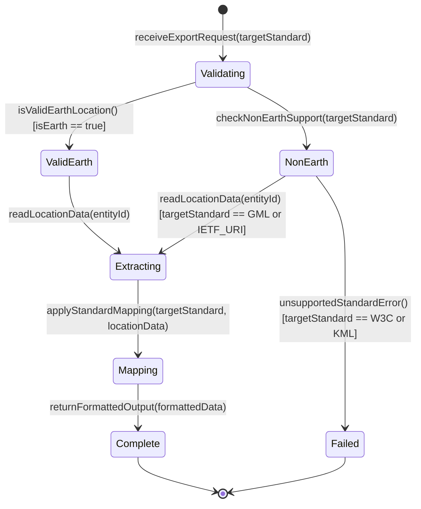

# Use Case: Port Location to External Standards

## Parent Epic
- [ ] #7 - [Geo-Location Grouping](https://github.com/gintatkinson/3dgs-028/blob/main/docs/epics/epic-01-geo-location-grouping.md) (portability of geo-location data to external geospatial standards and APIs)

## 1. Actors
- **Primary Actor:** Geospatial Integration System
- **Secondary Actors:** IETF URI Consumer, W3C Geolocation API Consumer, GML Processor, KML Processor

## 2. Preconditions
- A geo-location entity has been registered in the system with a valid `reference-frame` (astronomical-body set to "earth" and geodetic-datum set to "wgs-84" or equivalent Earth-based system).
- The geo-location entity contains a complete coordinate set (at minimum latitude and longitude for ellipsoid case, or x, y, z for Cartesian case).
- The target external standard has a defined mapping specification.

## 3. Trigger
An external system or application requests geographic location data in a format compatible with one of the supported external standards: IETF geo URI (RFC 5870), W3C Geolocation API, Geography Markup Language (GML, ISO 19136), or KML.

## 4. Main Success Scenario (Basic Flow)
1. The Geospatial Integration System receives a request from an external consumer to export a geo-location entity in a specified standard format.
2. The Integration System reads the geo-location entity from the device datastore.
3. The Integration System verifies that the location uses an Earth-based reference frame with a supported geodetic datum (e.g., wgs-84).
4. The Integration System extracts the coordinate data (latitude, longitude, optionally height for ellipsoid case).
5. The Integration System applies the standard-specific mapping rules: For IETF URI, encode as `geo:lat,lon` with optional `;crs=wgs-84` and `;u=accuracy` parameters; For W3C, map to GeolocationCoordinates interface with heading and speed derived from velocity vector; For GML, produce `gml:pos` with appropriate CRS attributes; For KML, produce `kml:Point` coordinates with altitude mode handling.
6. The Integration System returns the formatted location data to the external consumer.

## 5. Alternate and Exception Flows
- **5a. Non-Earth Reference Frame (Branches from Basic Flow step 3):**
  1. The geo-location uses an astronomical body other than "earth" (e.g., "moon", "mars").
  2. W3C Geolocation API and KML standards do not support non-Earth coordinate systems natively.
  3. The Integration System returns an error indicating that the target standard does not support non-Earth reference frames but may support GML or IETF URI formats.
- **5b. Missing Geodetic Datum (Branches from Basic Flow step 3):**
  1. The geo-location entity lacks an explicit `geodetic-datum` value.
  2. The Integration System attempts to infer the default datum ("wgs-84" for Earth).
  3. If the astronomical body is not "earth" and no default applies, the Integration System returns an error requiring explicit datum specification.
- **5c. Relative Height Mode in KML (Branches from Basic Flow step 5):**
  1. The KML consumer requests the `relativeToGround` or `relativeToSeaFloor` altitude mode.
  2. The YANG grouping stores absolute heights, not relative heights.
  3. The Integration System requires additional ground-level elevation data to convert the absolute height to a relative height.
  4. If ground-level data is unavailable, the Integration System returns the height in absolute mode only.
- **5d. Precision Loss During Mapping (Branches from Basic Flow step 5):**
  1. The YANG grouping uses `decimal64` values with up to 16 fraction digits for latitude/longitude.
  2. The target standard uses `double` or string representations with potentially different precision.
  3. The Integration System maps the values with best-effort precision preservation and logs a warning if precision may be affected.

## 6. Postconditions (Guarantees)
- **Success Guarantee:** The geo-location data is successfully translated to the requested external standard format. The output contains all mappable fields including coordinates, accuracy, and optionally timestamp and velocity-derived heading/speed. A precision loss warning is logged if applicable.
- **Failure Guarantee:** The mapping fails with a descriptive error indicating the unsupported aspect (e.g., non-Earth body for W3C, missing datum for GML). The original YANG data remains unchanged. No partial or incorrect mapping is returned.

## UML Diagrams
### Use Case Diagram

### State Machine Diagram

## 7. Operational Context
From RFC 9179, Section 5.1: "In order to verify portability while developing this module, the following standards and standard APIs were considered." The section details mapping to IETF URI (5.1.1), W3C Geolocation API (5.1.2), GML (5.1.3), and KML (5.1.4), with specific field-level comparison tables and conversion caveats.

## 8. Realization Matrix
### Required User Stories
- [ ] #8 - [Query Location by Timestamp](https://github.com/gintatkinson/3dgs-028/blob/main/docs/user-stories/us-01-query-location-timestamp.md) (porting requires reading location data with timestamp context)
- [ ] #10 - [Compute Speed from Velocity Vector](https://github.com/gintatkinson/3dgs-028/blob/main/docs/user-stories/us-03-compute-speed-velocity.md) (W3C Geolocation API mapping requires speed derivation)
- [ ] #11 - [Compute Heading from Velocity Vector](https://github.com/gintatkinson/3dgs-028/blob/main/docs/user-stories/us-04-compute-heading-velocity.md) (W3C Geolocation API mapping requires heading derivation)
- [ ] #13 - [Switch Between Ellipsoid and Cartesian Coordinates](https://github.com/gintatkinson/3dgs-028/blob/main/docs/user-stories/us-06-switch-coordinate-systems.md) (some standards require specific coordinate representations)

### Required Features
- [ ] #1 - [Geo-Location Root Container](https://github.com/gintatkinson/3dgs-028/blob/main/docs/features/feat-01-geo-location-root.md) (timestamp and valid-until for temporal context in exported data)
- [ ] #2 - [Reference Frame](https://github.com/gintatkinson/3dgs-028/blob/main/docs/features/feat-02-reference-frame.md) (astronomical-body required to determine Earth vs non-Earth export support)
- [ ] #3 - [Geodetic System](https://github.com/gintatkinson/3dgs-028/blob/main/docs/features/feat-03-geodetic-system.md) (geodetic-datum and accuracy values map to CRS parameters in external standards)
- [ ] #4 - [Ellipsoid Coordinate System](https://github.com/gintatkinson/3dgs-028/blob/main/docs/features/feat-04-ellipsoid-coordinates.md) (latitude, longitude, height map directly to all four external standards)
- [ ] #6 - [Velocity Vector](https://github.com/gintatkinson/3dgs-028/blob/main/docs/features/feat-06-velocity-vector.md) (velocity components map to W3C heading/speed and IETF URI parameters)

## Source References
Structural Schema: [ietf-geo-location@2022-02-11.yang](https://github.com/YangModels/yang/blob/main/standard/ietf/RFC/ietf-geo-location%402022-02-11.yang)
Normative Specification: [RFC 9179: A YANG Grouping for Geographic Locations](https://datatracker.ietf.org/doc/rfc9179/) (Clause: Section 5)
