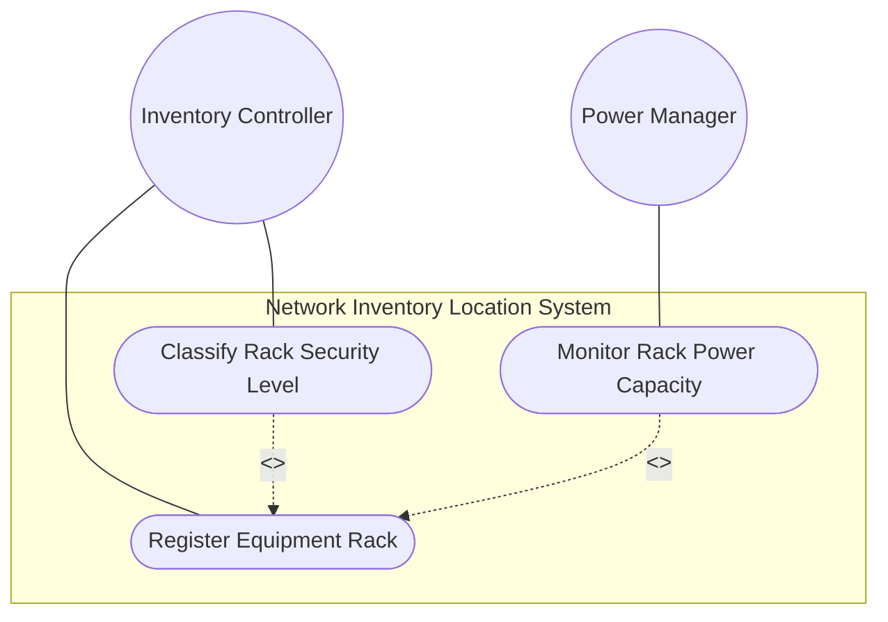
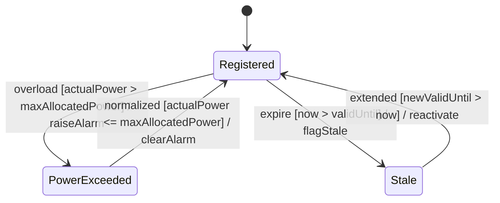

# Use Case: Deploy and Manage Equipment Racks in Network Facilities

## Parent Epic
- [ ] #9 - Network Inventory Location — Rack Infrastructure (https://github.com/gintatkinson/3dgs-028/blob/main/docs/epics/epic-02-rack-infrastructure.md) (Core rack container and rack entity lifecycle)

## 1. Actors
- **Primary Actor:** Data Center Operations Team / Inventory Controller
- **Secondary Actors:** Facility Management System, Power Management Controller

## 2. Preconditions
- A facility location (e.g., equipment room) exists in the `locations/location` list
- The controller has rack physical specifications (dimensions, power capacity, security classification)

## 3. Trigger
A new physical rack is installed in a facility or an existing rack record needs to be created/updated in the network inventory.

## 4. Main Success Scenario (Basic Flow)
1. The Inventory Controller assigns a unique string `id` to the rack
2. The Controller sets the `rack-class` identityref to the appropriate security classification (`rack-standard`, `rack-secure-baseline`, `rack-secure-medium`, or `rack-secure-high`)
3. The Controller records the rack's physical dimensions: `height`, `width`, and `depth` (all in millimeters)
4. The Controller records the rack's electrical specifications: `max-voltage` (in volts) and `max-allocated-power` (in watts)
5. The Controller sets the `timestamp` to the current date-and-time
6. The Controller optionally sets `valid-until` for rack data expiration
7. The rack record is stored as read-only operational state

## 5. Alternate and Exception Flows
- **5a. Invalid Rack Classification (Branches from Basic Flow step 2):**
  1. The operator provides a rack-class value not derived from the `rack-class-type` identity base
  2. The identityref validation rejects the classification
  3. The operator selects a valid classification from the hierarchy and returns to step 2

- **5b. Zero or Implausible Dimensions (Branches from Basic Flow step 3):**
  1. The operator enters height, width, or depth values of 0 or values exceeding the uint16 range (>65535)
  2. The uint16 range constraint rejects out-of-range values
  3. Zero dimensions are logically flagged as invalid for a physical rack; operator corrects and returns to step 3

- **5c. Power Exceeds Capacity (Branches from Basic Flow step 4):**
  1. Equipment installed in the rack draws more power than `max-allocated-power`
  2. The power management controller raises an alarm indicating power capacity exceeded
  3. The operator must either reduce power draw or update `max-allocated-power` to a higher value

- **5d. Expired Rack Data (Branches from Basic Flow step 6):**
  1. A query includes a rack whose `valid-until` has passed
  2. The system returns the rack data but flags it as stale
  3. The rack is excluded from capacity planning calculations

- **5e. Custom Rack Classification Extension (Branches from Basic Flow step 2):**
  1. A vendor wants to use a regional or proprietary rack classification not in the standard set
  2. The vendor extends the `rack-class-type` identity hierarchy with a new derived identity
  3. The new classification is now available as an identityref value

## 6. Postconditions (Guarantees)
- **Success Guarantee:** A rack record exists in the `racks/rack` list with a unique id, valid security classification, physical dimensions (millimeters), and electrical specifications; the rack is queryable and usable for capacity planning
- **Failure Guarantee:** Invalid rack-class values are rejected; out-of-range dimensions are rejected; the rack cannot be used for planning without valid classification

## UML Diagrams
### Use Case Diagram

### State Machine Diagram

## 7. Operational Context
> "racks" represent physical equipment racks in which NEs can be installed, which facilitate device maintenance. Each rack is assigned a unique ID and a name in the context of a facility, e.g. a site. A rack may have some specific attributes, such as appearance-related attributes and electricity-related attributes.

## 8. Realization Matrix
### Required User Stories
- [ ] #17 - [Query Rack Infrastructure Inventory](https://github.com/gintatkinson/3dgs-028/blob/main/docs/user-stories/us-04-query-rack-inventory.md) (Rack inventory listing and filtering)
- [ ] #20 - [Calculate Rack Power and Spatial Capacity Utilization](https://github.com/gintatkinson/3dgs-028/blob/main/docs/user-stories/us-06-rack-capacity-calculations.md) (Power and spatial capacity calculations)
### Required Features
- [ ] #5 - [Rack Entity for Network Inventory](https://github.com/gintatkinson/3dgs-028/blob/main/docs/features/feat-05-rack-entity.md) (Core rack entity with classification, dimensions, power, and temporal validity)

## Source References
Structural Schema: [ietf-ni-location.yang](https://github.com/ietf-ivy-wg/network-inventory-location/blob/main/ietf-ni-location.yang) (container racks, list rack, identities for rack-class-type)
Normative Specification: [draft-ietf-ivy-network-inventory-location-06](https://datatracker.ietf.org/doc/html/draft-ietf-ivy-network-inventory-location) (Section 3: Rack)
