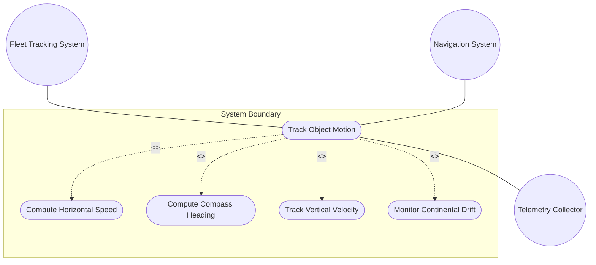
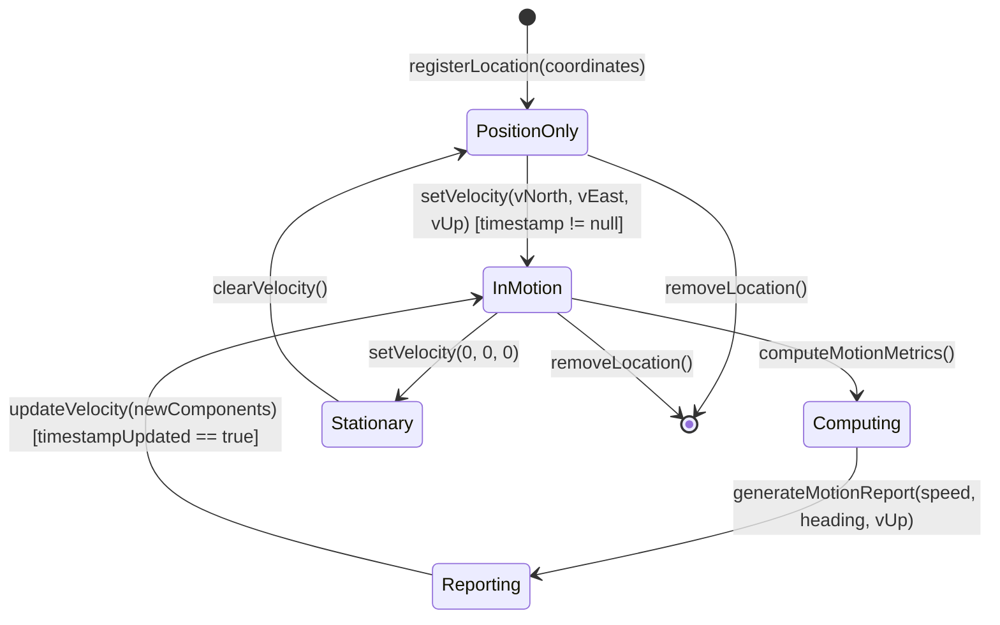

# Use Case: Track Object Motion with Velocity Vector

## Parent Epic
- [ ] #7 - [Geo-Location Grouping](https://github.com/gintatkinson/3dgs-028/blob/main/docs/epics/epic-01-geo-location-grouping.md) (end-to-end motion tracking using the velocity vector components and derived metrics)

## 1. Actors
- **Primary Actor:** Fleet Tracking System
- **Secondary Actors:** Navigation System, Telemetry Collector

## 2. Preconditions
- A geo-location entity has been registered with a valid position (ellipsoid or Cartesian coordinates).
- The geo-location entity has a recorded `timestamp` indicating when the position was last measured.
- The object is in relatively stable motion (the velocity model assumes constant velocity between updates, not complex maneuvering).

## 3. Trigger
A fleet tracking system or telemetry collector requests motion data for a tracked object, or a position update arrives that requires velocity vector calculation based on successive position readings.

## 4. Main Success Scenario (Basic Flow)
1. The Fleet Tracking System reads the current geo-location entity including the velocity vector (v-north, v-east, v-up) from the device datastore.
2. The Tracking System extracts the v-north, v-east, and v-up components from the velocity container.
3. The Tracking System computes the derived horizontal speed using `speed = sqrt(v_north^2 + v_east^2)`.
4. The Tracking System computes the derived compass heading using `heading = arctan(v_east / v_north)` and handles edge cases (division by zero when v-north = 0).
5. The Tracking System combines the position (latitude/longitude or x/y/z) with the heading and speed to produce a complete motion state report.
6. The Tracking System updates the display or analytics dashboard with the object's motion information.

## 5. Alternate and Exception Flows
- **5a. Stationary Object (Branches from Basic Flow step 3):**
  1. Both v-north and v-east are zero (or within floating-point tolerance).
  2. The Tracking System computes speed = 0.0 and notes that heading is undefined.
  3. The system reports the object as stationary with zero speed and no heading direction.
- **5b. True North Motion (Branches from Basic Flow step 4):**
  1. v-north is non-zero and v-east is zero.
  2. The heading is computed as 0.0 degrees (due north) when v-north > 0, or 180.0 degrees (due south) when v-north < 0.
  3. The system reports the heading with appropriate cardinal direction metadata.
- **5c. Pure East/West Motion (Branches from Basic Flow step 4):**
  1. v-north is zero and v-east is non-zero.
  2. The heading is 90.0 degrees (due east) when v-east > 0, or 270.0 degrees (due west) when v-east < 0.
  3. The division-by-zero in the arctan formula is handled by these explicit cases.
- **5d. Continental Drift Tracking (Branches from Basic Flow step 2):**
  1. The velocity components are extremely small (e.g., < 0.0000001 m/s, representing ~3 mm/year plate motion).
  2. The Tracking System uses high-precision arithmetic (decimal64 with 12 fraction digits) to avoid precision loss.
  3. The system reports the extremely slow motion with scientific notation or appropriate unit scaling.
- **5e. Missing Velocity Data (Branches from Basic Flow step 1):**
  1. The geo-location entity does not have a velocity container (the object is assumed stationary or velocity tracking is not enabled).
  2. The Tracking System reports only position data without velocity-derived metrics.
  3. The system may suggest enabling velocity tracking for future readings.

## 6. Postconditions (Guarantees)
- **Success Guarantee:** A complete motion state report is generated containing position, speed (m/s), heading (degrees from true north), and vertical velocity component (v-up). All derived values are computed with decimal64 precision. Edge cases (stationary, cardinal directions) are handled explicitly.
- **Failure Guarantee:** If velocity data is missing, only position is reported with a note that velocity is unavailable. If a velocity component is malformed or out of range, the motion computation fails with a specific error identifying the invalid component.

## UML Diagrams
### Use Case Diagram

### State Machine Diagram

## 7. Operational Context
From RFC 9179, Section 2.3: "Support is added for objects in relatively stable motion. For objects in relatively stable motion, the grouping provides a three-dimensional vector value. The components of the vector are 'v-north', 'v-east', and 'v-up', which are all given in fractional meters per second."

"Tracking more complex forms of motion is outside the scope of this work. The intent of the grouping being defined here is to identify where something is located, and generally this is expected to be somewhere on, or relative to, Earth (or another astronomical body)."

## 8. Realization Matrix
### Required User Stories
- [ ] #10 - [Compute Speed from Velocity Vector](https://github.com/gintatkinson/3dgs-028/blob/main/docs/user-stories/us-03-compute-speed-velocity.md) (speed derivation from v-north and v-east)
- [ ] #11 - [Compute Heading from Velocity Vector](https://github.com/gintatkinson/3dgs-028/blob/main/docs/user-stories/us-04-compute-heading-velocity.md) (heading derivation including division-by-zero edge cases)
- [ ] #8 - [Query Location by Timestamp](https://github.com/gintatkinson/3dgs-028/blob/main/docs/user-stories/us-01-query-location-timestamp.md) (velocity data is associated with the timestamp when measured)

### Required Features
- [ ] #1 - [Geo-Location Root Container](https://github.com/gintatkinson/3dgs-028/blob/main/docs/features/feat-01-geo-location-root.md) (timestamp provides temporal reference for velocity measurements)
- [ ] #6 - [Velocity Vector](https://github.com/gintatkinson/3dgs-028/blob/main/docs/features/feat-06-velocity-vector.md) (v-north, v-east, v-up leaf nodes provide the raw velocity components)
- [ ] #2 - [Reference Frame](https://github.com/gintatkinson/3dgs-028/blob/main/docs/features/feat-02-reference-frame.md) (true north reference direction is defined by the astronomical body's reference frame)

## Source References
Structural Schema: [ietf-geo-location@2022-02-11.yang](https://github.com/YangModels/yang/blob/main/standard/ietf/RFC/ietf-geo-location%402022-02-11.yang)
Normative Specification: [RFC 9179: A YANG Grouping for Geographic Locations](https://datatracker.ietf.org/doc/rfc9179/) (Clause: Section 2.3)
