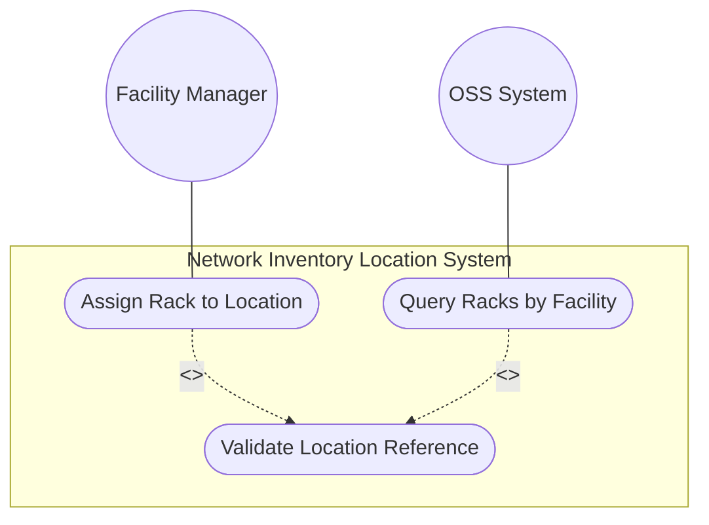
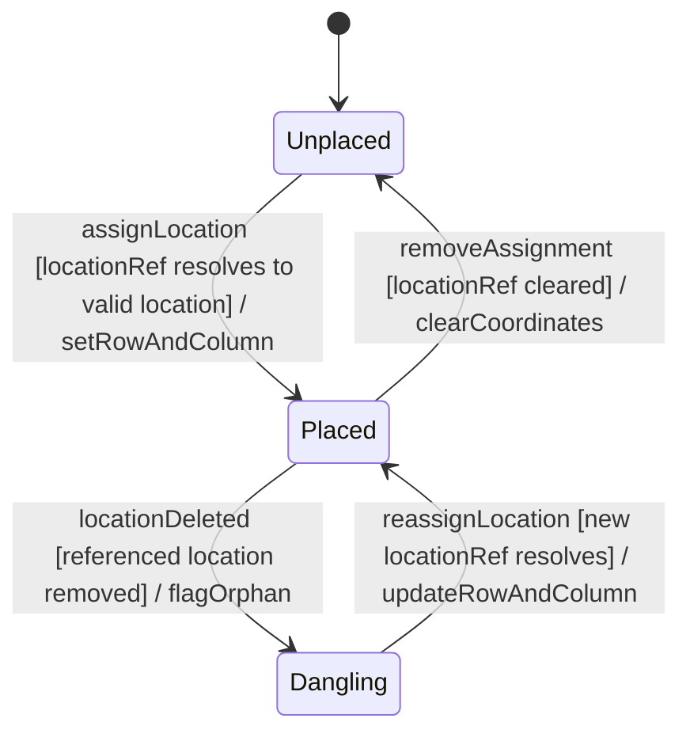

# Use Case: Assign and Locate Racks within Facility Rooms and Spaces

## Parent Epic
- [ ] #9 - Network Inventory Location — Rack Infrastructure (https://github.com/gintatkinson/3dgs-028/blob/main/docs/epics/epic-02-rack-infrastructure.md) (Rack-to-location spatial assignment)

## 1. Actors
- **Primary Actor:** Facility Manager / Data Center Operator
- **Secondary Actors:** Inventory Controller, OSS Query System

## 2. Preconditions
- A rack record exists in the `racks/rack` list with a unique id
- A facility location exists in `locations/location` (e.g., equipment room, data center floor)

## 3. Trigger
A rack needs to be assigned to a specific physical location (equipment room, site) with its spatial coordinates (row and column numbers).

## 4. Main Success Scenario (Basic Flow)
1. The Facility Manager selects a rack record by its id
2. The Manager sets the `rack-location/location-ref` to the id of the target facility location
3. The `ni-location-ref` typedef validates that the referenced location id exists in the `locations/location` list
4. The Manager sets `row-number` to identify which row within the location the rack occupies
5. The Manager sets `column-number` to identify which column within the location the rack occupies
6. The rack is now spatially mapped to a facility, enabling room-level equipment queries
7. OSS systems can query racks filtered by `location-ref` to retrieve all racks in a specific room

## 5. Alternate and Exception Flows
- **5a. Dangling Location Reference (Branches from Basic Flow step 2):**
  1. The `location-ref` points to a location id that does not exist or has been deleted
  2. The `ni-location-ref` leafref validation fails
  3. The rack placement is not established; the operator must select a valid existing location

- **5b. Location Deletion with Dependent Racks (Branches from Basic Flow step 6):**
  1. A location is deleted while racks still reference it via `location-ref`
  2. The racks now have dangling location references
  3. The inventory controller must reassign or retire affected racks

- **5c. Out-of-Range Row or Column Numbers (Branches from Basic Flow step 4):**
  1. The operator enters a row-number or column-number exceeding uint32 range (>4294967295)
  2. The uint32 range constraint rejects the value
  3. The operator enters a valid value within range and returns to step 4

- **5d. Multiple Racks at Same Grid Position (Branches from Basic Flow step 4):**
  1. Two racks in the same location are assigned identical row-number and column-number
  2. The system detects the spatial conflict
  3. The operator reassigns one rack to a different grid position or confirms shared occupancy

## 6. Postconditions (Guarantees)
- **Success Guarantee:** The rack is spatially assigned to a valid location with row and column coordinates; OSS queries can filter racks by location; the rack placement is resolvable in facility floor plans
- **Failure Guarantee:** Dangling location-ref values are rejected; out-of-range row/column values are rejected; racks with broken location references are flagged for remediation

## UML Diagrams
### Use Case Diagram

### State Machine Diagram

## 7. Operational Context
> Through "rack-location", each rack can be assigned to a site or a specific location within a site, such as an equipment room. The location information of the rack, which comprises the location reference, row number, and column number.

## 8. Realization Matrix
### Required User Stories
- [ ] #18 - [Locate Racks by Facility or Location](https://github.com/gintatkinson/3dgs-028/blob/main/docs/user-stories/us-05-locate-racks-by-facility.md) (Filtering racks by location reference)
- [ ] #23 - [Navigate Full Facility Topology from Site to Chassis](https://github.com/gintatkinson/3dgs-028/blob/main/docs/user-stories/us-07-navigate-facility-topology.md) (Full topology navigation from site to rack)
### Required Features
- [ ] #6 - [Rack Placement within Network Inventory Location](https://github.com/gintatkinson/3dgs-028/blob/main/docs/features/feat-06-rack-placement.md) (Rack location assignment with location-ref, row, column)
- [ ] #1 - [Network Inventory Location Entity](https://github.com/gintatkinson/3dgs-028/blob/main/docs/features/feat-01-ni-location-entity.md) (Location resolution for rack placement references)

## Source References
Structural Schema: [ietf-ni-location.yang](https://github.com/ietf-ivy-wg/network-inventory-location/blob/main/ietf-ni-location.yang) (container rack-location, typedef ni-location-ref)
Normative Specification: [draft-ietf-ivy-network-inventory-location-06](https://datatracker.ietf.org/doc/html/draft-ietf-ivy-network-inventory-location) (Section 3, Section 6)
