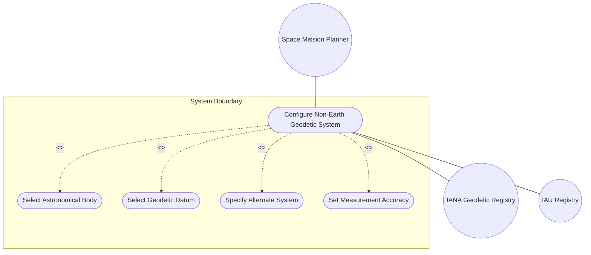
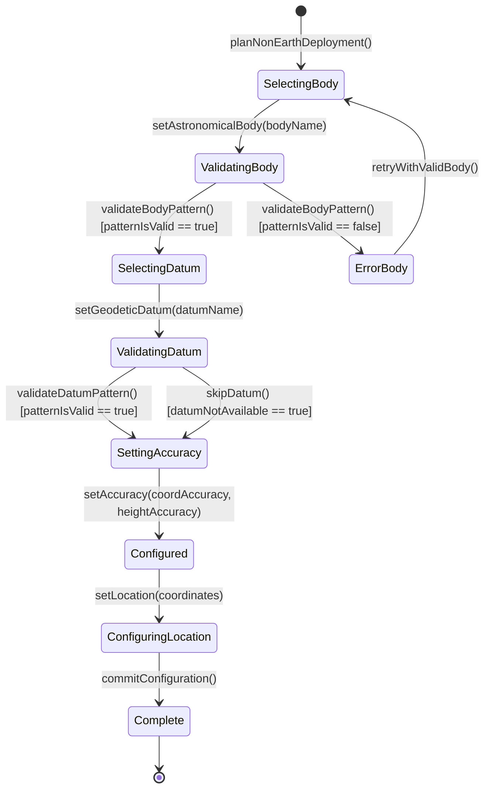

# Use Case: Configure Geodetic System for Non-Earth Body

## Parent Epic
- [ ] #7 - [Geo-Location Grouping](https://github.com/gintatkinson/3dgs-028/blob/main/docs/epics/epic-01-geo-location-grouping.md) (end-to-end configuration of location referencing for celestial bodies other than Earth)

## 1. Actors
- **Primary Actor:** Space Mission Planner
- **Secondary Actors:** IANA Geodetic System Values Registry, IAU Registry

## 2. Preconditions
- The device or system requires location specification for a non-Earth astronomical body (e.g., Moon, Mars, Enceladus, comet).
- The IANA "Geodetic System Values" registry contains an entry for the target body's geodetic system.
- The IAU registry provides the canonical name for the astronomical body.

## 3. Trigger
A space mission planner or celestial navigation system needs to configure the reference frame for a device, sensor, or asset located on a celestial body other than Earth.

## 4. Main Success Scenario (Basic Flow)
1. The Space Mission Planner identifies the target celestial body for the device location (e.g., "moon", "mars").
2. The Planner looks up the IAU canonical name for the body and converts it to lowercase with appropriate ASCII formatting per schema constraints.
3. The Planner sets `astronomical-body` to the IAU name (e.g., "moon", "mars", "enceladus").
4. The Planner looks up the appropriate geodetic-datum from the IANA Geodetic System Values registry for the target body (e.g., "me" for Mean Earth/Polar Axis on the Moon).
5. The Planner sets `geodetic-datum` to the registry value, converting to lowercase and replacing spaces with dashes per IANA rules.
6. The Planner optionally sets `coord-accuracy` and `height-accuracy` based on the measurement precision achievable for the non-Earth body.
7. The Planner configures the location coordinates in the appropriate system (ellipsoid or Cartesian) using the non-Earth reference frame's coordinate definitions.
8. The system commits the configuration with the non-Earth reference frame fully specified.

## 5. Alternate and Exception Flows
- **5a. Unregistered Geodetic Datum (Branches from Basic Flow step 4):**
  1. The Planner attempts to use a geodetic-datum value not registered in the IANA Geodetic System Values registry.
  2. The system does not reject the value (the schema pattern only constrains character set, not registry membership).
  3. The Planner is warned that unregistered datums may not be interoperable and is advised to register the value with IANA.
- **5b. Alternate System for Virtual Reality (Branches from Basic Flow step 2):**
  1. The Planner needs to specify a location in a virtual or simulated reality.
  2. The Planner sets `alternate-system` to a descriptive string identifying the virtual world.
  3. The system requires the `alternate-systems` feature to be enabled; if disabled, the operation is rejected.
  4. The alternate-system value modifies the interpretation of astronomical-body and geodetic-datum without changing their types.
- **5c. Comet with Forward-Slash Name (Branches from Basic Flow step 2):**
  1. The Planner sets `astronomical-body` to "67p/churyumov-gerasimenko" (a comet with a forward slash in its IAU designation).
  2. The forward slash is within the permitted ASCII character range (47, solidus).
  3. The system accepts the value and the comet's reference frame is configured.
- **5d. Non-Earth Body Without Known Datum (Branches from Basic Flow step 4):**
  1. The Planner sets `astronomical-body` to a novel body (e.g., a newly discovered asteroid) that has no established geodetic-datum.
  2. The Planner omits `geodetic-datum` entirely.
  3. The system stores the location without a datum; consumers must define coordinate meaning externally.

## 6. Postconditions (Guarantees)
- **Success Guarantee:** The non-Earth reference frame is fully configured with a valid astronomical body name (IAU-compliant), a registered or descriptive geodetic datum, and optional accuracy parameters. Location coordinates subsequently recorded under this reference frame are semantically unambiguous.
- **Failure Guarantee:** If the alternate-system feature is required but unsupported, the operation is rejected. If the astronomical-body pattern constraint is violated, the operation is rejected with a validation error. The device configuration remains in its previous valid state.

## UML Diagrams
### Use Case Diagram

### State Machine Diagram

## 7. Operational Context
From RFC 9179, Section 1: "Additionally, while this location is typically relative to Earth, it does not need to be. Indeed, it is easy to imagine a network or device located on the Moon, on Mars, on Enceladus (the moon of Saturn), or even on a comet (e.g., 67p/churyumov-gerasimenko)."

From RFC 9179, Section 2.1: "In addition to identifying the astronomical body, we also need to define the meaning of the coordinates (e.g., latitude and longitude) and the definition of 0-height. This is done with a 'geodetic-datum' value."

## 8. Realization Matrix
### Required User Stories
- [ ] #12 - [Select Frame of Reference](https://github.com/gintatkinson/3dgs-028/blob/main/docs/user-stories/us-05-select-reference-frame.md) (non-Earth body configuration is an extension of the frame of reference selection scenario)
- [ ] #9 - [Validate Location Freshness](https://github.com/gintatkinson/3dgs-028/blob/main/docs/user-stories/us-02-validate-location-freshness.md) (expired data handling applies equally to non-Earth locations)

### Required Features
- [ ] #2 - [Reference Frame](https://github.com/gintatkinson/3dgs-028/blob/main/docs/features/feat-02-reference-frame.md) (astronomical-body leaf, alternate-system leaf, and reference-frame container)
- [ ] #3 - [Geodetic System](https://github.com/gintatkinson/3dgs-028/blob/main/docs/features/feat-03-geodetic-system.md) (geodetic-datum, coord-accuracy, and height-accuracy for non-Earth bodies)
- [ ] #4 - [Ellipsoid Coordinate System](https://github.com/gintatkinson/3dgs-028/blob/main/docs/features/feat-04-ellipsoid-coordinates.md) (ellipsoid coordinates on non-Earth bodies use the body-specific reference frame)
- [ ] #5 - [Cartesian Coordinate System](https://github.com/gintatkinson/3dgs-028/blob/main/docs/features/feat-05-cartesian-coordinates.md) (Cartesian coordinates on non-Earth bodies use the body-specific reference frame)

## Source References
Structural Schema: [ietf-geo-location@2022-02-11.yang](https://github.com/YangModels/yang/blob/main/standard/ietf/RFC/ietf-geo-location%402022-02-11.yang)
Normative Specification: [RFC 9179: A YANG Grouping for Geographic Locations](https://datatracker.ietf.org/doc/rfc9179/) (Clause: Sections 1, 2.1, 6.1)
