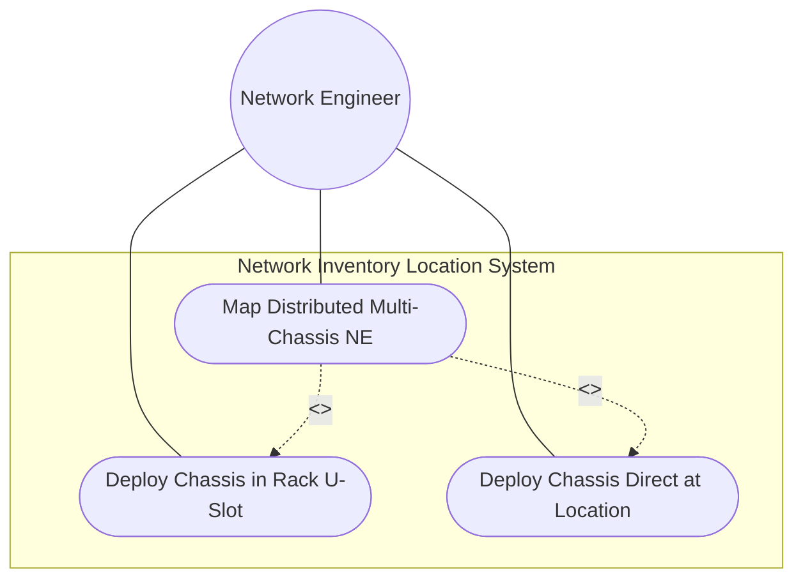
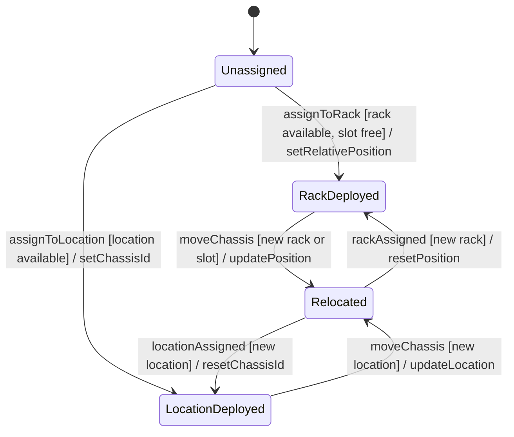

# Use Case: Deploy Chassis Equipment in Racks and Direct Locations

## Parent Epic
- [ ] #8 - Network Inventory Location — Location Hierarchy & Facilities (https://github.com/gintatkinson/3dgs-028/blob/main/docs/epics/epic-01-location-hierarchy-facilities.md) (Chassis placement across rack and direct-location deployments)

## 1. Actors
- **Primary Actor:** Network Deployment Engineer
- **Secondary Actors:** Inventory Controller, Network Element Management System

## 2. Preconditions
- A location or rack record exists in the inventory
- A network element exists in the base inventory (`nwi:network-elements/nwi:network-element`)
- The target chassis component is registered as a component of the network element

## 3. Trigger
A chassis needs to be physically deployed either directly at a location (e.g., ceiling-mounted AP) or within a rack at a specific U-slot position.

## 4. Main Success Scenario (Basic Flow)
1. The Deployment Engineer determines the deployment type: rack-mounted or direct-location
2. **For rack-mounted chassis:**
   a. The Engineer selects the target rack by id
   b. Assigns a `relative-position` (U-slot, uint8 0..255) to the chassis
   c. Sets `ne-ref` to the network element id
   d. Sets `component-ref` to the specific chassis component within the network element
3. **For direct-location chassis:**
   a. The Engineer selects the target location by id
   b. Assigns a `chassis-id` (uint32) as the unique identifier for this chassis instance
   c. Sets `ne-ref` to the network element id
   d. Sets `component-ref` to the specific chassis component
4. Both chassis records are stored as read-only operational state
5. Multiple chassis entries can reference the same ne-ref for distributed multi-chassis systems

## 5. Alternate and Exception Flows
- **5a. Duplicate Relative Position in Same Rack (Branches from Basic Flow step 2b):**
  1. The Engineer attempts to assign a chassis to a U-slot position already occupied in the same rack
  2. The key constraint (`relative-position` per rack) rejects the duplicate
  3. The engineer selects a different available U-slot position

- **5b. Unresolved Network Element Reference (Branches from Basic Flow step 2c/3c):**
  1. The `ne-ref` leafref points to a network element id that does not exist
  2. The leafref validation fails
  3. The engineer must correct the reference or register the network element first

- **5c. Unresolved Component Reference (Branches from Basic Flow step 2d/3d):**
  1. The `component-ref` leafref path (conditional on ne-ref resolution) does not find the component
  2. The component association cannot be established
  3. The engineer verifies the component-id within the referenced network element

- **5d. Relative Position Out of Range (Branches from Basic Flow step 2b):**
  1. The engineer enters a relative-position value exceeding 255
  2. The uint8 range constraint rejects the value
  3. The engineer enters a value within 0..255

- **5e. Distributed Multi-Chassis Same NE (Branches from Basic Flow step 5):**
  1. A single network element (e.g., stack switch) has chassis deployed across multiple racks or locations
  2. Each chassis entry references the same `ne-ref` but different rack/location and component-ref values
  3. The distributed mapping is recorded; no duplicate constraint violation occurs because entries are in different racks/locations

## 6. Postconditions (Guarantees)
- **Success Guarantee:** The chassis is recorded in the appropriate contained-chassis list with a valid relative-position (rack) or chassis-id (location), resolved ne-ref, and resolved component-ref; the chassis-to-location or chassis-to-rack mapping is queryable
- **Failure Guarantee:** Duplicate relative-positions in the same rack are rejected; unresolved ne-ref or component-ref references are rejected; out-of-range position values are rejected

## UML Diagrams
### Use Case Diagram

### State Machine Diagram

## 7. Operational Context
> Chassis directly deployed in this location without rack. Also used for distributed chassis components that are logically part of a network element but physically located. Multiple chassis entries may reference the same ne-ref for distributed systems. The list of chassis within a rack. Relative position (e.g., U-slot) of chassis within the rack.

## 8. Realization Matrix
### Required User Stories
- [ ] #26 - [Map Distributed Multi-Chassis Network Elements Across Locations](https://github.com/gintatkinson/3dgs-028/blob/main/docs/user-stories/us-09-distributed-multi-chassis.md) (Multi-location chassis mapping for distributed systems)
- [ ] #23 - [Navigate Full Facility Topology from Site to Chassis](https://github.com/gintatkinson/3dgs-028/blob/main/docs/user-stories/us-07-navigate-facility-topology.md) (Full topology path from site to chassis U-slot)
### Required Features
- [ ] #4 - [Location-Level Chassis Container](https://github.com/gintatkinson/3dgs-028/blob/main/docs/features/feat-04-location-chassis.md) (Direct chassis deployment at locations)
- [ ] #7 - [Rack-Level Chassis Container](https://github.com/gintatkinson/3dgs-028/blob/main/docs/features/feat-07-rack-chassis.md) (Rack-mounted chassis at specific U-slots)

## Source References
Structural Schema: [ietf-ni-location.yang](https://github.com/ietf-ivy-wg/network-inventory-location/blob/main/ietf-ni-location.yang) (list contained-chassis within location, list contained-chassis within rack)
Normative Specification: [draft-ietf-ivy-network-inventory-location-06](https://datatracker.ietf.org/doc/html/draft-ietf-ivy-network-inventory-location) (Appendix A.1, Appendix A.2)
