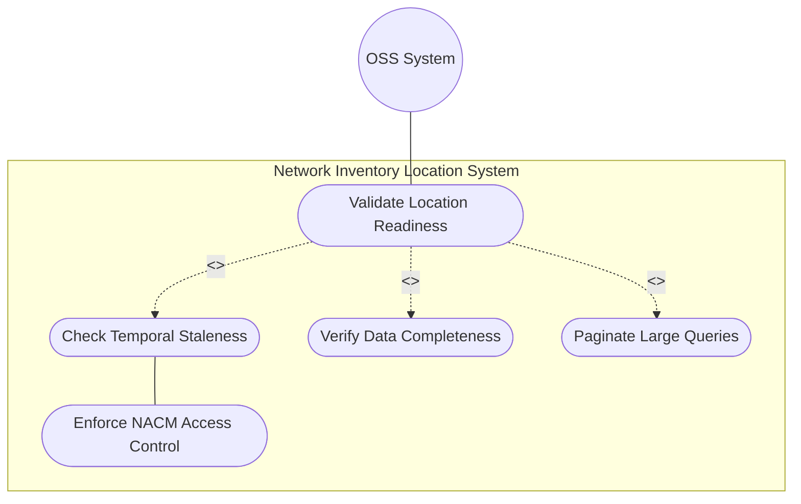
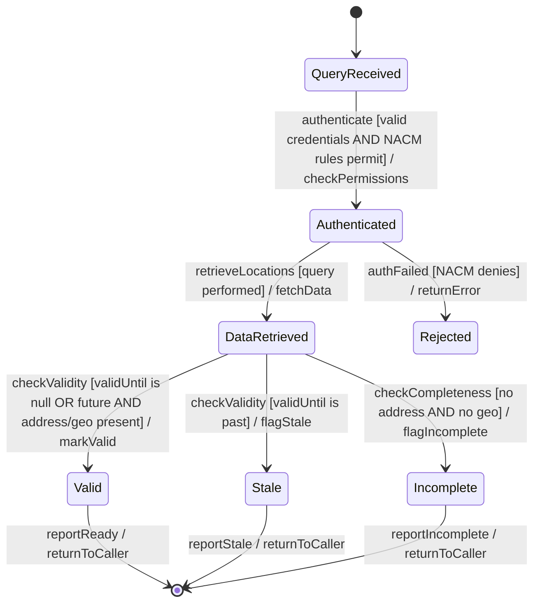

# Use Case: Validate Location Data Quality and Operational Readiness

## Parent Epic
- [ ] #8 - Network Inventory Location — Location Hierarchy & Facilities (https://github.com/gintatkinson/3dgs-028/blob/main/docs/epics/epic-01-location-hierarchy-facilities.md) (Cross-cutting data quality and operational readiness validation)

## 1. Actors
- **Primary Actor:** OSS Management System / Operations Dashboard
- **Secondary Actors:** Field Dispatcher, Inventory Controller

## 2. Preconditions
- Location and rack data exists in the network inventory
- OSS has established a secure transport session (NETCONF over SSH or RESTCONF over TLS)
- User has been authenticated and authorized via NACM

## 3. Trigger
An OSS system or dispatcher needs to verify that location data is complete and current before using it for field operations, capacity planning, or network element deployment.

## 4. Main Success Scenario (Basic Flow)
1. The OSS Management System initiates a validation query for a specific location or set of locations
2. The system checks that the `valid-until` timestamp is either absent (indefinite validity) or indicates a future time
3. The system checks that at least one of `physical-address` or `geo-location` sub-containers is populated
4. The system checks the `timestamp` to assess data recency
5. For rack-associated queries, the system checks `max-allocated-power` and `max-voltage` against deployed equipment
6. The system returns a validation report indicating: valid for dispatch, stale (expired), incomplete (missing address/geo), or unknown (no location data)
7. Valid locations can be used for dispatch, planning, and NE association queries

## 5. Alternate and Exception Flows
- **5a. Location Stale - Expired (Branches from Basic Flow step 2):**
  1. The `valid-until` timestamp is in the past (now > valid-until)
  2. The location is flagged as stale and excluded from operational use
  3. The controller is notified to extend validity or archive the record

- **5b. Location Incomplete (Branches from Basic Flow step 3):**
  1. Neither `physical-address` nor `geo-location` is populated
  2. The location is flagged as incomplete and cannot be used for dispatch
  3. The controller must enrich the record with at least one data type

- **5c. Pagination Required (Branches from Basic Flow step 1):**
  1. The validation query spans a very large result set (thousands of locations)
  2. The server enforces RESTCONF/NETCONF pagination to avoid excessive load
  3. The OSS client retrieves results in pages, re-requesting validation for each page

- **5d. Unauthorized Access (Branches from Basic Flow step 1):**
  1. An unauthenticated or unauthorized user attempts to query sensitive location data
  2. NACM access control rules deny the query
  3. The user must authenticate and be granted read access to the relevant subtrees

- **5e. Rack Power Capacity Exceeded (Branches from Basic Flow step 4):**
  1. Deployed chassis in a rack draw more power than `max-allocated-power`
  2. The validation report flags a power capacity violation
  3. The operations team must recalculate power budgets or redistribute equipment

- **5f. Data Source Staleness (Branches from Basic Flow step 4):**
  1. The `timestamp` indicates data was last updated beyond an acceptable freshness threshold
  2. The validation report flags the record for verification
  3. The controller initiates a new data collection cycle (RFID, geolocation, manual update)

## 6. Postconditions (Guarantees)
- **Success Guarantee:** A complete validation report is generated for queried locations, categorizing each as valid-for-dispatch, stale, incomplete, or unknown; valid locations are ready for operational use; stale/incomplete locations are flagged for remediation
- **Failure Guarantee:** Unauthorized access attempts are rejected; large result sets are paginated to prevent server overload; power capacity violations are reported

## UML Diagrams
### Use Case Diagram

### State Machine Diagram

## 7. Operational Context
> Data quality is indicated through timestamps recording the last update time, as well as an optional expiration time for location validity. Before using a location for field dispatch or planning, verification is required to ensure at least one of physical-address or geo-location is present, and that the valid-until leaf is either not present or indicates a future time. Once the valid-until time has passed, the location MUST be considered stale and MUST NOT be used for operational purposes.

## 8. Realization Matrix
### Required User Stories
- [ ] #12 - [Validate Location for Field Dispatch Readiness](https://github.com/gintatkinson/3dgs-028/blob/main/docs/user-stories/us-02-validate-location-dispatch.md) (Dispatch readiness validation logic)
- [ ] #15 - [Handle Expired Location Data and Temporal Staleness](https://github.com/gintatkinson/3dgs-028/blob/main/docs/user-stories/us-03-expired-location-handling.md) (Temporal staleness lifecycle)
- [ ] #24 - [Enforce Read-Only Access Control on Location Data](https://github.com/gintatkinson/3dgs-028/blob/main/docs/user-stories/us-08-enforce-access-control.md) (NACM security enforcement)
- [ ] #27 - [Paginated Query of Large-Scale Location Inventories](https://github.com/gintatkinson/3dgs-028/blob/main/docs/user-stories/us-10-paginated-queries.md) (Pagination for large datasets)
- [ ] #20 - [Calculate Rack Power and Spatial Capacity Utilization](https://github.com/gintatkinson/3dgs-028/blob/main/docs/user-stories/us-06-rack-capacity-calculations.md) (Power capacity validation for racks)
### Required Features
- [ ] #1 - [Network Inventory Location Entity](https://github.com/gintatkinson/3dgs-028/blob/main/docs/features/feat-01-ni-location-entity.md) (Location timestamps and validity data)
- [ ] #2 - [Physical Address for Network Inventory Locations](https://github.com/gintatkinson/3dgs-028/blob/main/docs/features/feat-02-physical-address.md) (Physical address presence check)
- [ ] #3 - [Geographic Location for Network Inventory](https://github.com/gintatkinson/3dgs-028/blob/main/docs/features/feat-03-geographic-location.md) (Geo-location presence check)
- [ ] #5 - [Rack Entity for Network Inventory](https://github.com/gintatkinson/3dgs-028/blob/main/docs/features/feat-05-rack-entity.md) (Rack power capacity and timestamp data)

## Source References
Structural Schema: [ietf-ni-location.yang](https://github.com/ietf-ivy-wg/network-inventory-location/blob/main/ietf-ni-location.yang)
Normative Specification: [draft-ietf-ivy-network-inventory-location-06](https://datatracker.ietf.org/doc/html/draft-ietf-ivy-network-inventory-location) (Section 6: Operational Considerations, Section 7: Security Considerations)
