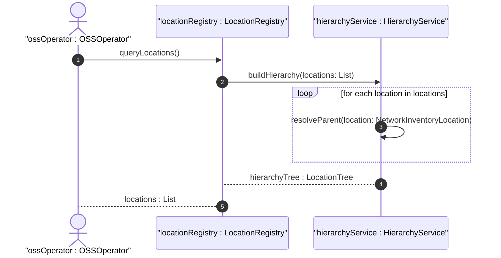

# User Story: Query Network Inventory Location Hierarchy

## Parent Epic
- [ ] #8 - Network Inventory Location — Location Hierarchy & Facilities (https://github.com/gintatkinson/3dgs-028/blob/main/docs/epics/epic-01-location-hierarchy-facilities.md) (Hierarchical location traversal is a core capability of the location model)

## Domain Object Mapping
- **Primary Domain Objects:** NetworkInventoryLocation (nil:locations/location)
- **Actor/Role:** OSS Operator / Network Management System

## BDD Scenario (OOA/OOD Realization)
**As a** network operator
**I want to** retrieve the complete location hierarchy beginning from a site down to individual rooms
**So that** I can understand the physical topology of network element deployments

**Given** a location list with parent-child relationships established via the `parent` leafref
**When** the OSS queries `/locations/location` via NETCONF or RESTCONF
**Then** all locations are returned with their `id`, `type`, and `parent` fields, enabling the OSS to reconstruct the full hierarchy tree

## UML Sequence Diagram

## Operational Context
> The "location" list is generalized to support a variety of geographic location, such as sites, rooms, buildings. Locations can be nested to form a hierarchy. For example, buildings may be within a site, and a room may be within a building.

> OSS systems and other management applications obtain location information via standard YANG retrieval operations (NETCONF, RESTCONF), such as querying network elements associated with a specific site or rack.

## Required Features Matrix
- [ ] #1 - [Network Inventory Location Entity](https://github.com/gintatkinson/3dgs-028/blob/main/docs/features/feat-01-ni-location-entity.md) (Core location list with parent leafref for hierarchy formation)
- [ ] #2 - [Physical Address for Network Inventory Locations](https://github.com/gintatkinson/3dgs-028/blob/main/docs/features/feat-02-physical-address.md) (Physical address enriches hierarchy display with human-readable location info)

## Source References
Structural Schema: [ietf-ni-location.yang](https://github.com/ietf-ivy-wg/network-inventory-location/blob/main/ietf-ni-location.yang) (list location, leaf parent)
Normative Specification: [draft-ietf-ivy-network-inventory-location-06](https://datatracker.ietf.org/doc/html/draft-ietf-ivy-network-inventory-location) (Section 2, Section 6)
