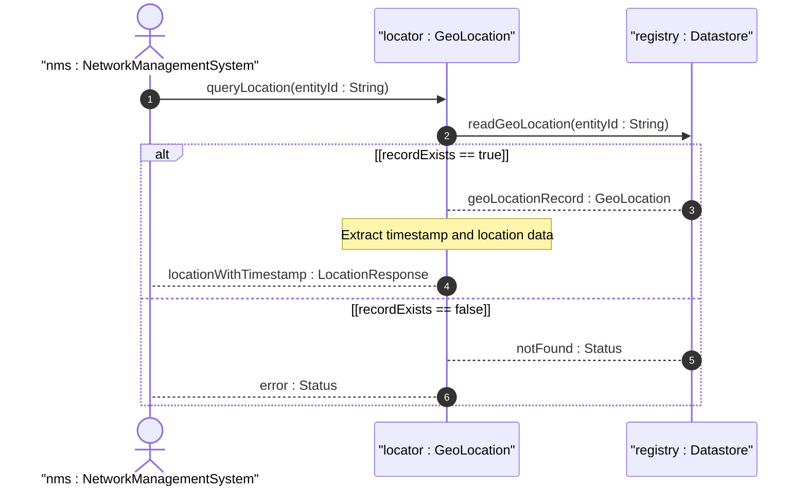

# User Story: Query Location by Timestamp

## Parent Epic
- [ ] #7 - [Geo-Location Grouping](https://github.com/gintatkinson/3dgs-028/blob/main/docs/epics/epic-01-geo-location-grouping.md) (temporal querying of location data recorded at specific points in time)

## Domain Object Mapping
- **Primary Domain Objects:** GeoLocation (container geo-location), Timestamp (leaf timestamp)
- **Actor/Role:** Network Management System

## BDD Scenario (OOA/OOD Realization)
**Given** a geo-location entity has been recorded with a specific timestamp
**When** a network management system queries the location data
**Then** the system returns the location with its associated timestamp indicating when the measurement was taken

**As a** Network Management System
**I want to** retrieve a geo-location record with its measurement timestamp
**So that** I can determine the temporal relevance and freshness of the location data

## UML Sequence Diagram

## Operational Context
From RFC 9179, Section 2.3: "If the object is in motion, the velocity vector describes this motion at the time given by the timestamp."

From RFC 9179, Section 2.6 (YANG tree): "timestamp? yang:date-and-time — Reference time when location was recorded."

From the YANG module: "leaf timestamp { type yang:date-and-time; description 'Reference time when location was recorded.'; }"

## Required Features Matrix
- [ ] #1 - [Geo-Location Root Container](https://github.com/gintatkinson/3dgs-028/blob/main/docs/features/feat-01-geo-location-root.md) (timestamp leaf provides the temporal reference for the location record)
- [ ] #6 - [Velocity Vector](https://github.com/gintatkinson/3dgs-028/blob/main/docs/features/feat-06-velocity-vector.md) (velocity is measured at the time given by the timestamp)

## Source References
Structural Schema: [ietf-geo-location@2022-02-11.yang](https://github.com/YangModels/yang/blob/main/standard/ietf/RFC/ietf-geo-location%402022-02-11.yang)
Normative Specification: [RFC 9179: A YANG Grouping for Geographic Locations](https://datatracker.ietf.org/doc/rfc9179/)
