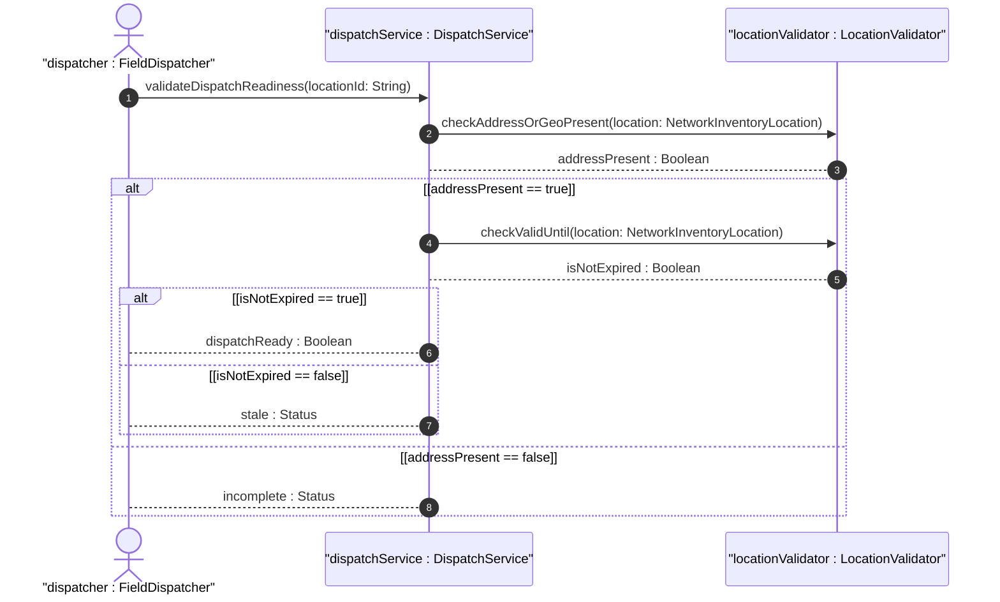
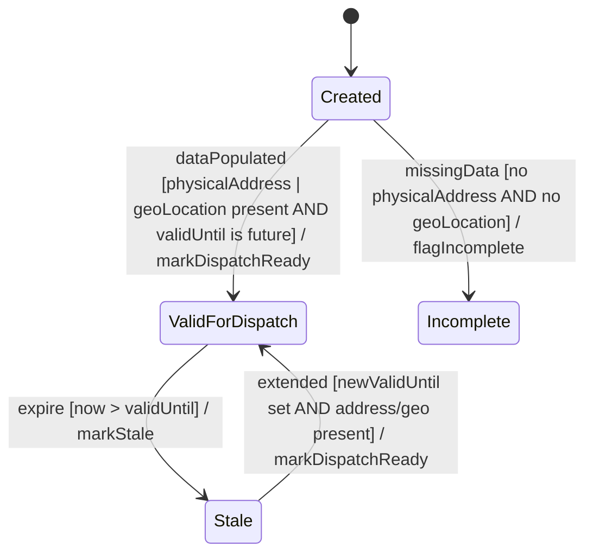

# User Story: Validate Location for Field Dispatch Readiness

## Parent Epic
- [ ] #8 - Network Inventory Location — Location Hierarchy & Facilities (https://github.com/gintatkinson/3dgs-028/blob/main/docs/epics/epic-01-location-hierarchy-facilities.md) (Operational validation of location data for dispatch)

## Domain Object Mapping
- **Primary Domain Objects:** NetworkInventoryLocation, PhysicalAddress, GeographicLocation
- **Actor/Role:** Field Operations System / Dispatch Controller

## BDD Scenario (OOA/OOD Realization)
**As a** field operations dispatcher
**I want to** verify that a location has sufficient data for field dispatch
**So that** I can confidently send technicians to the correct physical location

**Given** a location entry with a `physical-address` and/or `geo-location` populated
**When** the dispatch validation service checks the location data
**Then** if at least one of physical-address or geo-location is present, AND `valid-until` is either absent or in the future, the location is marked as valid for dispatch

**Given** a location with neither `physical-address` nor `geo-location`
**When** dispatch validation is performed
**Then** the location fails the verification check and is flagged as incomplete

**Given** a location with valid address data but an expired `valid-until` timestamp
**When** dispatch validation is performed
**Then** the location is considered stale and must NOT be used for operational purposes

## UML Sequence Diagram

## UML State Machine Diagram

## Operational Context
> Before using a location for field dispatch or planning, verification is required to ensure at least one of physical-address or geo-location is present, and that the valid-until leaf is either not present or indicates a future time. Once the valid-until time has passed, the location MUST be considered stale and MUST NOT be used for operational purposes.

## Required Features Matrix
- [ ] #1 - [Network Inventory Location Entity](https://github.com/gintatkinson/3dgs-028/blob/main/docs/features/feat-01-ni-location-entity.md) (Location timestamps and temporal validity markers for staleness checks)
- [ ] #2 - [Physical Address for Network Inventory Locations](https://github.com/gintatkinson/3dgs-028/blob/main/docs/features/feat-02-physical-address.md) (Physical address presence is one of two required data elements for dispatch)
- [ ] #3 - [Geographic Location for Network Inventory](https://github.com/gintatkinson/3dgs-028/blob/main/docs/features/feat-03-geographic-location.md) (Geo-location coordinates satisfy the alternate dispatch readiness condition)

## Source References
Structural Schema: [ietf-ni-location.yang](https://github.com/ietf-ivy-wg/network-inventory-location/blob/main/ietf-ni-location.yang)
Normative Specification: [draft-ietf-ivy-network-inventory-location-06](https://datatracker.ietf.org/doc/html/draft-ietf-ivy-network-inventory-location) (Section 6: Operational Considerations)
