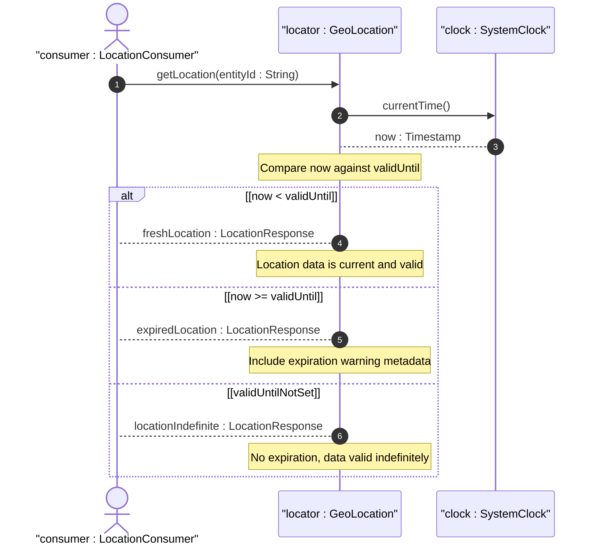
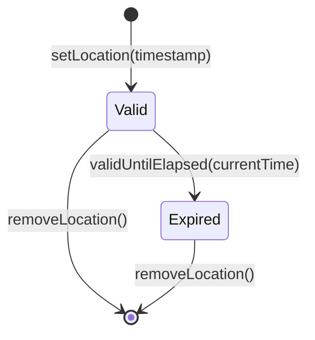

# User Story: Validate Location Freshness

## Parent Epic
- [ ] #7 - [Geo-Location Grouping](https://github.com/gintatkinson/3dgs-028/blob/main/docs/epics/epic-01-geo-location-grouping.md) (temporal validation of location data through valid-until expiration)

## Domain Object Mapping
- **Primary Domain Objects:** GeoLocation (container geo-location), ValidUntil (leaf valid-until), Timestamp (leaf timestamp)
- **Actor/Role:** Location Consumer

## BDD Scenario (OOA/OOD Realization)
**Given** a geo-location entity has a valid-until timestamp set to a future date
**When** a consumer reads the location data before the valid-until time
**Then** the location data is considered fresh and valid for use

**As a** Location Consumer
**I want to** check whether a geo-location record has expired based on its valid-until timestamp
**So that** I can discard or downgrade confidence in stale location data

## UML Sequence Diagram

## UML State Machine Diagram

## Operational Context
From RFC 9179, YANG module: "leaf valid-until { type yang:date-and-time; description 'The timestamp for which this geo-location is valid until. If unspecified, the geo-location has no specific expiration time.'; }"

From RFC 9179, Section 5.1.3: "values down to the resolution of seconds for 'gml:TimePeriod' can be mapped using the 'valid-until' node of the YANG grouping."

## Required Features Matrix
- [ ] #1 - [Geo-Location Root Container](https://github.com/gintatkinson/3dgs-028/blob/main/docs/features/feat-01-geo-location-root.md) (valid-until leaf defines the expiration time; timestamp leaf provides the measurement reference)

## Source References
Structural Schema: [ietf-geo-location@2022-02-11.yang](https://github.com/YangModels/yang/blob/main/standard/ietf/RFC/ietf-geo-location%402022-02-11.yang)
Normative Specification: [RFC 9179: A YANG Grouping for Geographic Locations](https://datatracker.ietf.org/doc/rfc9179/)
