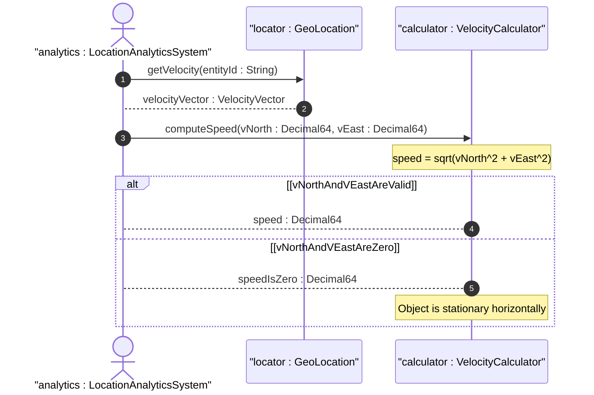

# User Story: Compute Speed from Velocity Vector

## Parent Epic
- [ ] #7 - [Geo-Location Grouping](https://github.com/gintatkinson/3dgs-028/blob/main/docs/epics/epic-01-geo-location-grouping.md) (calculation of derived scalar speed from 3D velocity vector components)

## Domain Object Mapping
- **Primary Domain Objects:** VelocityVector (container velocity), VNorth (leaf v-north), VEast (leaf v-east)
- **Actor/Role:** Location Analytics System

## BDD Scenario (OOA/OOD Realization)
**Given** a geo-location entity has a velocity vector with v-north = 3.0 m/s and v-east = 4.0 m/s
**When** the location analytics system computes the horizontal speed
**Then** the derived speed is 5.0 m/s using the formula speed = sqrt(v_north^2 + v_east^2)

**As a** Location Analytics System
**I want to** compute the scalar horizontal speed from the velocity vector components
**So that** I can display the object's speed without requiring knowledge of the underlying vector algebra

## UML Sequence Diagram

## Operational Context
From RFC 9179, Section 2.3: "To derive the two-dimensional heading and speed, one would use the following formulas: speed = sqrt(v_north^2 + v_east^2)"

"All components are given in fractional meters per second. For some applications that demand high accuracy and where the data is infrequently updated, this velocity vector can track very slow movement such as continental drift."

## Required Features Matrix
- [ ] #6 - [Velocity Vector](https://github.com/gintatkinson/3dgs-028/blob/main/docs/features/feat-06-velocity-vector.md) (v-north and v-east leaf nodes provide the input components for speed computation)

## Source References
Structural Schema: [ietf-geo-location@2022-02-11.yang](https://github.com/YangModels/yang/blob/main/standard/ietf/RFC/ietf-geo-location%402022-02-11.yang)
Normative Specification: [RFC 9179: A YANG Grouping for Geographic Locations](https://datatracker.ietf.org/doc/rfc9179/) (Clause: Section 2.3)
