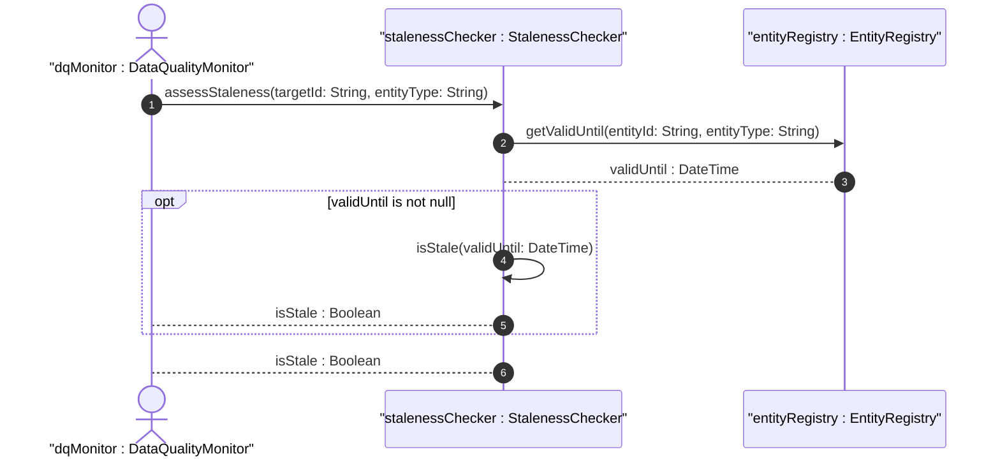
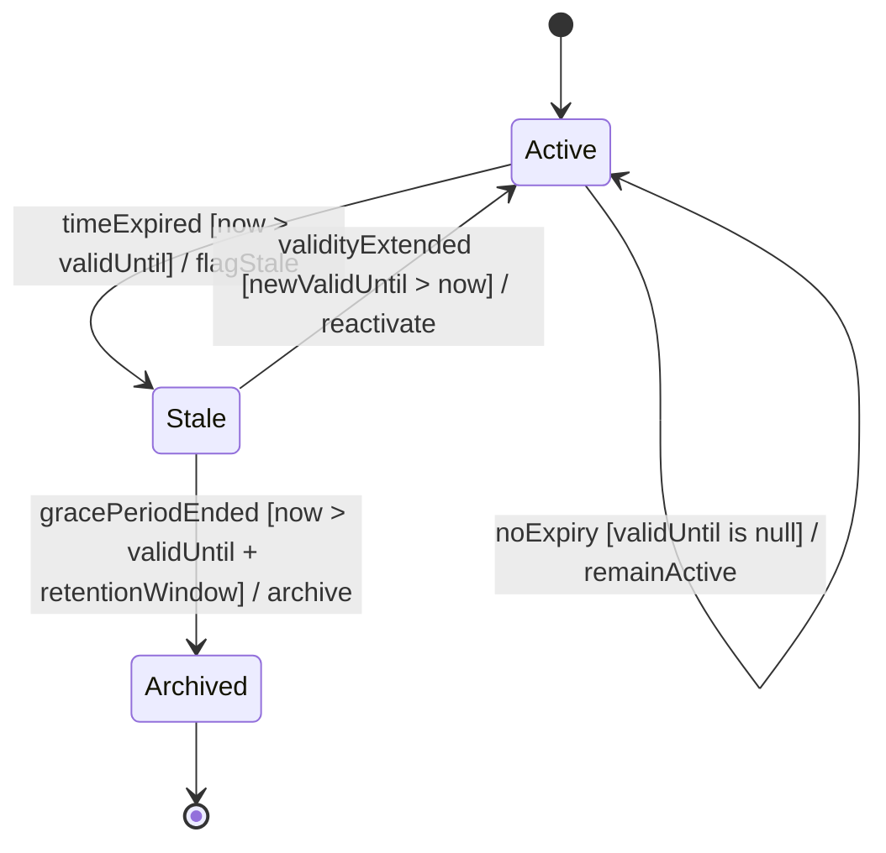

# User Story: Handle Expired Location Data and Temporal Staleness

## Parent Epic
- [ ] #8 - Network Inventory Location — Location Hierarchy & Facilities (https://github.com/gintatkinson/3dgs-028/blob/main/docs/epics/epic-01-location-hierarchy-facilities.md) (Temporal validity lifecycle of location data)

## Domain Object Mapping
- **Primary Domain Objects:** NetworkInventoryLocation, Rack
- **Actor/Role:** Inventory Controller / Data Quality Monitor

## BDD Scenario (OOA/OOD Realization)
**As an** inventory data manager
**I want to** detect and flag location and rack records that have passed their valid-until timestamp
**So that** stale data is excluded from operational use and planning

**Given** a location with `valid-until` set to a past timestamp (now > valid-until)
**When** the data quality assessment runs
**Then** the location is flagged as stale and excluded from dispatch readiness

**Given** a rack with `valid-until` set to a future timestamp
**When** the rack is queried for capacity planning
**Then** the rack data is considered valid and included in planning calculations

**Given** a location with no `valid-until` specified
**When** the staleness check is performed
**Then** the location has no specific expiration and remains valid indefinitely

## UML Sequence Diagram

## UML State Machine Diagram

## Operational Context
> Data quality is indicated through timestamps recording the last update time, as well as an optional expiration time for location validity. Once the valid-until time has passed, the location MUST be considered stale and MUST NOT be used for operational purposes.

## Required Features Matrix
- [ ] #1 - [Network Inventory Location Entity](https://github.com/gintatkinson/3dgs-028/blob/main/docs/features/feat-01-ni-location-entity.md) (Location-level valid-until and timestamp for staleness lifecycle)
- [ ] #5 - [Rack Entity for Network Inventory](https://github.com/gintatkinson/3dgs-028/blob/main/docs/features/feat-05-rack-entity.md) (Rack-level valid-until and timestamp for rack staleness lifecycle)

## Source References
Structural Schema: [ietf-ni-location.yang](https://github.com/ietf-ivy-wg/network-inventory-location/blob/main/ietf-ni-location.yang) (leaf valid-until on both location and rack)
Normative Specification: [draft-ietf-ivy-network-inventory-location-06](https://datatracker.ietf.org/doc/html/draft-ietf-ivy-network-inventory-location) (Section 6: Operational Considerations)
