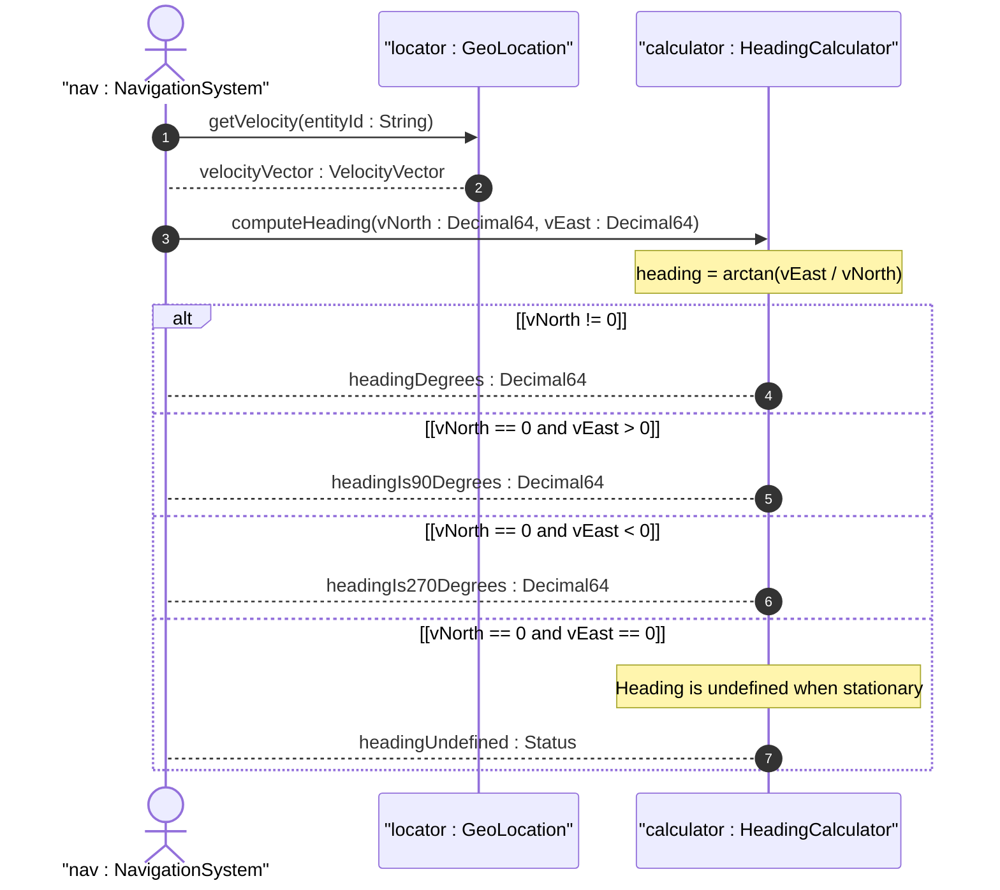

# User Story: Compute Heading from Velocity Vector

## Parent Epic
- [ ] #7 - [Geo-Location Grouping](https://github.com/gintatkinson/3dgs-028/blob/main/docs/epics/epic-01-geo-location-grouping.md) (calculation of derived heading angle from 3D velocity vector components)

## Domain Object Mapping
- **Primary Domain Objects:** VelocityVector (container velocity), VNorth (leaf v-north), VEast (leaf v-east)
- **Actor/Role:** Navigation System

## BDD Scenario (OOA/OOD Realization)
**Given** a geo-location entity has a velocity vector with v-north = 1.0 m/s and v-east = 1.0 m/s
**When** the navigation system computes the heading
**Then** the derived heading is 45.0 degrees from true north using heading = arctan(v_east / v_north)

**As a** Navigation System
**I want to** compute the compass heading direction from the velocity vector
**So that** I can determine the direction of motion relative to true north

## UML Sequence Diagram

## Operational Context
From RFC 9179, Section 2.3: "To derive the two-dimensional heading and speed, one would use the following formulas: heading = arctan(v_east / v_north)."

"The values 'v-north' and 'v-east' are relative to true north as defined by the reference frame for the astronomical body."

Division by zero handling when v-north = 0 must be addressed: heading is 90 degrees when v-east > 0 and 270 degrees when v-east < 0.

## Required Features Matrix
- [ ] #6 - [Velocity Vector](https://github.com/gintatkinson/3dgs-028/blob/main/docs/features/feat-06-velocity-vector.md) (v-north and v-east leaf nodes provide the input components for heading computation)
- [ ] #2 - [Reference Frame](https://github.com/gintatkinson/3dgs-028/blob/main/docs/features/feat-02-reference-frame.md) (true north direction is defined by the reference frame for the astronomical body)

## Source References
Structural Schema: [ietf-geo-location@2022-02-11.yang](https://github.com/YangModels/yang/blob/main/standard/ietf/RFC/ietf-geo-location%402022-02-11.yang)
Normative Specification: [RFC 9179: A YANG Grouping for Geographic Locations](https://datatracker.ietf.org/doc/rfc9179/) (Clause: Section 2.3)
