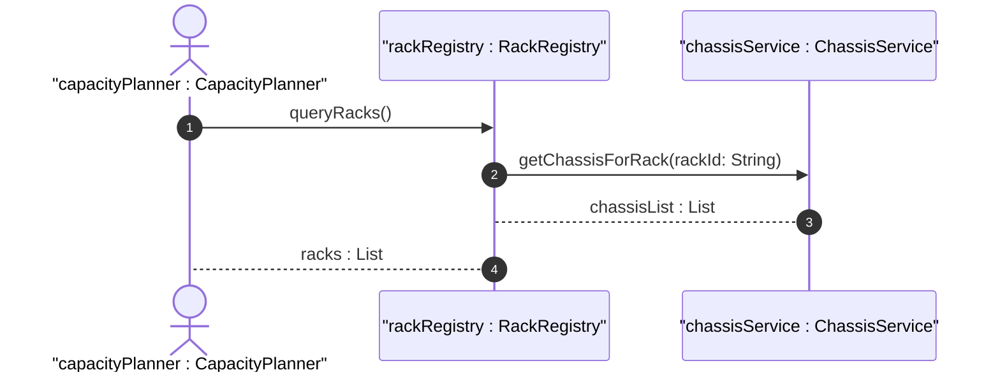

# User Story: Query Rack Infrastructure Inventory

## Parent Epic
- [ ] #9 - Network Inventory Location — Rack Infrastructure (https://github.com/gintatkinson/3dgs-028/blob/main/docs/epics/epic-02-rack-infrastructure.md) (Full rack inventory listing with filtering)

## Domain Object Mapping
- **Primary Domain Objects:** Rack, RackLocation, RackChassis
- **Actor/Role:** Network Planning Operator / Capacity Manager

## BDD Scenario (OOA/OOD Realization)
**As a** network capacity planner
**I want to** retrieve the complete list of racks with their dimensions, power capacity, and installed chassis
**So that** I can assess available rack space and plan new equipment installations

**Given** a rack inventory with multiple racks across different locations
**When** the operator queries `/locations/racks/rack` via NETCONF or RESTCONF
**Then** all racks are returned with their identifiers, dimensions (height, width, depth in mm), electrical specifications (max-voltage, max-allocated-power), and rack-class security classification

## UML Sequence Diagram

## Operational Context
> "racks" represent physical equipment racks in which NEs can be installed, which facilitate device maintenance. Each rack is assigned a unique ID and a name in the context of a facility, e.g. a site. A rack may have some specific attributes, such as appearance-related attributes and electricity-related attributes.

## Required Features Matrix
- [ ] #5 - [Rack Entity for Network Inventory](https://github.com/gintatkinson/3dgs-028/blob/main/docs/features/feat-05-rack-entity.md) (Core rack entity with dimensions, power, and classification)
- [ ] #6 - [Rack Placement within Network Inventory Location](https://github.com/gintatkinson/3dgs-028/blob/main/docs/features/feat-06-rack-placement.md) (Rack placement for spatial filtering)
- [ ] #7 - [Rack-Level Chassis Container](https://github.com/gintatkinson/3dgs-028/blob/main/docs/features/feat-07-rack-chassis.md) (Chassis inventory within racks for capacity assessment)

## Source References
Structural Schema: [ietf-ni-location.yang](https://github.com/ietf-ivy-wg/network-inventory-location/blob/main/ietf-ni-location.yang) (list rack within racks container)
Normative Specification: [draft-ietf-ivy-network-inventory-location-06](https://datatracker.ietf.org/doc/html/draft-ietf-ivy-network-inventory-location) (Section 3: Rack)
