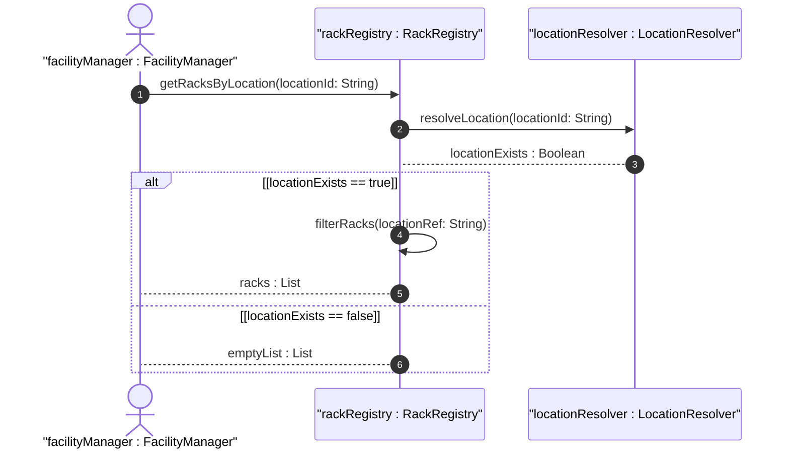

# User Story: Locate Racks by Facility or Location

## Parent Epic
- [ ] #9 - Network Inventory Location — Rack Infrastructure (https://github.com/gintatkinson/3dgs-028/blob/main/docs/epics/epic-02-rack-infrastructure.md) (Spatial filtering of racks by location reference)

## Domain Object Mapping
- **Primary Domain Objects:** Rack, RackLocation, NetworkInventoryLocation
- **Actor/Role:** Facility Manager / Data Center Operator

## BDD Scenario (OOA/OOD Realization)
**As a** data center facility manager
**I want to** retrieve all racks located within a specific equipment room or site
**So that** I can manage equipment inventory at the room level

**Given** a location "Room-101" containing several racks
**When** the operator queries racks filtered by `rack-location/location-ref = "Room-101"`
**Then** all racks with that location reference are returned with their row and column numbers

**Given** a rack with an unresolved location-ref (pointing to a deleted location)
**When** the rack list is queried
**Then** the rack has a dangling location reference and cannot be spatially mapped to a facility

## UML Sequence Diagram

## Operational Context
> Through "rack-location", each rack can be assigned to a site or a specific location within a site, such as an equipment room. OSS systems and other management applications obtain location information via standard YANG retrieval operations, such as querying network elements associated with a specific site or rack.

## Required Features Matrix
- [ ] #6 - [Rack Placement within Network Inventory Location](https://github.com/gintatkinson/3dgs-028/blob/main/docs/features/feat-06-rack-placement.md) (Location reference and row/column placement data for filtering)
- [ ] #5 - [Rack Entity for Network Inventory](https://github.com/gintatkinson/3dgs-028/blob/main/docs/features/feat-05-rack-entity.md) (Rack identity and classification for filtered results)
- [ ] #1 - [Network Inventory Location Entity](https://github.com/gintatkinson/3dgs-028/blob/main/docs/features/feat-01-ni-location-entity.md) (Location resolution for validating rack placement references)

## Source References
Structural Schema: [ietf-ni-location.yang](https://github.com/ietf-ivy-wg/network-inventory-location/blob/main/ietf-ni-location.yang) (container rack-location)
Normative Specification: [draft-ietf-ivy-network-inventory-location-06](https://datatracker.ietf.org/doc/html/draft-ietf-ivy-network-inventory-location) (Section 3, Section 6)
