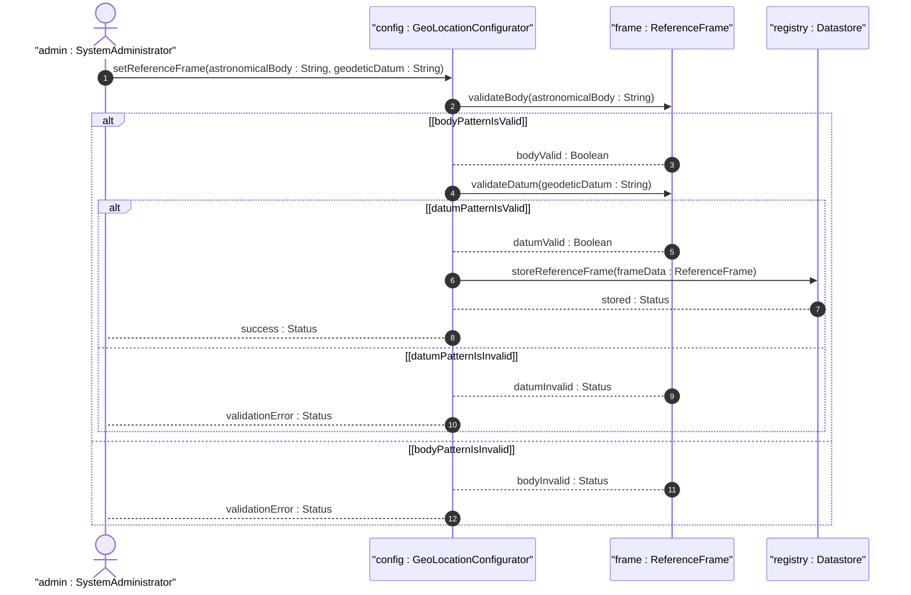

# User Story: Select Frame of Reference

## Parent Epic
- [ ] #7 - [Geo-Location Grouping](https://github.com/gintatkinson/3dgs-028/blob/main/docs/epics/epic-01-geo-location-grouping.md) (configuration of the frame of reference defining the coordinate system context)

## Domain Object Mapping
- **Primary Domain Objects:** ReferenceFrame (container reference-frame), AstronomicalBody (leaf astronomical-body), GeodeticSystem (container geodetic-system), GeodeticDatum (leaf geodetic-datum)
- **Actor/Role:** System Administrator

## BDD Scenario (OOA/OOD Realization)
**Given** a geo-location entity is being configured for a device on the Moon
**When** the system administrator sets astronomical-body to "moon" and geodetic-datum to "me"
**Then** all subsequent coordinate values (latitude, longitude, height, or x, y, z) are interpreted within the lunar Mean Earth/Polar Axis reference frame

**As a** System Administrator
**I want to** configure the astronomical body and geodetic datum for a location entity
**So that** coordinates are correctly interpreted within the appropriate planetary or celestial reference system

## UML Sequence Diagram

## Operational Context
From RFC 9179, Section 2.1: "The frame of reference ('reference-frame') defines what the location values refer to and their meaning. The referred-to object can be any astronomical body. It could be a planet such as Earth or Mars, a moon such as Enceladus, an asteroid such as Ceres, or even a comet such as 1P/Halley. The default 'astronomical-body' value is 'earth'."

"In addition to identifying the astronomical body, we also need to define the meaning of the coordinates (e.g., latitude and longitude) and the definition of 0-height. This is done with a 'geodetic-datum' value. The default value for 'geodetic-datum' is 'wgs-84'."

## Required Features Matrix
- [ ] #2 - [Reference Frame](https://github.com/gintatkinson/3dgs-028/blob/main/docs/features/feat-02-reference-frame.md) (astronomical-body leaf and alternate-system leaf define the frame of reference)
- [ ] #3 - [Geodetic System](https://github.com/gintatkinson/3dgs-028/blob/main/docs/features/feat-03-geodetic-system.md) (geodetic-datum leaf defines coordinate meaning; coord-accuracy and height-accuracy provide measurement precision)

## Source References
Structural Schema: [ietf-geo-location@2022-02-11.yang](https://github.com/YangModels/yang/blob/main/standard/ietf/RFC/ietf-geo-location%402022-02-11.yang)
Normative Specification: [RFC 9179: A YANG Grouping for Geographic Locations](https://datatracker.ietf.org/doc/rfc9179/) (Clause: Section 2.1)
