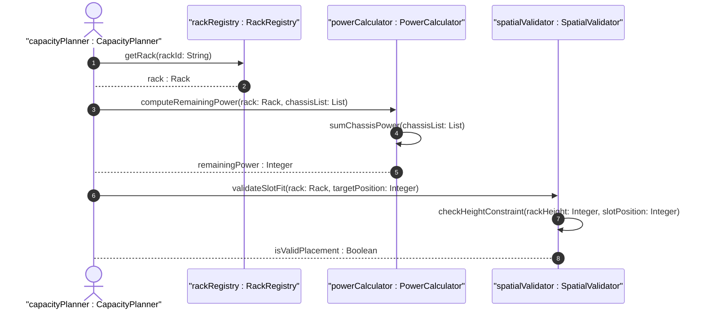

# User Story: Calculate Rack Power and Spatial Capacity Utilization

## Parent Epic
- [ ] #9 - Network Inventory Location — Rack Infrastructure (https://github.com/gintatkinson/3dgs-028/blob/main/docs/epics/epic-02-rack-infrastructure.md) (Electrical and spatial capacity calculations)

## Domain Object Mapping
- **Primary Domain Objects:** Rack
- **Actor/Role:** Capacity Planning System / Power Management Controller

## BDD Scenario (OOA/OOD Realization)
**As a** power management controller
**I want to** calculate the remaining power and spatial capacity of each rack based on its allocated equipment
**So that** I can prevent circuit overloads and optimize rack utilization

**Given** a rack with `max-allocated-power` of 8000 watts and `max-voltage` of 240 volts
**When** the capacity calculation service computes available power
**Then** the remaining power headroom is derived as `max-allocated-power` minus the sum of power draws from all installed chassis (if power draw data is available from component metadata)

**Given** a rack with `height` of 2200mm
**When** a new chassis needs to be installed at a relative-position (U-slot) that would exceed the physical rack height
**Then** the deployment is rejected because the chassis position exceeds the rack's spatial bounds

## UML Sequence Diagram

## Operational Context
> Max-voltage: the maximum voltage supported by the rack. The maximum allocated power for the rack. A rack may have some specific attributes, such as appearance-related attributes and electricity-related attributes.

> In large-scale inventories containing numerous network elements and components, querying location associations can impose a load on the server. To optimize retrieval and avoid overwhelming the server, mechanisms such as RESTCONF or NETCONF pagination should be utilized for queries involving large result sets.

## Required Features Matrix
- [ ] #5 - [Rack Entity for Network Inventory](https://github.com/gintatkinson/3dgs-028/blob/main/docs/features/feat-05-rack-entity.md) (Electrical and spatial attributes for capacity calculation — max-voltage, max-allocated-power, height, width, depth)
- [ ] #7 - [Rack-Level Chassis Container](https://github.com/gintatkinson/3dgs-028/blob/main/docs/features/feat-07-rack-chassis.md) (Chassis relative-position data for spatial validation against rack height)

## Source References
Structural Schema: [ietf-ni-location.yang](https://github.com/ietf-ivy-wg/network-inventory-location/blob/main/ietf-ni-location.yang) (rack attributes: max-voltage, max-allocated-power, height, width, depth)
Normative Specification: [draft-ietf-ivy-network-inventory-location-06](https://datatracker.ietf.org/doc/html/draft-ietf-ivy-network-inventory-location) (Section 3: Rack)
