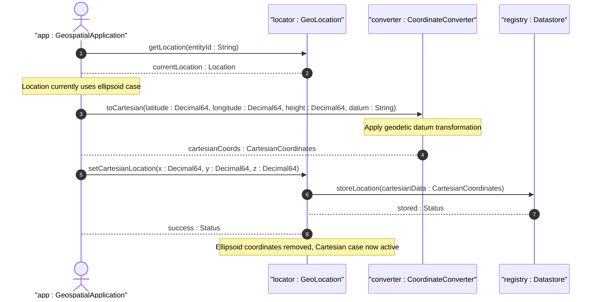

# User Story: Switch Between Ellipsoid and Cartesian Coordinates

## Parent Epic
- [ ] #7 - [Geo-Location Grouping](https://github.com/gintatkinson/3dgs-028/blob/main/docs/epics/epic-01-geo-location-grouping.md) (coordinated use of the location choice between ellipsoid and Cartesian coordinate systems)

## Domain Object Mapping
- **Primary Domain Objects:** Location (choice location), EllipsoidCoordinates (case ellipsoid), CartesianCoordinates (case cartesian)
- **Actor/Role:** Geospatial Application

## BDD Scenario (OOA/OOD Realization)
**Given** a geo-location entity currently stores location data in ellipsoidal coordinates (latitude, longitude, height)
**When** a geospatial application needs to express the location in Cartesian Earth-Centered Earth-Fixed (ECEF) coordinates
**Then** the application can replace the location data with Cartesian x, y, z values, and the ellipsoid coordinates are removed per the choice semantics

**As a** Geospatial Application
**I want to** switch a location entity between ellipsoidal and Cartesian coordinate representations
**So that** I can use the coordinate system most appropriate for the target computation or visualization

## UML Sequence Diagram

## Operational Context
From RFC 9179, Section 2.2: "This is the location on, or relative to, the astronomical object. It is specified using two or three coordinate values. These values are given either as 'latitude', 'longitude', and an optional 'height', or as Cartesian coordinates of 'x', 'y', and 'z'."

"In both choices, the exact meanings of all the values are defined by the 'geodetic-datum' value in Section 2.1."

The YANG `choice` statement ensures only one coordinate system is active at a time; switching between systems requires the application to perform the coordinate transformation.

## Required Features Matrix
- [ ] #4 - [Ellipsoid Coordinate System](https://github.com/gintatkinson/3dgs-028/blob/main/docs/features/feat-04-ellipsoid-coordinates.md) (ellipsoid case with latitude, longitude, height leaves)
- [ ] #5 - [Cartesian Coordinate System](https://github.com/gintatkinson/3dgs-028/blob/main/docs/features/feat-05-cartesian-coordinates.md) (cartesian case with x, y, z leaves)
- [ ] #3 - [Geodetic System](https://github.com/gintatkinson/3dgs-028/blob/main/docs/features/feat-03-geodetic-system.md) (geodetic-datum defines the transformation parameters between coordinate systems)

## Source References
Structural Schema: [ietf-geo-location@2022-02-11.yang](https://github.com/YangModels/yang/blob/main/standard/ietf/RFC/ietf-geo-location%402022-02-11.yang)
Normative Specification: [RFC 9179: A YANG Grouping for Geographic Locations](https://datatracker.ietf.org/doc/rfc9179/) (Clause: Section 2.2)
