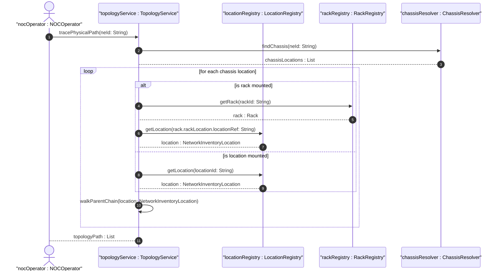

# User Story: Navigate Full Facility Topology from Site to Chassis

## Parent Epic
- [ ] #8 - Network Inventory Location — Location Hierarchy & Facilities (https://github.com/gintatkinson/3dgs-028/blob/main/docs/epics/epic-01-location-hierarchy-facilities.md) (End-to-end topology navigation)

## Domain Object Mapping
- **Primary Domain Objects:** NetworkInventoryLocation, Rack, LocationChassis, RackChassis
- **Actor/Role:** Network Operations Center (NOC) Operator

## BDD Scenario (OOA/OOD Realization)
**As a** NOC operator troubleshooting a network element
**I want to** trace the full physical path from site to building to room to rack to chassis
**So that** I can dispatch a technician to the exact U-slot position in the correct rack

**Given** a network element "NE-1" deployed in a distributed configuration
**When** the operator queries the location model for the full containment chain
**Then** the topology traversal reveals: Site -> Building -> Room -> Rack -> U-slot (relative-position) -> chassis, providing a complete physical location path

**Given** a chassis deployed directly at a location without a rack (e.g., ceiling-mounted access point)
**When** the topology navigation reaches the location level
**Then** the chassis is found in the location-level contained-chassis list with no intermediate rack

## UML Sequence Diagram

## Operational Context
> The location model augments the base network inventory to enrich NEs with location information. Network Elements can be grouped by location to provide more information for network planning, deployment, and maintenance (e.g., easily locate problematic NEs, optimize network resources, or help planning forecasts).

## Required Features Matrix
- [ ] #1 - [Network Inventory Location Entity](https://github.com/gintatkinson/3dgs-028/blob/main/docs/features/feat-01-ni-location-entity.md) (Location hierarchy with parent chain for topology walk)
- [ ] #4 - [Location-Level Chassis Container](https://github.com/gintatkinson/3dgs-028/blob/main/docs/features/feat-04-location-chassis.md) (Non-rack chassis for edge deployments)
- [ ] #5 - [Rack Entity for Network Inventory](https://github.com/gintatkinson/3dgs-028/blob/main/docs/features/feat-05-rack-entity.md) (Rack identity for rack-mounted chassis)
- [ ] #6 - [Rack Placement within Network Inventory Location](https://github.com/gintatkinson/3dgs-028/blob/main/docs/features/feat-06-rack-placement.md) (Rack-to-location link for topology resolution)
- [ ] #7 - [Rack-Level Chassis Container](https://github.com/gintatkinson/3dgs-028/blob/main/docs/features/feat-07-rack-chassis.md) (Rack chassis U-slot position for precise technician dispatch)

## Source References
Structural Schema: [ietf-ni-location.yang](https://github.com/ietf-ivy-wg/network-inventory-location/blob/main/ietf-ni-location.yang)
Normative Specification: [draft-ietf-ivy-network-inventory-location-06](https://datatracker.ietf.org/doc/html/draft-ietf-ivy-network-inventory-location) (Section 1, Appendix A)
