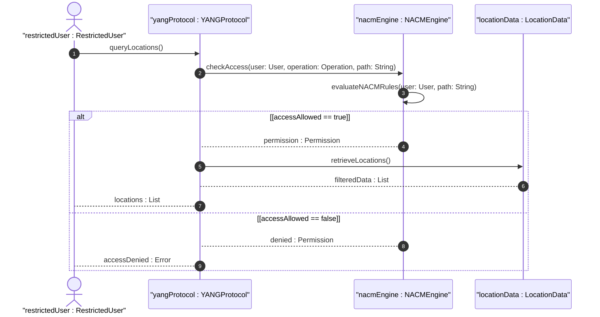

# User Story: Enforce Read-Only Access Control on Location Data

## Parent Epic
- [ ] #8 - Network Inventory Location — Location Hierarchy & Facilities (https://github.com/gintatkinson/3dgs-028/blob/main/docs/epics/epic-01-location-hierarchy-facilities.md) (Security and access control)

## Domain Object Mapping
- **Primary Domain Objects:** NetworkInventoryLocation, Rack
- **Actor/Role:** Security Administrator / NACM System

## BDD Scenario (OOA/OOD Realization)
**As a** security administrator
**I want to** restrict access to sensitive location data based on user roles
**So that** unauthorized parties cannot discover physical facility layouts, geographic coordinates, or rack security classifications

**Given** a user with a restricted NACM profile
**When** the user queries the `/locations` subtree
**Then** only location data authorized by their NACM access rules is returned

**Given** an unauthenticated or unauthorized request
**When** attempting to retrieve location data via NETCONF or RESTCONF
**Then** the request is rejected due to lack of mutual authentication or insufficient access permissions

**Given** the sensitivity classifications of location data (physical addresses, geographic coordinates, rack security levels)
**When** access control rules are defined
**Then** read access is explicitly configured for each sensitive subtree

## UML Sequence Diagram

## Operational Context
> The Network Configuration Access Control Model (NACM) provides the means to restrict access for particular NETCONF or RESTCONF users to a preconfigured subset of all available NETCONF or RESTCONF protocol operations and content. Some of the readable data nodes in this YANG module may be considered sensitive or vulnerable in some network environments. It is thus important to control read access to these data nodes.

## Required Features Matrix
- [ ] #1 - [Network Inventory Location Entity](https://github.com/gintatkinson/3dgs-028/blob/main/docs/features/feat-01-ni-location-entity.md) (Location data nodes subject to NACM read restrictions)
- [ ] #2 - [Physical Address for Network Inventory Locations](https://github.com/gintatkinson/3dgs-028/blob/main/docs/features/feat-02-physical-address.md) (Sensitive physical address data requiring access control)
- [ ] #3 - [Geographic Location for Network Inventory](https://github.com/gintatkinson/3dgs-028/blob/main/docs/features/feat-03-geographic-location.md) (Sensitive GPS coordinates requiring access control)
- [ ] #5 - [Rack Entity for Network Inventory](https://github.com/gintatkinson/3dgs-028/blob/main/docs/features/feat-05-rack-entity.md) (Sensitive rack security classification data)

## Source References
Structural Schema: [ietf-ni-location.yang](https://github.com/ietf-ivy-wg/network-inventory-location/blob/main/ietf-ni-location.yang)
Normative Specification: [draft-ietf-ivy-network-inventory-location-06](https://datatracker.ietf.org/doc/html/draft-ietf-ivy-network-inventory-location) (Section 7: Security Considerations, RFC 8341)
