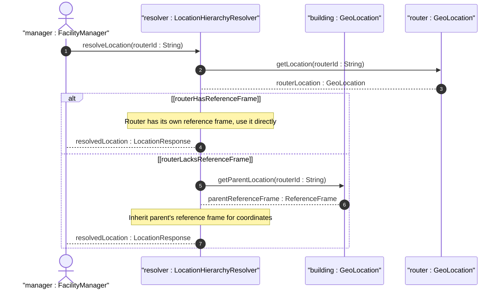

# User Story: Nest Locations with Inherited Reference Frame

## Parent Epic
- [ ] #7 - [Geo-Location Grouping](https://github.com/gintatkinson/3dgs-028/blob/main/docs/epics/epic-01-geo-location-grouping.md) (hierarchical nesting of location entities with inherited reference frame context)

## Domain Object Mapping
- **Primary Domain Objects:** GeoLocation (container geo-location), ReferenceFrame (container reference-frame)
- **Actor/Role:** Facility Manager

## BDD Scenario (OOA/OOD Realization)
**Given** a parent building entity has a geo-location with reference-frame set to earth and wgs-84
**When** a child router entity is placed inside the building and its geo-location is queried
**Then** the child entity inherits the parent's reference-frame (astronomical-body and geodetic-datum) unless explicitly overridden

**As a** Facility Manager
**I want to** define locations for equipment within a building without repeating the reference frame for each child entity
**So that** location data remains compact, consistent, and easily maintained across nested equipment hierarchies

## UML Sequence Diagram

## Operational Context
From RFC 9179, Section 2.4: "When locations are nested (e.g., a building may have a location that houses routers that also have locations), the module using this grouping is free to indicate in its definition that the 'reference-frame' is inherited from the containing object so that the 'reference-frame' need not be repeated in every instance of location data."

## Required Features Matrix
- [ ] #1 - [Geo-Location Root Container](https://github.com/gintatkinson/3dgs-028/blob/main/docs/features/feat-01-geo-location-root.md) (the root container that aggregates all location data for nested hierarchies)
- [ ] #2 - [Reference Frame](https://github.com/gintatkinson/3dgs-028/blob/main/docs/features/feat-02-reference-frame.md) (the reference-frame container whose values are inherited by child location entities)

## Source References
Structural Schema: [ietf-geo-location@2022-02-11.yang](https://github.com/YangModels/yang/blob/main/standard/ietf/RFC/ietf-geo-location%402022-02-11.yang)
Normative Specification: [RFC 9179: A YANG Grouping for Geographic Locations](https://datatracker.ietf.org/doc/rfc9179/) (Clause: Section 2.4)
