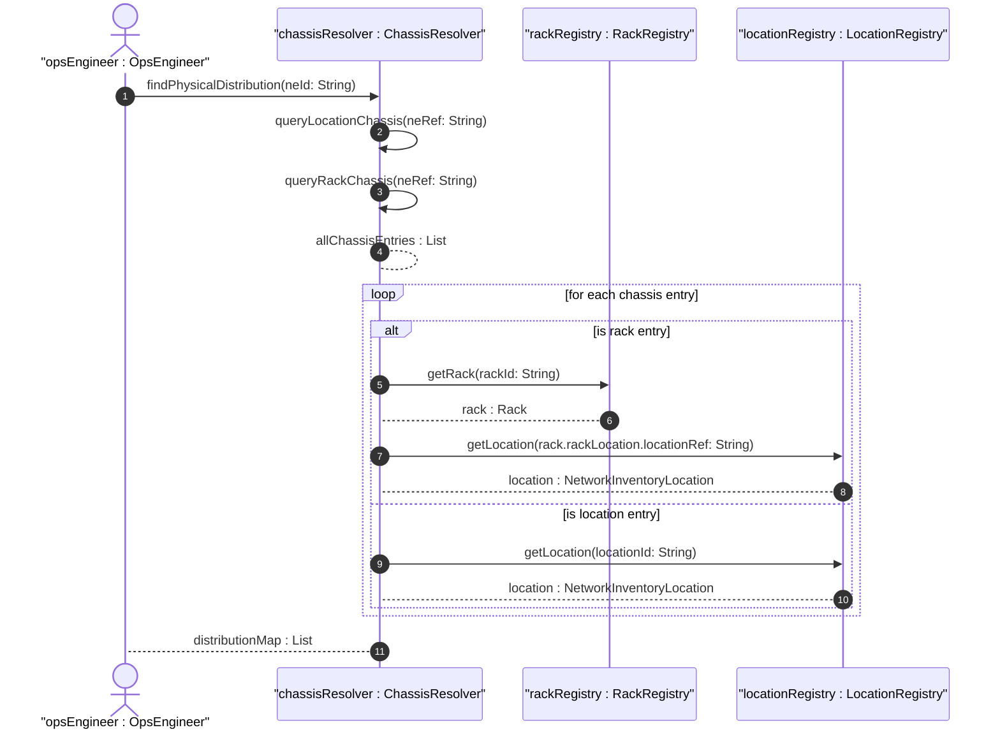

# User Story: Map Distributed Multi-Chassis Network Elements Across Locations

## Parent Epic
- [ ] #8 - Network Inventory Location — Location Hierarchy & Facilities (https://github.com/gintatkinson/3dgs-028/blob/main/docs/epics/epic-01-location-hierarchy-facilities.md) (Distributed chassis topology mapping)

## Domain Object Mapping
- **Primary Domain Objects:** NetworkInventoryLocation, LocationChassis, Rack, RackChassis, NetworkElement
- **Actor/Role:** Network Operations Engineer

## BDD Scenario (OOA/OOD Realization)
**As a** network operations engineer
**I want to** view all physical locations of a distributed multi-chassis network element
**So that** I can understand the physical dispersion of a logical network element across the facility

**Given** a stack switch "NE-1" with chassis-1 in Rack-101-A, chassis-2 in Rack-201-B, and chassis-3 in Rack-301-C
**When** the engineer queries all chassis entries referencing ne-ref "NE-1"
**Then** all three chassis entries are returned with their respective rack placements and location references, showing the full physical distribution

**Given** a network element with a single chassis at one location
**When** the distributed chassis mapping is queried
**Then** a single entry is returned matching the ne-ref

## UML Sequence Diagram

## Operational Context
> Chassis directly deployed in this location without rack. Also used for distributed chassis components that are logically part of a network element but physically located. Multiple chassis entries may reference the same ne-ref for distributed systems.

> The following shows the location data instance for a distributed deployment where a single logical network element (NE-1, a stack switch) spans multiple physical locations. The three chassis of the stack switch are located in separate telecommunications rooms on different floors, interconnected via stacking cables.

## Required Features Matrix
- [ ] #4 - [Location-Level Chassis Container](https://github.com/gintatkinson/3dgs-028/blob/main/docs/features/feat-04-location-chassis.md) (Location-level chassis entries referencing the same ne-ref)
- [ ] #7 - [Rack-Level Chassis Container](https://github.com/gintatkinson/3dgs-028/blob/main/docs/features/feat-07-rack-chassis.md) (Rack-level chassis entries referencing the same ne-ref)
- [ ] #1 - [Network Inventory Location Entity](https://github.com/gintatkinson/3dgs-028/blob/main/docs/features/feat-01-ni-location-entity.md) (Location hierarchy context for distributed chassis)

## Source References
Structural Schema: [ietf-ni-location.yang](https://github.com/ietf-ivy-wg/network-inventory-location/blob/main/ietf-ni-location.yang) (contained-chassis lists with ne-ref)
Normative Specification: [draft-ietf-ivy-network-inventory-location-06](https://datatracker.ietf.org/doc/html/draft-ietf-ivy-network-inventory-location) (Appendix A.2: Distributed Multi-Chassis Network Element)
