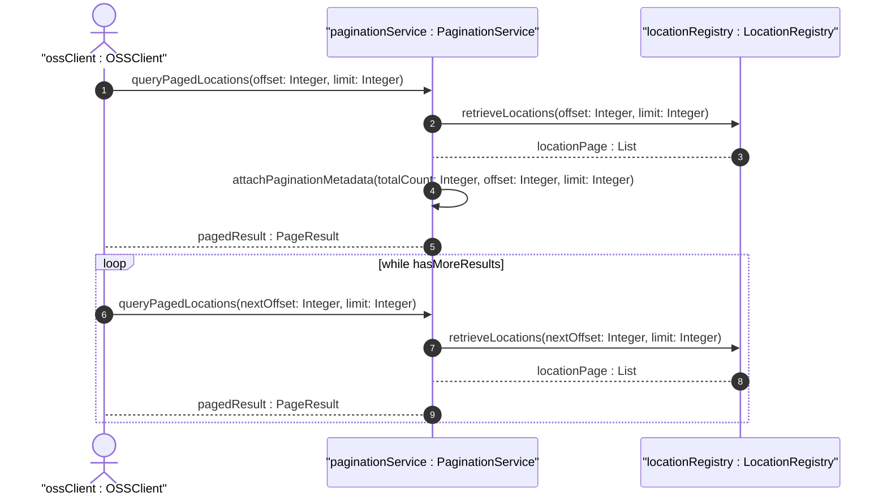

# User Story: Paginated Query of Large-Scale Location Inventories

## Parent Epic
- [ ] #8 - Network Inventory Location — Location Hierarchy & Facilities (https://github.com/gintatkinson/3dgs-028/blob/main/docs/epics/epic-01-location-hierarchy-facilities.md) (Operational scalability)

## Domain Object Mapping
- **Primary Domain Objects:** NetworkInventoryLocation, Rack
- **Actor/Role:** OSS Client / Inventory Management Application

## BDD Scenario (OOA/OOD Realization)
**As an** OSS client managing a large-scale network with thousands of locations and racks
**I want to** retrieve inventory data using paginated queries
**So that** I avoid overwhelming the server and receive manageable result sets

**Given** an inventory containing 50,000 locations
**When** the OSS queries `/locations/location` with RESTCONF pagination parameters (offset/limit or cursor-based)
**Then** results are returned in pages of the requested size rather than as a single massive payload

**Given** a query for racks within a site containing hundreds of racks
**When** the client uses NETCONF with subtree filtering and pagination
**Then** the server returns paginated rack results with standard NETCONF pagination markers

## UML Sequence Diagram

## Operational Context
> In large-scale inventories containing numerous network elements and components, querying location associations can impose a load on the server. To optimize retrieval and avoid overwhelming the server, mechanisms such as RESTCONF or NETCONF pagination should be utilized for queries involving large result sets.

## Required Features Matrix
- [ ] #1 - [Network Inventory Location Entity](https://github.com/gintatkinson/3dgs-028/blob/main/docs/features/feat-01-ni-location-entity.md) (Location list as primary pagination target)
- [ ] #5 - [Rack Entity for Network Inventory](https://github.com/gintatkinson/3dgs-028/blob/main/docs/features/feat-05-rack-entity.md) (Rack list as secondary pagination target)

## Source References
Structural Schema: [ietf-ni-location.yang](https://github.com/ietf-ivy-wg/network-inventory-location/blob/main/ietf-ni-location.yang)
Normative Specification: [draft-ietf-ivy-network-inventory-location-06](https://datatracker.ietf.org/doc/html/draft-ietf-ivy-network-inventory-location) (Section 6: Operational Considerations)
